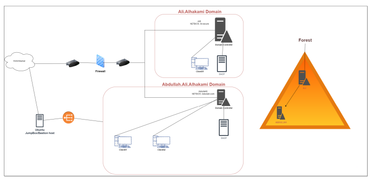

# FalconEye Lab

# Table of Contents
- [Context](#context)
- [Scenario](#scenario)
  * [Topology Summary](#topology-summary)
- [Questions](#questions)
  * [Unquoted Service Path 101](#unquoted-service-path-101)
  * [Pass the Hash and Overpass the Hash 101](#pass-the-hash-and-overpass-the-hash-101)
  * [Credential Escalation Ladder](#credential-escalation-ladder)

# Context

Lab link: [https://cyberdefenders.org/blueteam-ctf-challenges/falconeye/](https://cyberdefenders.org/blueteam-ctf-challenges/falconeye/)

Suggested tools: Splunk

Tactics: Reconnaissance, Persistence, Privilege Escalation, Defense Evasion, Credential Access, Lateral Movement, Command and Control

# Scenario

As a SOC analyst, you aim to investigate a security breach in an Active Directory network using Splunk SIEM solution to uncover the attacker's steps and techniques while creating a timeline of their activities. The investigation begins with network enumeration to identify potential vulnerabilities. Using a specialized privilege escalation tool, the attacker exploited an unquoted service path vulnerability in a specific process.

Once the attacker had elevated access, the attacker launched a `DCsync` attack to extract sensitive data from the Active Directory domain controller, compromising user accounts. The attacker employed evasion techniques to avoid detection and utilized a pass-the-hash (PTH) attack to gain unauthorized access to user accounts. Pivoting through the network, the attacker explored different systems and established persistence.

Throughout the investigation, tracking the attacker's activities and creating a comprehensive timeline is crucial. This will provide valuable insights into the attack and aid in identifying potential gaps in the network's security.

## Topology Summary

Forest structure — a single AD forest with a parent-child domain relationship:

- `Ali.Alhakami` (root domain, NetBIOS: `ALI`) — the parent
- `Abdullah.Ali.Alhakami` (child domain, NetBIOS: `ABDULLAH`) — subordinate to the root

That parent-child relationship matters a lot for this lab given `DCSync` is in scope: a compromised child domain can often pivot into the forest root because trust flows implicitly within a forest.

Per-domain assets:

- `Ali.Alhakami`: one Domain Controller, one client (`Client01`), a DHCP server, sitting behind a firewall facing the WAN/internet
- `Abdullah.Ali.Alhakami`: one Domain Controller, two clients (`Client01`, `Client02`), a DHCP server

Access path: WAN/Internet → firewall → into the `Ali.Alhakami` network segment. Separately, there's an Ubuntu JumpBox/Bastion host connecting in through what looks like a load balancer or proxy icon — this is likely the attacker's foothold or the analyst's access point into the environment.



# Questions

Q1- What is the name of the compromised account?

Answer: `Abdullah-work\Helpdesk`

Reason: Splunk query results against `index=folks` for successful logon events (EventCode `4624`) using NT LAN Manager (NTLM) authentication, excluding machine and SYSTEM accounts, show the `Abdullah-work\Helpdesk` account authenticating repeatedly from `CLIENT02` beginning at `06:49:48 UTC` on `2023-05-10` and recurring through `08:09:36 UTC` the same day. Multiple logons occurred within seconds of each other, including duplicate entries at `07:21:34` and `07:13:18`. This tight, repetitive authentication pattern is inconsistent with normal interactive helpdesk usage and indicates automated or scripted credential use, marking the `Helpdesk` account on `CLIENT02` as the compromised account.

```sql
index="folks" EventCode=4624 NOT TargetUserName IN ("*$*","*SYSTEM*") authentication_method=NTLM
| table _time, TargetDomainName, TargetUserName, Source_Workstation
```


Q2- What is the name of the compromised machine?

Answer: `CLIENT02`

Reason: Splunk query results against `index=folks` for successful logon events (EventCode `4624`) using NT LAN Manager (NTLM) authentication also pinpoint the compromised host. Every successful authentication of `Abdullah-work\Helpdesk` originated from `Source_Workstation = CLIENT02`, beginning at `06:49:48 UTC` and recurring through `08:09:36 UTC` on `2023-05-10`. This consistent source workstation across all suspicious logon events establishes `CLIENT02` as the machine from which the attacker operated using the compromised `Helpdesk` credentials.

Q3- What tool did the attacker use to enumerate the environment?

Answer: `BloodHound`

Reason: PowerShell Operational logging on `CLIENT02` (`EventCode 4103`/`4104`, script block logging) captured execution of the `Invoke-BloodHound` function at `03:28:41 UTC` on `2023-05-10`, which loads and runs the BloodHound C# Ingestor via .NET reflection to collect Active Directory (AD) relationship data. This places BloodHound-driven AD enumeration roughly three hours before the compromised `Helpdesk` account's first observed logon at `06:49:48 UTC`, consistent with the attacker mapping trust paths and attack vectors before pivoting into credential abuse.

```sql
index="folks" host=CLIENT02 source="XmlWinEventLog:Microsoft-Windows-PowerShell/Operational" (EventCode=4103 OR EventCode=4104) "bloodhound"
| table _time, ScriptBlockText
```

Q4- The attacker used an Unquoted Service Path to escalate privileges. What is the name of the vulnerable service?

Answer: `Automate-Basic-Monitoring.exe`

Reason: Process creation logs show the attacker registering a new Windows service via the `sc create` command on `2023-05-09`, first at `08:24:12 UTC` creating "Automation security monitoring tasks" and again at `11:38:14 UTC` creating "Monitoring service," both pointing to the binary path `C:\Program Files\Basic Monitoring\Automate-Basic-Monitoring.exe` with `start= auto`. Because the path contains an unquoted space (`Basic Monitoring`) and is not wrapped in quotation marks, the Windows Service Control Manager (SCM) will attempt to resolve ambiguous path segments in order (e.g. `C:\Program.exe`, then `C:\Program Files\Basic.exe`) before falling back to the full intended path, allowing a maliciously placed executable earlier in that resolution chain to run with the service's privileges. The service was then started at `12:24:25 UTC` via `sc start Monitor`, executing under `SYSTEM` context.

```sql
index="folks" "sc.exe"
| table _time, CommandLine
```


## Unquoted Service Path 101

**Offensive (Offsec): How the Attacker Exploits It**

When a Windows service binary path contains spaces and is not enclosed in quotation marks, the Service Control Manager (SCM) does not know where the executable name ends and the argument list begins. To resolve this ambiguity, the SCM attempts each whitespace-delimited segment of the path, in order, as a candidate executable, appending `.exe` and searching from the drive root inward until it finds a match.

A simple 101 example: a service is registered with the unquoted path `C:\Program Files\Basic Monitoring\Automate-Basic-Monitoring.exe`. The SCM will try, in sequence:

```powershell
C:\Program.exe
C:\Program Files\Basic.exe
C:\Program Files\Basic Monitoring\Automate-Basic-Monitoring.exe
```

If an attacker has write access to `C:\` or `C:\Program Files\` (common on misconfigured shares, some third-party software install directories, or systems with weak Access Control List (ACL) inheritance), they can drop a malicious `Program.exe` or `Basic.exe` at an earlier resolution point. When the service starts, whether on boot (`start= auto`) or via `sc start`, the SCM executes the attacker's binary instead of the intended one, and it runs with whatever privileges the service account holds, frequently SYSTEM. This is what was observed in the `CLIENT02` incident: `sc create` registered a service pointing to an unquoted path under `C:\Program Files\Basic Monitoring\`, and `sc start Monitor` later triggered execution under the SYSTEM context.

**Defensive (Defsec): Detection and Mitigation**

Detection:

- Audit the registry at `HKLM\SYSTEM\CurrentControlSet\Services\<ServiceName>\ImagePath` for any path containing a space that is not wrapped in quotation marks
- Monitor process creation events (EventCode `4688`) and service creation events (EventCode `7045` on the System log, or `4697` if enabled) for `sc create` / `ImagePath` values matching this pattern
- Correlate service start events with unexpected child processes launching from truncated path segments (e.g. `C:\Program.exe`)

Mitigation:

- Always wrap service binary paths containing spaces in quotation marks at creation time: `sc create SvcName binPath= "C:\Program Files\Basic Monitoring\Automate-Basic-Monitoring.exe"`
- Periodically scan all registered services for unquoted paths with embedded spaces and remediate proactively
- Restrict write permissions on `C:\`, `C:\Program Files\`, and other high-level directories so low-privileged users cannot place files at earlier resolution points in the chain
- Apply least privilege to service accounts so that even a successful hijack yields limited impact rather than SYSTEM-level compromise

Q5- What is the SHA256 of the executable that escalates the attacker's privileges?

Answer: `8ACC5D98CFFE8FE7D85DE218971B18D49166922D079676729055939463555BD2`

Reason: Sysmon process creation logs on `CLIENT02` record `C:\Program Files\Basic Monitoring\Automate-Basic-Monitoring.exe` executing at `04:57:36 UTC` on `2023-05-10` with the hash `8ACC5D98CFFE8FE7D85DE218971B18D49166922D079676729055939463555BD2`, confirming the identity of the binary placed to exploit the unquoted service path in the `Automate-Basic-Monitoring` service and gain SYSTEM-level execution.

```sql
index="folks" host=CLIENT02 process="C:\\Program Files\\Basic Monitoring\\Automate-Basic-Monitoring.exe" 
| table _time, process, SHA256
```


Q6- When did the attacker download fun.exe?

Answer: `2023-05-10 05:08`

Reason: Sysmon FileCreate events (EventCode `11`) show `C:\Users\HelpDesk\fun.exe` written to disk at `05:08:57 UTC` on `2023-05-10`, roughly eight minutes after the trojanized `Automate-Basic-Monitoring.exe` executed at `04:57:36 UTC`. The file's landing in the compromised `Helpdesk` user profile directory rather than a system path indicates it was staged post-escalation, likely as the next-stage tool used for credential access or lateral movement.

```sql
index="folks" "fun.exe" EventCode=11
| table _time, TargetFilename
```


Q7- What is the command line used to launch the DCSync attack

Answer: `"C:\Users\HelpDesk\fun.exe" "lsadump::dcsync /user:Abdullah-work\Administrator”`

Reason: Sysmon process creation logs (EventCode `1`) show `C:\Users\HelpDesk\fun.exe`, a renamed copy of Mimikatz identified by the `lsadump::dcsync` module invocation, executing at `08:09:36 UTC` on `2023-05-10` with the command line `"C:\Users\HelpDesk\fun.exe" "lsadump::dcsync /user:Abdullah-work\Administrator"`. This directly targets the `Abdullah-work\Administrator` account, abusing directory replication permissions to request the domain controller replicate that account's password hash as though `fun.exe` were a legitimate peer Domain Controller (DC). This execution timestamp matches the last observed successful `4624` logon of the compromised `Helpdesk` account, confirming `fun.exe` ran under the compromised `Helpdesk` session.

```sql
index="folks" "lsadump::dcsync" EventCode=1
| table _time, Image, CommandLine
```


Q8- What is the original name of `fun.exe`?

Answer: `Mimikatz.exe`

Reason: Sysmon EventCode `1` for the same execution at `08:09:36.687 UTC` on `2023-05-10` (`ProcessGuid {e7c1085c-5140-645b-d906-000000000c00}`) exposes the Portable Executable (PE) metadata embedded in the renamed binary: `OriginalFileName=mimikatz.exe`, `Description=mimikatz for Windows`, `Product=mimikatz`, and `Company=gentilkiwi (Benjamin DELPY)`, the known author of Mimikatz. This confirms `fun.exe` is a simple rename of Mimikatz rather than a distinct tool. The event also shows it was spawned by `powershell.exe` running under the compromised `Abdullah-work\HelpDesk` session (`LogonId 0x22ab48`) at High integrity, consistent with the `SYSTEM`-level access gained via the unquoted service path escalation.

```xml
<Data Name='RuleName'>-</Data>
<Data Name='UtcTime'>2023-05-10 08:09:36.687</Data>
<Data Name='ProcessGuid'>{e7c1085c-5140-645b-d906-000000000c00}</Data>
<Data Name='ProcessId'>1424</Data>
<Data Name='Image'>C:\Users\HelpDesk\fun.exe</Data>
<Data Name='FileVersion'>2.2.0.0</Data>
<Data Name='Description'>mimikatz for Windows</Data>
<Data Name='Product'>mimikatz</Data>
<Data Name='Company'>gentilkiwi (Benjamin DELPY)</Data>
<Data Name='OriginalFileName'>mimikatz.exe</Data>
<Data Name='CommandLine'>"C:\Users\HelpDesk\fun.exe" "lsadump::dcsync /user:Abdullah-work\Administrator"</Data>
<Data Name='CurrentDirectory'>C:\Users\HelpDesk\</Data>
<Data Name='User'>Abdullah-work\HelpDesk</Data>
<Data Name='LogonGuid'>{e7c1085c-2956-645b-48ab-220000000000}</Data>
<Data Name='LogonId'>0x22ab48</Data>
<Data Name='TerminalSessionId'>4</Data>
<Data Name='IntegrityLevel'>High</Data>
<Data Name='Hashes'>MD5=87B441720681BA85662B69DF1BD41711,SHA256=CFD90BF9CB627FB3574096B9D1C33522A46DB7412CD0FF42226474BF6A74CD77,IMPHASH=D4372DF10FAD3DA029FE49F3B0FC6E99</Data>
<Data Name='ParentProcessGuid'>{e7c1085c-4ea6-645b-8d06-000000000c00}</Data>
<Data Name='ParentProcessId'>6900</Data>
<Data Name='ParentImage'>C:\Windows\System32\WindowsPowerShell\v1.0\powershell.exe</Data>
<Data Name='ParentCommandLine'>"C:\Windows\System32\WindowsPowerShell\v1.0\powershell.exe" </Data>
<Data Name='ParentUser'>Abdullah-work\HelpDesk</Data>
```

Q9- The attacker performed the Over-Pass-The-Hash technique. What is the AES256 hash of the account he attacked?

Answer: `facca59ab6497980cbb1f8e61c446bdbd8645166edd83dac0da2037ce954d379`

Reason: Process creation logs on `CLIENT02` show `C:\Users\HelpDesk\Microsoft-Update.exe`, a renamed Rubeus binary, executing at `05:49:10 UTC` on `2023-05-10` with the command line `asktgt /user:Mohammed /aes256:facca59ab6497980cbb1f8e61c446bdbd8645166edd83dac0da2037ce954d379 /opsec /createnetonly:C:\Windows\System32\cmd.exe /show /ptt`, confirming an Overpass-the-Hash attack against the `Mohammed` account using its AES256 Kerberos key rather than a plaintext password. 

The `/opsec` and `/createnetonly` flags indicate deliberate evasion tradecraft, spawning an isolated `cmd.exe` network-only logon session to avoid leaving the forged Ticket Granting Ticket (TGT) in the current process's token cache, and the resulting ticket was immediately injected into the session via `/ptt` (Pass-the-Ticket) at `05:49:11 UTC`. The associated TGT request event (EventCode `4768`) carried `TicketEncryptionType=0x17`, which is RC4-HMAC rather than AES256. This does not contradict the AES256 finding: the response ticket's own signing/wrapping encryption type is independent of the key material supplied in the request.

```sql
index="folks" EventCode=4768 TicketEncryptionType=0x17 

index="folks" "asktgt" "Mohammed"
| table _time, CommandLine

_time	CommandLine
2023-05-10 05:49:11	C:\Windows\System32\cmd.exe
2023-05-10 05:49:10	"C:\Users\HelpDesk\Microsoft-Update.exe" asktgt /user:Mohammed /aes256:facca59ab6497980cbb1f8e61c446bdbd8645166edd83dac0da2037ce954d379 /opsec /createnetonly:C:\Windows\System32\cmd.exe /show /ptt
```

## Pass the Hash and Overpass the Hash 101

**Offensive (Offsec): How the Attacker Exploits It**

Both attacks start from the same place: an NTLM password hash obtained from LSASS memory (via Mimikatz `sekurlsa::logonpasswords`, a DCSync, or credential dumping) rather than the plaintext password. Windows never needs the plaintext password for NTLM authentication anyway, only the hash, which is why possessing the hash alone is enough to authenticate as the user.

In Mimikatz, both techniques use the same core command, `sekurlsa::pth`:

```
sekurlsa::pth /user:Administrator /domain:Abdullah-work /ntlm:<NTLM_HASH> /run:cmd.exe
```

This spawns a new process (`cmd.exe` in the example) and injects the supplied NTLM hash into that process's LSASS-backed logon session (`LogonType 9`, `NewCredentials`). What happens next depends entirely on what protocol the spawned process is asked to speak:

- **Classic Pass-the-Hash (PtH):** if the spawned process connects to a target using NTLM (for example, accessing an SMB share by IP address, `\\192.168.1.10\C$`), Windows uses the injected NTLM hash directly to complete NTLM authentication. No Kerberos is involved at all.
- **Overpass-the-Hash (Over-PtH), also called "Pass-the-Key":** if the spawned process instead needs to reach a Kerberos-enabled resource (typically by hostname or Service Principal Name (SPN) rather than IP), Windows will attempt Kerberos first. Since the RC4-HMAC Kerberos encryption type derives its key directly from the NTLM hash, the same injected hash can be used as valid key material to request a Kerberos Ticket Granting Ticket (TGT) via an AS-REQ. The attacker walks away with a legitimate Kerberos TGT, obtained without ever knowing the plaintext password, and from there can request service tickets normally.

The distinction matters operationally: PtH is limited to NTLM-speaking services and is increasingly blocked where NTLM is disabled or restricted, while Over-PtH converts the same stolen hash into a Kerberos ticket, which can bypass NTLM-hardening controls and access services that only accept Kerberos.

**Defensive (Defsec): Detection and Mitigation**

Detection:

- Monitor for `4624` logon events with `LogonType 9` (`NewCredentials`) originating from unexpected parent processes, a signature of `sekurlsa::pth`style credential injection
- Monitor Kerberos `4768` (TGT request/AS-REQ) events for encryption type `0x17` (RC4-HMAC) on domains where Advanced Encryption Standard (AES) etypes are expected; a sudden RC4 TGT request from a host that normally uses AES is a strong Over-PtH indicator
- Correlate a `4624`/`NewCredentials` session with a subsequent `4768` from the same host in a short time window

Mitigation:

- Enforce AES-only Kerberos encryption types domain-wide to remove RC4-HMAC as a viable path for Over-PtH
- Disable NTLM authentication where feasible, or restrict it via Group Policy (`Network security: Restrict NTLM`)
- Enable Credential Guard to isolate LSASS secrets from user-mode access
- Run LSASS as a Protected Process Light (`RunAsPPL`) to block direct memory reads by tools like Mimikatz
- Apply least privilege and local admin restriction so a single compromised host does not yield hashes with broad domain reach

## Credential Escalation Ladder

**Most common hash and ticket attacks ranked by difficulty and damage potential**

1. **AS-REP Roasting** — easiest, least damage. No credentials needed at all, just a list of usernames and an account with preauth disabled (often a config oversight, not even a real vuln). Yields one user's password if crackable. Purely opportunistic, low reliability (many domains have zero such accounts), and blocked entirely once preauth is enforced.
2. **Kerberoasting** — slightly harder, still fairly low damage per-shot. Needs some valid domain credential (even a low-priv phished account, like Helpdesk here), targets service accounts specifically. Damage is capped by whatever that one service account can do — could be nothing interesting, could be a jackpot if it's a Domain Admin-equivalent service account with a weak password.
3. **Pass-the-Hash** — moderate. Requires you've already compromised some account's NTLM hash (via LSASS dump, SAM dump, etc. — a real intrusion step already happened). Damage is scoped to wherever that specific hash grants NTLM access; blocked if NTLM is disabled network-wide or if Credential/Remote Guard is in play.
4. **Overpass-the-Hash** — moderate-to-high. Same prerequisite as PtH (a stolen hash) but converts it into a Kerberos TGT, which works in NTLM-hardened environments and blends in as "normal" Kerberos traffic — harder to detect, same blast radius as whatever that user's real privileges are.
5. **DCSync** — high damage. Doesn't require dumping a hash from a live machine at all — it abuses AD replication rights to pull any account's hash straight from a DC, remotely. Needs elevated replication permissions (Domain Admin-tier or misconfigured delegation), which is itself hard to get, but once you have it you can target literally any account in the domain, including krbtgt. This is what this lab's attacker used, and it's the technique that unlocks Golden Ticket.
6. **Golden Ticket** — worst case, maximum damage. Requires the krbtgt hash specifically (usually obtained via DCSync), but once you have it, you can forge a fully valid TGT for any user, with any group memberships, entirely offline, no further contact with a DC needed to mint it. It's not scoped to one account's real privileges — it's arbitrary, persistent, domain-wide impersonation, and the only real remediation is rotating krbtgt's password twice, domain-wide.

Q10- What service did the attacker abuse to access the Client03 machine as Administrator?

Answer: `http/Client03`

Reason: The Rubeus S4U command executed via `C:\Users\HelpDesk\Microsoft-Update.exe` at `06:18:19 UTC` on `2023-05-10` specifies `/msdsspn:http/Client03`, meaning the S4U2Proxy request targeted the HTTP Service Principal Name (SPN) registered on `Client03`. This confirms the attacker abused `Client02$`'s constrained delegation rights to that specific SPN to obtain a service ticket for the HTTP service on `Client03` while impersonating `Administrator`, enabling authenticated access (e.g. via Windows Remote Management (WinRM) or a web-based management interface bound to that SPN) without ever possessing `Administrator`'s actual credentials.

```sql
index="folks" host=CLIENT02 CLIENT03 | table _time, CommandLine | reverse
```


Q11- The `Client03` machine spawned a new process when the attacker logged on remotely. What is the process name?

Answer: `wsmprovhost.exe`

Reason: Sysmon EventCode `1` on `Client03.Abdullah.Ali.Alhakami` at `06:23:37.721 UTC` on `2023-05-10` shows `C:\Windows\System32\HOSTNAME.EXE` executing under `Abdullah-work\Administrator` at High integrity, with `ParentImage=C:\Windows\System32\wsmprovhost.exe` (`ParentCommandLine: C:\Windows\system32\wsmprovhost.exe -Embedding`). This confirms `wsmprovhost.exe`, the WinRM Provider Host process, was the process spawned on `Client03` to host the attacker's remote session, consistent with the WinRM-based logon enabled by the S4U2Proxy ticket for `http/Client03`. The `hostname.exe` invocation immediately after is consistent with basic post-logon situational awareness (confirming which host the session landed on).

```sql
index="folks" "wsmprovhost" "Client03"
```

Q12- The attacker compromises the `it-support` account. What was the logon type?

Answer: 9

Reason: Two `4624` logon events at `LogonType=9` for the `it-support` account, roughly two minutes apart, confirm the attacker compromised this account. A `LogonType 9` (`NewCredentials`) logon is the signature left by tools like Mimikatz's `sekurlsa::pth` or Rubeus's `/createnetonly`, both of which spawn a locally-running process carrying alternate network credentials, consistent with the same credential-injection tradecraft observed earlier in this incident against `Helpdesk` and `Mohammed`.

Q13- What ticket name did the attacker generate to access the parent DC as `Administrator`?

Answer: `trust-test2.kirbi`

Reason: The renamed Mimikatz binary (`Better-to-trust.exe`) invoked `kerberos::golden` with `service:krbtgt`, the child domain's `krbtgt` RC4 key, the child domain SID (`/sid`), and, critically, an injected `/sids` value corresponding to the **Enterprise Admins** group Relative Identifier (RID `519`) in the parent domain. This constructs a forged inter-realm TGT that carries parent-domain Enterprise Admin group membership via SID History injection, then requests it be usable against the parent domain (`/target:Ali.Alhakami`). This is the classic "Golden Ticket + SID History" trust-abuse technique used to escalate from a compromised child domain to full control of the parent domain. The final successful ticket, `trust-test2.kirbi`, was the one used to authenticate as `Administrator` against the parent DC.