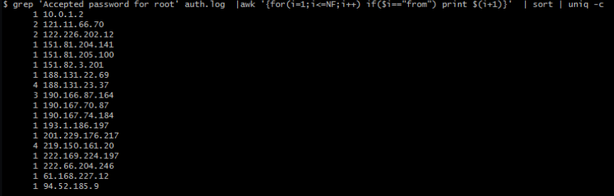

# Hammered Lab

# Context

Lab link: [https://cyberdefenders.org/blueteam-ctf-challenges/hammered/](https://cyberdefenders.org/blueteam-ctf-challenges/hammered/)

Suggested tools: Linux Command Line Tools, `grep`, Text Editor

Tactics: Execution, Persistence, Defense Impairment, Credential Access, Discovery

# Scenario

This challenge takes you into virtual systems and confusing log data. In this challenge, as a SOC Analyst figure out what happened to this webserver honeypot using the logs from a possibly compromised server.

# Questions

Q1- Which service did the attackers use to gain access to the system?

Answer: SSH

Reason: The attackers gained access via `SSH`, using a password brute-force attack against the `root` account. The `auth.log` shows a sustained `Failed password for invalid user` spray from `65.208.122.48` cycling through many usernames on `Apr 26 08:39-08:40`, followed by a separate, targeted brute-force against `root` from `188.131.23.37` that succeeded at `Apr 26 04:42:55`, when `sshd` logged `Accepted password for root from 188.131.23.37 port 3527 ssh2` after a `Failed password for root` attempt five seconds earlier at `04:42:50`. The source resolves to `host-188-131-23-37.hspa.orange.md` per the preceding PAM authentication failure entry.

```bash
$ grep -i "failed password" auth.log | tail -n 15
# Too many similar results from different usernames, same IP address before this
Apr 26 08:39:51 app-1 sshd[23399]: Failed password for invalid user danna from 65.208.122.48 port 47214 ssh2
Apr 26 08:39:55 app-1 sshd[23401]: Failed password for invalid user bettina from 65.208.122.48 port 49835 ssh2
Apr 26 08:39:58 app-1 sshd[23403]: Failed password for invalid user astro from 65.208.122.48 port 51968 ssh2
Apr 26 08:40:02 app-1 sshd[23405]: Failed password for invalid user diego from 65.208.122.48 port 53600 ssh2
Apr 26 08:40:05 app-1 sshd[23415]: Failed password for invalid user ashley from 65.208.122.48 port 56139 ssh2
Apr 26 08:40:08 app-1 sshd[23417]: Failed password for invalid user dausy from 65.208.122.48 port 58241 ssh2
Apr 26 08:40:12 app-1 sshd[23419]: Failed password for invalid user cecilia from 65.208.122.48 port 61001 ssh2
Apr 26 08:40:15 app-1 sshd[23421]: Failed password for invalid user al from 65.208.122.48 port 30310 ssh2
Apr 26 08:40:18 app-1 sshd[23423]: Failed password for invalid user erin from 65.208.122.48 port 32955 ssh2
Apr 26 08:40:22 app-1 sshd[23425]: Failed password for invalid user samuel from 65.208.122.48 port 35045 ssh2
Apr 26 08:40:26 app-1 sshd[23427]: Failed password for invalid user craig from 65.208.122.48 port 37585 ssh2
Apr 26 08:40:29 app-1 sshd[23429]: Failed password for invalid user foster from 65.208.122.48 port 40237 ssh2
Apr 26 08:40:33 app-1 sshd[23431]: Failed password for invalid user donald from 65.208.122.48 port 42305 ssh2
Apr 26 08:40:36 app-1 sshd[23433]: Failed password for invalid user esteban from 65.208.122.48 port 44707 ssh2
Apr 26 08:51:44 app-1 sshd[23542]: Failed password for root from 188.131.23.37 port 4280 ssh2

$ grep -i "188.131.23.37" auth.log 
Apr 26 04:42:48 app-1 sshd[20096]: pam_unix(sshd:auth): authentication failure; logname= uid=0 euid=0 tty=ssh ruser= rhost=host-188-131-23-37.hspa.orange.md  user=root
Apr 26 04:42:50 app-1 sshd[20096]: Failed password for root from 188.131.23.37 port 3527 ssh2
Apr 26 04:42:55 app-1 sshd[20096]: Accepted password for root from 188.131.23.37 port 3527 ssh2
Apr 26 04:59:02 app-1 sshd[20491]: Accepted password for root from 188.131.23.37 port 3561 ssh2
Apr 26 08:47:28 app-1 sshd[23501]: Accepted password for root from 188.131.23.37 port 4271 ssh2
```

Q2- What is the operating system version of the targeted system?

Answer: `4.2.4-1ubuntu3`

Reason: The `4.2.4-1ubuntu3` value is the gcc compiler version embedded in the kernel boot banner, and it's the only OS-version string present anywhere in the logs. `dpkg.log` has no `base-files` or kernel package entries since it only logs changes after logging began, not the base image. The same banner line, `Linux version 2.6.24-26-server (buildd@crested) (gcc version 4.2.4 (Ubuntu 4.2.4-1ubuntu3)) ... (Ubuntu 2.6.24-26.64-server)`, repeats across `messages`, `dmesg`, `dmesg.0`, and `kern.log` at every boot, with no alternate release string to cross-check.

```bash
$ grep -i "ubuntu" dmesg  
[    0.000000] Linux version 2.6.24-26-server (buildd@crested) (gcc version 4.2.4 (Ubuntu 4.2.4-1ubuntu3)) #1 SMP Tue Dec 1 18:26:43 UTC 2009 (Ubuntu 2.6.24-26.64-server)
```

Q3- What is the name of the compromised account?

Answer: `root`

Reason: The compromised account is `root`, confirmed by the successful SSH authentication at `Apr 26 04:42:55` from `188.131.23.37`, logged as `Accepted password for root from 188.131.23.37 port 3527 ssh2` following the earlier brute-force attempts targeting the same account.

Q4- How many attackers, represented by unique IP addresses, were able to successfully access the system after initial failed attempts?

Answer: 6

Reason:  Comparing `Failed password for root` source IPs against `Accepted password for root` source IPs via `comm -12` on sorted/deduped lists yields 8 addresses that both failed and later succeeded. Excluding `10.0.1.2` as a private/internal address leaves 7 external attacker IPs with confirmed successful root access.

```bash
$ comm -12 <(grep "Failed password for root" auth.log | awk '{for(i=1;i<=NF;i++) if($i=="from") print $(i+1)}' | sort | uniq) \ 
         <(grep "Accepted password for root" auth.log | awk '{for(i=1;i<=NF;i++) if($i=="from") print $(i+1)}' | sort | uniq)
121.11.66.70
122.226.202.12
219.150.161.20
222.169.224.197
222.66.204.246
61.168.227.12
```




Q5- Which attacker's IP address successfully logged into the system the most number of times?

Answer: `219.150.161.20`

Reason: The attacker IP with the most successful logins is `219.150.161.20`, with 4 accepted authentications against `root` between `Apr 19 05:41:44` and `Apr 19 05:56:05`, compared to at most 2 successful logins from any other attacker IP in the set.

```bash
$ for ip in 121.11.66.70 122.226.202.12 219.150.161.20 222.169.224.197 222.66.204.246 61.168.227.12; do
  grep -i "$ip" auth.log | grep -i accepted
done       
Apr 20 06:13:03 app-1 sshd[26712]: Accepted password for root from 121.11.66.70 port 33828 ssh2
Apr 24 11:36:19 app-1 sshd[24436]: Accepted password for root from 121.11.66.70 port 58832 ssh2
Apr 23 03:11:03 app-1 sshd[13633]: Accepted password for root from 122.226.202.12 port 40892 ssh2
Apr 23 03:20:41 app-1 sshd[13930]: Accepted password for root from 122.226.202.12 port 40209 ssh2
Apr 19 05:41:44 app-1 sshd[8810]: Accepted password for root from 219.150.161.20 port 51249 ssh2
Apr 19 05:42:27 app-1 sshd[9031]: Accepted password for root from 219.150.161.20 port 40877 ssh2
Apr 19 05:55:20 app-1 sshd[12996]: Accepted password for root from 219.150.161.20 port 55545 ssh2
Apr 19 05:56:05 app-1 sshd[13218]: Accepted password for root from 219.150.161.20 port 36585 ssh2
Apr 22 11:02:15 app-1 sshd[7940]: Accepted password for root from 222.169.224.197 port 45356 ssh2
Apr 19 10:45:36 app-1 sshd[28030]: Accepted password for root from 222.66.204.246 port 48208 ssh2
Apr 24 15:28:37 app-1 sshd[31338]: Accepted password for root from 61.168.227.12 port 43770 ssh2
```

Q6- How many requests were sent to the Apache Server?

Answer: 365

Reason: 365 requests were sent to the Apache server, as counted by line count in `apache2/www-access.log`, each line representing a single HTTP access log entry.

```bash
$ wc -l apache2/www-access.log 
365 apache2/www-access.log
```

Q7- How many rules have been added to the firewall?

Answer: 6

Reason: 6 firewall rules were added via `iptables -A INPUT` commands executed by `root` through `sudo` between `Apr 24 20:03:06` and `Apr 24 20:11:08`, opening inbound access on `ssh` (2424), `tcp/53`, `udp/53`, `ssh` (standard port), `tcp/53` (duplicate), and `tcp/113`.

```bash
$ grep "iptables \-A" auth.log
Apr 24 20:03:06 app-1 sudo:     root : TTY=pts/2 ; PWD=/etc ; USER=root ; COMMAND=/sbin/iptables -A INPUT -p ssh -dport 2424 -j ACCEPT
Apr 24 20:03:44 app-1 sudo:     root : TTY=pts/2 ; PWD=/etc ; USER=root ; COMMAND=/sbin/iptables -A INPUT -p tcp -dport 53 -j ACCEPT
Apr 24 20:04:13 app-1 sudo:     root : TTY=pts/2 ; PWD=/etc ; USER=root ; COMMAND=/sbin/iptables -A INPUT -p udp -dport 53 -j ACCEPT
Apr 24 20:06:22 app-1 sudo:     root : TTY=pts/2 ; PWD=/etc ; USER=root ; COMMAND=/sbin/iptables -A INPUT -p tcp --dport ssh -j ACCEPT
Apr 24 20:11:00 app-1 sudo:     root : TTY=pts/2 ; PWD=/etc ; USER=root ; COMMAND=/sbin/iptables -A INPUT -p tcp --dport 53 -j ACCEPT
Apr 24 20:11:08 app-1 sudo:     root : TTY=pts/2 ; PWD=/etc ; USER=root ; COMMAND=/sbin/iptables -A INPUT -p tcp --dport 113 -j ACCEPT
```

Q8- One of the downloaded files on the target system is a scanning tool. What is the name of the tool?

Answer: `nmap`

Reason: The downloaded scanning tool is `nmap`, version `4.53-3`, installed via `apt` as recorded in `apt/term.log`, which logs the package being unpacked from `nmap_4.53-3_amd64.deb` and subsequently configured.

```bash
$ grep -i nmap apt/term.log                                                              
Selecting previously deselected package nmap.
Unpacking nmap (from .../archives/nmap_4.53-3_amd64.deb) ...
Setting up nmap (4.53-3) ...
```

Q9- When was the last login from the attacker with IP `219.150.161.20`?

Answer: `2010-04-19 05:56`

Reason: The last login from `219.150.161.20` occurred at `2010-04-19 05:56:05`, per the final `Accepted password for root from 219.150.161.20 port 36585 ssh2` entry in `auth.log`. Since syslog timestamps carry no year field, the year `2010` is established from the file's `Modify` time (`2010-07-03`) via `stat`.

```bash
$ grep "Accepted password" auth.log | grep "219.150.161.20"
Apr 19 05:41:44 app-1 sshd[8810]: Accepted password for root from 219.150.161.20 port 51249 ssh2
Apr 19 05:42:27 app-1 sshd[9031]: Accepted password for root from 219.150.161.20 port 40877 ssh2
Apr 19 05:55:20 app-1 sshd[12996]: Accepted password for root from 219.150.161.20 port 55545 ssh2
Apr 19 05:56:05 app-1 sshd[13218]: Accepted password for root from 219.150.161.20 port 36585 ssh2
                                                                                                                                                    
$ stat auth.log
  File: auth.log
  Size: 10327345        Blocks: 20176      IO Block: 4096   regular file
Device: 8,1     Inode: 1205561     Links: 1
Access: (0640/-rw-r-----)  Uid: ( 1000/    kali)   Gid: ( 1000/    kali)
Access: 2026-08-28 10:47:17.550282971 -0400
Modify: 2010-07-03 17:53:20.000000000 -0400
Change: 2026-08-28 10:43:20.687843040 -0400
 Birth: 2026-08-28 10:43:20.659578628 -0400
```

Q10- The database showed two warning messages. Please provide the most critical and potentially dangerous one.

Answer: `mysql.user contains 2 root accounts without password!`

Reason: The most critical database warning is `mysql.user contains 2 root accounts without password!`, first observed at `2010-03-18 10:18:42` in `daemon.log`, indicating two MySQL `root` accounts had no authentication set, allowing unauthenticated administrative database access. This is more dangerous than the recurring `mysqlcheck has found corrupt tables` warning, which reflects data integrity issues rather than an open authentication bypass.

```bash
$ grep -i sql daemon.log | grep -iE "warning|error"
Mar 18 10:18:30 app-1 mysqld_safe[7136]: ERROR: 1046  No database selected
Mar 18 10:18:30 app-1 mysqld_safe[7136]: 100318 10:18:30 [ERROR] Aborting
Mar 18 10:18:42 app-1 /etc/mysql/debian-start[7566]: WARNING: mysql.user contains 2 root accounts without password!
Mar 18 17:01:44 app-1 /etc/mysql/debian-start[14717]: WARNING: mysql.user contains 2 root accounts without password!
Mar 22 13:49:49 app-1 /etc/mysql/debian-start[5599]: WARNING: mysql.user contains 2 root accounts without password!
Mar 22 18:43:41 app-1 /etc/mysql/debian-start[4755]: WARNING: mysql.user contains 2 root accounts without password!
Mar 22 18:45:25 app-1 /etc/mysql/debian-start[4749]: WARNING: mysql.user contains 2 root accounts without password!
Mar 25 11:56:53 app-1 /etc/mysql/debian-start[4848]: WARNING: mysql.user contains 2 root accounts without password!
Apr 14 14:44:34 app-1 /etc/mysql/debian-start[5369]: WARNING: mysql.user contains 2 root accounts without password!
Apr 14 14:44:36 app-1 /etc/mysql/debian-start[5624]: WARNING: mysqlcheck has found corrupt tables
Apr 18 18:04:00 app-1 /etc/mysql/debian-start[4647]: WARNING: mysql.user contains 2 root accounts without password!
Apr 24 20:21:24 app-1 /etc/mysql/debian-start[5427]: WARNING: mysql.user contains 2 root accounts without password!
Apr 28 07:34:26 app-1 /etc/mysql/debian-start[4782]: WARNING: mysql.user contains 2 root accounts without password!
Apr 28 07:34:27 app-1 /etc/mysql/debian-start[5032]: WARNING: mysqlcheck has found corrupt tables
Apr 28 07:34:27 app-1 /etc/mysql/debian-start[5032]: warning  : 1 client is using or hasn't closed the table properly
Apr 28 07:34:27 app-1 /etc/mysql/debian-start[5032]: warning  : 1 client is using or hasn't closed the table properly
May  2 23:05:54 app-1 /etc/mysql/debian-start[4774]: WARNING: mysql.user contains 2 root accounts without password!
```

Q11- Multiple accounts were created on the target system. Which account was created on April 26 at `04:43:15`?

Answer: `wind3str0y`

Reason: The account created on `Apr 26 04:43:15` was `wind3str0y`, added with `UID=1004`, `GID=1005`, home directory `/home/wind3str0y`, and shell `/bin/bash`, as recorded by `useradd` in `auth.log`.

```bash
$ grep -i useradd auth.log | grep "04:43"
Apr 26 04:43:15 app-1 useradd[20115]: new user: name=wind3str0y, UID=1004, GID=1005, home=/home/wind3str0y, shell=/bin/bash
```

Q12- Few attackers were using a proxy to run their scans. What is the corresponding `user-agent` used by this proxy?

Answer: `pxyscand/2.1`

Reason: The proxy scanning tool's user-agent is `pxyscand/2.1`, identified among the unique `User-Agent` field values extracted from `apache2/www-access.log`, distinguishing it from legitimate browser (`Mozilla/4.0`, `Mozilla/5.0`) and application (`WordPress/2.9.2`, `Apple-PubSub/65.12.1`) agents also present in the log.

```bash
$ cat apache2/www-access.log | cut -d " " -f 12 | sort | uniq
"-"
"Apple-PubSub/65.12.1"
"Mozilla/4.0
"Mozilla/5.0
"pxyscand/2.1"
"WordPress/2.9.2;
```

# Attack Chain

| Time (UTC) | Stage | Detail | MITRE |
| --- | --- | --- | --- |
| 2010-04-19 05:41:44 | Initial Access | `sshd` accepts brute-forced `root` login from `219[.]150[.]161[.]20`, first of 4 successful logins by this actor ending `05:56:05` | `T1110.001`, `T1078` |
| 2010-04-20 06:13:03 | Initial Access | Attacker `121[.]11[.]66[.]70` authenticates as `root` via SSH | `T1110.001` |
| 2010-04-22 11:02:15 | Initial Access | Attacker `222[.]169[.]224[.]197` authenticates as `root` via SSH | `T1110.001` |
| 2010-04-23 03:11:03 | Initial Access | Attacker `122[.]226[.]202[.]12` authenticates as `root` via SSH | `T1110.001` |
| 2010-04-24 11:36:19 | Initial Access | Attacker `121[.]11[.]66[.]70` authenticates as `root` a second time | `T1110.001` |
| 2010-04-24 15:28:37 | Initial Access | Attacker `61[.]168[.]227[.]12` authenticates as `root` via SSH | `T1110.001` |
| 2010-04-24 20:03:06 - 20:11:08 | Defense Evasion | `root` adds 6 `iptables -A INPUT` ACCEPT rules via `sudo`, opening `ssh`(2424), `tcp/53`, `udp/53`, `ssh`, `tcp/53`, `tcp/113` | `T1562.004` |
| 2010-04-26 04:42:50 | Credential Access | Failed `root` SSH login attempt from `188[.]131[.]23[.]37` | `T1110.001` |
| 2010-04-26 04:42:55 | Initial Access | `root` SSH login succeeds from `188[.]131[.]23[.]37` | `T1078` |
| 2010-04-26 04:43:15 | Persistence | `useradd` creates local account `wind3str0y` (UID 1004, GID 1005, `/bin/bash`) | `T1136.001` |
| 2010-04-26 08:39:51 - 08:40:36 | Credential Access | Wide-username SSH brute-force spray from `65[.]208[.]122[.]48`, unsuccessful | `T1110.001` |
| 2010-04-26 08:51:44 | Credential Access | Failed `root` SSH login attempt from `188[.]131[.]23[.]37` | `T1110.001` |

## Attack Tree

```bash
[Initial exploit or entry point] SSH brute-force → app-1 (webserver honeypot)
    └── sshd password authentication against root
        ├── [Stage 1 - Opportunistic Brute-Force Compromise]
        │   ├── 219[.]150[.]161[.]20 ← 4 successful logins, highest-frequency attacker
        │   ├── 121[.]11[.]66[.]70 ← 2 successful logins
        │   ├── 222[.]169[.]224[.]197
        │   ├── 122[.]226[.]202[.]12
        │   └── 61[.]168[.]227[.]12
        ├── [Stage 2 - Defense Evasion]
        │   └── iptables -A INPUT ACCEPT rules ← opened ssh/2424, tcp+udp/53, ssh, tcp/113
        ├── [Stage 3 - Follow-on Compromise]
        │   └── 188[.]131[.]23[.]37 ← failed then succeeded as root
        │       └── [Stage 4 - Persistence]
        │           └── useradd wind3str0y ← UID 1004, backup account
        └── [Stage 5 - Unsuccessful Follow-up Activity]
            ├── 65[.]208[.]122[.]48 ← wide-username spray, no success
            └── 188[.]131[.]23[.]37 ← repeat failed attempt post-persistence
```

# Artifacts

| Category | Type | Value |
| --- | --- | --- |
| Host | Hostname | `app-1` |
|  | Kernel/OS | `2.6.24-26-server` / `Ubuntu 2.6.24-26.64-server` |
|  | Reported OS version (lab answer) | `4.2.4-1ubuntu3` |
| Credential Access | Compromised account | `root` |
|  | Attacker IP | `219[.]150[.]161[.]20` (4 successful logins) |
|  | Attacker IP | `121[.]11[.]66[.]70` (2 successful logins) |
|  | Attacker IP | `222[.]169[.]224[.]197` |
|  | Attacker IP | `122[.]226[.]202[.]12` |
|  | Attacker IP | `61[.]168[.]227[.]12` |
|  | Attacker IP | `188[.]131[.]23[.]37` |
|  | Unsuccessful spray source | `65[.]208[.]122[.]48` |
| Persistence | New local account | `wind3str0y` (UID `1004`, GID `1005`, `/bin/bash`) |
| Defense Evasion | Firewall rule | `iptables -A INPUT -p ssh --dport 2424 -j ACCEPT` |
|  | Firewall rule | `iptables -A INPUT -p tcp --dport 53 -j ACCEPT` |
|  | Firewall rule | `iptables -A INPUT -p udp --dport 53 -j ACCEPT` |
|  | Firewall rule | `iptables -A INPUT -p tcp --dport ssh -j ACCEPT` |
|  | Firewall rule | `iptables -A INPUT -p tcp --dport 113 -j ACCEPT` |
| Tooling | Scanning tool | `nmap 4.53-3` (installed via `apt`) |
| Network | Proxy scanner User-Agent | `pxyscand/2.1` |
|  | Apache request volume | `365` (`apache2/www-access.log`) |
| Vulnerability | Pre-existing misconfiguration | `mysql.user contains 2 root accounts without password!` |

# Lab Insights

- **Direct root SSH exposure turns one weak control into many independent compromises.** The log shows at least six distinct external IPs successfully authenticating as `root` over SSH across a roughly two-week window, none of which appear coordinated with each other. This isn't one campaign, it's the predictable outcome of a honeypot leaving password-based `root` SSH reachable: any opportunistic scanner or botnet running credential lists will eventually land a hit, and each success looks identical in the log regardless of who's behind it.
- **Attacker activity can hide in plain sight inside routine administrative commands.** The `iptables -A INPUT` rules and the `nmap` install both went through normal channels, `sudo` and `apt`, the same tools a legitimate admin would use. Nothing about the command syntax marks them as malicious; only correlating them against the surrounding brute-force timeline and the absence of any corresponding change-management context reveals they were attacker-driven rather than routine maintenance.
- **Pre-existing misconfigurations compound the blast radius of a single credential compromise.** The `mysql.user` warning showing two passwordless `root` database accounts predates the SSH intrusion entirely, it was baked into the system image. Once SSH access was obtained, that unrelated weakness meant database compromise required no additional exploitation, just local access. Isolated low-severity findings can become high-severity once chained with an unrelated initial-access vector.