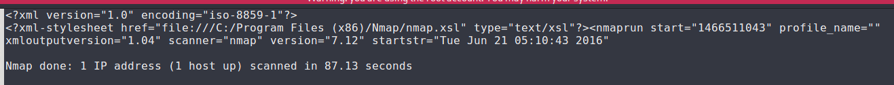

# Hunter Lab

# Context

Lab link: [https://cyberdefenders.org/blueteam-ctf-challenges/hunter/](https://cyberdefenders.org/blueteam-ctf-challenges/hunter/)

Suggested tools: `AccessData_FTK_Imager`, Registry Explorer/RECmd, Reg Ripper "Windows", Reg Ripper "Linux", DCode, ShellBags Explorer, DB Browser for SQLite, `WinPrefetchView`, `JumpList` Explorer, 010 Editor, SysTools Outlook PST Viewer 4.5.0.0, Autopsy, HindSight, Arsenal Image Mounter, `LinkParser` v1.3

Tactics: Initial Access, Execution, Persistence, Privilege Escalation, Stealth, Credential Access, Discovery, Lateral Movement, Collection, Command and Control, Exfiltration, Impact

# Scenario

Case Overview: The SOC team got an alert regarding some illegal port scanning activity coming from an employee's system. The employee was not authorized to do any port scanning or any offensive hacking activity within the network. The employee claimed that he had no idea about that, and it is probably a malware acting on his behalf. The IR team managed to respond immediately and take a full forensic image of the user's system to perform some investigations.

There is a theory that the user intentionally installed illegal applications to do port scanning and maybe other things. He was probably planning for something bigger, far beyond a port scanning!

It all began when the user asked for a salary raise that was rejected. After that, his behavior was abnormal and different. The suspect is believed to have weak technical skills, and there might be an outsider helping him!

Your objective as a soc analyst is to analyze the image and to either confirm or deny this theory.

# Questions

Q1- What is the computer name of the suspect machine?

Answer: `4ORENSICS`

Reason: The computer name of the suspect machine was recovered from the `SYSTEM` hive at `ControlSet001\Control\ComputerName\ComputerName`, queried via `reglookup -p` against the mounted `Hunter.ad1` image, resolving to `4ORENSICS` with a key last-modified time of 2016-06-21 08:29:49 UTC.

```bash
# Start by mounting the .ad1 image using your tool of choice, e.g. 4n6mount
$ sudo 4n6mount Hunter.ad1 /mnt/tmp_mount

$ reglookup -p /ControlSet001/Control/ComputerName/ComputerName Windows/System32/config/SYSTEM
PATH,TYPE,VALUE,MTIME
/ControlSet001/Control/ComputerName/ComputerName,KEY,,2016-06-21 08:29:49
/ControlSet001/Control/ComputerName/ComputerName/,SZ,mnmsrvc,
/ControlSet001/Control/ComputerName/ComputerName/ComputerName,SZ,4ORENSICS,
```

Q2- What is the computer IP?

Answer: `10.0.2.15`

Reason: The suspect machine's IP address, `10.0.2.15`, was recovered from the `SYSTEM` hive under `ControlSet001\Services\Tcpip\Parameters\Interfaces\{8CB9FBF6-AE23-4E1C-AA0A-EE23CB4FE736}\DhcpIPAddress`, queried via `reglookup -p` against the mounted `Hunter.ad1` image.

```bash
$ reglookup -p /ControlSet001/Services/Tcpip/Parameters/Interfaces Windows/System32/config/SYSTEM | grep -i DhcpIPAddress
/ControlSet001/Services/Tcpip/Parameters/Interfaces/{8CB9FBF6-AE23-4E1C-AA0A-EE23CB4FE736}/DhcpIPAddress,SZ,10.0.2.15,
```

Q3- What was the DHCP `LeaseObtainedTime`?

Answer: `21/06/2016 02:24:12 UTC`

Reason: The DHCP lease for the suspect machine was obtained at `21/06/2016 02:24:12 UTC`, recovered from the `LeaseObtainedTime` DWORD value (`0x5768A54C`) under `ControlSet001\Services\Tcpip\Parameters\Interfaces\{8CB9FBF6-AE23-4E1C-AA0A-EE23CB4FE736}` in the `SYSTEM` hive, converted from Unix epoch `1466475852`.

```bash
$ reglookup -p /ControlSet001/Services/Tcpip/Parameters/Interfaces Windows/System32/config/SYSTEM | grep -i LeaseObtainedTime
/ControlSet001/Services/Tcpip/Parameters/Interfaces/{8CB9FBF6-AE23-4E1C-AA0A-EE23CB4FE736}/LeaseObtainedTime,DWORD,0x5768A54C,
                                                                                                                                         
$ echo $((0x5768A54C))                                                                                                       
1466475852
                                                                                                                                         
$ date -u -d @$(echo $((0x5768A54C)))                                                                                        
Tue Jun 21 02:24:12 AM UTC 2016
```

Q4- What is the computer SID?

Answer: `S-1-5-21-2489440558-2754304563-710705792`

Reason: The machine SID, `S-1-5-21-2489440558-2754304563-710705792`, was recovered from the `SOFTWARE` hive under `Microsoft\Windows NT\CurrentVersion\ProfileList`, common to all local user SIDs on the system as the machine's domain-relative identifier prefix.

```bash
$ reglookup -p "/Microsoft/Windows NT/CurrentVersion/ProfileList" Windows/System32/config/SOFTWARE \ 
  | grep -oE 'S-1-5-21-[0-9]+-[0-9]+-[0-9]+' | uniq
S-1-5-21-2489440558-2754304563-710705792
```

Q5- What is the Operating System(OS) version?

Answer: `8.1`

Reason: The operating system version, `8.1`, was recovered from the `ProductName` value under `Microsoft\Windows NT\CurrentVersion` in the `SOFTWARE` hive, which reports the installed edition as `Windows 8.1 Enterprise`.

```bash
$ reglookup -p "/Microsoft/Windows NT/CurrentVersion" Windows/System32/config/SOFTWARE | grep -iE "ProductName"            
/Microsoft/Windows NT/CurrentVersion/ProductName,SZ,Windows 8.1 Enterprise,
```

Q6- What was the computer timezone?

Answer: `UTC-07:00`

Reason: The computer's timezone was `UTC-07:00`, derived from the `ActiveTimeBias` DWORD value (`0x000001A4` = 420 minutes) under `ControlSet001\Control\TimeZoneInformation` in the `SYSTEM` hive, where the bias represents the offset in minutes behind UTC (420 / 60 = 7 hours).

```bash
$ reglookup -p /ControlSet001/Control/TimeZoneInformation Windows/System32/config/SYSTEM | grep -i "activetimebias"
/ControlSet001/Control/TimeZoneInformation/ActiveTimeBias,DWORD,0x000001A4,
                                                                                                                                         
$ echo $((0x000001A4))                                                                                             
420
```

Q7- How many times did this user log on to the computer?

Answer: 3

Reason: The user account (RID 1001) logged onto the computer `3` times, per the `Login Count` field parsed from the `SAM` hive via RegRipper's `samparse` plugin.

```bash
$ regripper -r ./Windows/System32/config/SAM -p samparse | grep 1001 -A 10 | grep Count 
Launching samparse v.20220921
Login Count     : 3
```

Q8- When was the last login time for the discovered account? Format: one-space between date and time

Answer: `2016-06-21 01:42`

Reason: The last login time for the discovered account (RID 1001) was `2016-06-21 01:42`, recovered from the `Last Login Date` field parsed from the `SAM` hive via RegRipper's `samparse` plugin.

```bash
$ regripper -r ./Windows/System32/config/SAM -p samparse | grep 1001 -A 10 | grep -i "last login"
Launching samparse v.20220921
Last Login Date : Tue Jun 21 01:42:40 2016 Z
```

Q9- There was a network scanner running on this computer, what was it? And when was the last time the suspect used it? Format: `program.exe`,`YYYY-MM-DD HH:MM:SS UTC`

Answer: `zenmap.exe`, `2016-06-21 12:08:13 UTC`

Reason: The network scanner identified on the suspect's machine was `zenmap.exe` (the GUI frontend for Nmap), with a last-run time of `2016-06-21 12:08:13 UTC`, recovered from the Prefetch file `ZENMAP.EXE-56B17C4C.pf` under `Windows\Prefetch`.

```bash
$ sccainfo Windows/Prefetch/ZENMAP.EXE-56B17C4C.pf | grep -i "last run"
        Last run time: 1                : Jun 21, 2016 12:08:13.799392600 UTC
```

Q10- When did the port scan end? (Example: `Sat Jan 23 hh:mm:ss 2016`)

Answer: `Tue Jun 21 05:12:09 2016`

Reason: The port scan recorded in `nmapscan.xml` (found on `Users\Hunter\Desktop`) completed at `Tue Jun 21 05:12:09 2016`, per the scan's `finishstr` timestamp within the Nmap XML output.

```bash
$ mousepad Users/Hunter/Desktop/nmapscan.xml
```



Q11- How many ports were scanned?

Answer: 1000

Reason: The scan recorded in `nmapscan.xml` covered `1000` total ports, per the scan engine's runtime summary line for the `SYN Stealth Scan`.

```bash
$ cat Users/Hunter/Desktop/nmapscan.xml | grep -i "completed syn"
Completed SYN Stealth Scan at 05:11, 12.69s elapsed (1000 total ports)
```

Q12- What ports were found open? (comma-separated, ascending)

Answer: `22,80,9929,31337`

Reason: The SYN Stealth Scan against `45.33.32.156` discovered four open ports: `22,80,9929,31337`, per the "Discovered open port" log lines within `nmapscan.xml`.


Q13- What was the version of the network scanner running on this computer?

Answer: `7.12`

Reason: The network scanner running on the suspect's machine was Nmap version `7.12`, per the scan header in `nmapscan.xml`, which also confirms the local timezone as Pacific Daylight Time (`UTC-07:00`), consistent with the `ActiveTimeBias` value recovered earlier.

```bash
$ cat Users/Hunter/Desktop/nmapscan.xml | grep -i "starting"
Starting Nmap 7.12 ( https://nmap.org ) at 2016-06-21 05:10 Pacific Daylight Time
```

Q14- The employee engaged in a Skype conversation with someone. What is the skype username of the other party?

Answer: `linux-rul3z`

Reason: The employee's Skype conversation partner was identified as `linux-rul3z`, recovered via `strings` extraction of the chatsync file `Users/Hunter/AppData/Roaming/Skype/hunterehpt/chatsync/ef/efcc1c6a4c151fa6.dat`, which showed the conversation identifier `#linux-rul3z/$hunterehpt;a7be5d4f18395856` alongside both usernames in plaintext.

```bash
$ strings "Users/Hunter/AppData/Roaming/Skype/hunterehpt/chatsync/ef/efcc1c6a4c151fa6.dat" | head
sCdB
#linux-rul3z/$hunterehpt;a7be5d4f18395856
bpnd
'[OI
linux-rul3z
hunterehpt
[...]
```

Q15- What is the name of the application both parties agreed to use to exfiltrate data and provide remote access for the external attacker in their Skype conversation?

Answer: Teamviewer

Reason: Both parties in the Skype conversation agreed to use `TeamViewer` for remote access and data exfiltration, per the plaintext message "can you install team viewer?" recovered via `strings` extraction of the `chatsync` file `Users/Hunter/AppData/Roaming/Skype/hunterehpt/chatsync/ef/efcc1c6a4c151fa6.dat`.

```bash
$ strings "Users/Hunter/AppData/Roaming/Skype/hunterehpt/chatsync/ef/efcc1c6a4c151fa6.dat" | grep team
can you install team viewer?
```

Q16- What is the Gmail email address of the suspect employee?

Answer: `ehptmsgs@gmail[.]com`

Reason: The suspect employee's Gmail address, `ehptmsgs@gmail[.]com`, was recovered from `Users/Hunter/AppData/Roaming/Skype/shared.xml` via a `strings` extraction filtered for Gmail address patterns.

```bash
$ strings Users/Hunter/AppData/Roaming/Skype/shared.xml | grep -oiE "[a-z0-9._%+-]+@gmail\.com" | sort -u
ehptmsgs@gmail.com
```

Q17- It looks like the suspect user deleted an important diagram after his conversation with the external attacker. What is the file name of the deleted diagram?

Answer: `home-network-design-networking-for-a-single-family-home-case-house-arkko-1433-x-792.jpg`

Reason: The deleted diagram's filename, `home-network-design-networking-for-a-single-family-home-case-house-arkko-1433-x-792.jpg`, was recovered from an email attachment listed in the `Important.mbox` message extracted from the Outlook `backup.pst` file under `Users/Hunter/Documents/Outlook Files`, parsed via `readpst`.

```bash
$ readpst -o /tmp Users/Hunter/Documents/Outlook\ Files/backup.pst
                                                                                                                                         
$ grep -i "filename" /tmp/Important.mbox     
        filename*=utf-8''Pictures.7z;
        filename="Pictures.7z"
        filename*=utf-8''home-network-design-networking-for-a-single-family-home-case-house-arkko-1433-x-792.jpg;
        filename="home-network-design-networking-for-a-single-family-home-case-house-arkko-1433-x-792.jpg"
```

Q18- The user `Documents`' directory contained a PDF file discussing data exfiltration techniques. What is the name of the file?

Answer: `Ryan_VanAntwerp_thesis.pdf`

Reason: The suspect's `Documents` directory contained a PDF titled "Exfiltration Techniques: An Examination and Emulation" by Ryan C. Van Antwerp, filed as `Ryan_VanAntwerp_thesis.pdf`, indicating the suspect had researched data exfiltration methodology.


Q19- What was the name of the Disk Encryption application Installed on the victim system? (two words space separated)

Answer: Crypto Swap

Reason: The disk encryption application installed on the victim system was `Crypto Swap`, a component of the Jetico BCWipe suite, identified via its Start Menu shortcut recovered from the UTF-16LE encoded `UnInstall.log` after conversion to UTF-8.

```bash
# grep cannot parse UTF-16LE directly so convert the file first
$ iconv -f UTF-16LE -t UTF-8 Program\ Files\ \(x86\)/Jetico/BCWipe/UnInstall.log | grep -i crypto
3 0 C:\ProgramData\Microsoft\Windows\Start Menu\Programs\BCWipe\Crypto Swap.lnk
```

Q20- What are the serial numbers of the two identified USB storage?

Answer: `07B20C03C80830A9`, `AAI6UXDKZDV8E9OU`

Reason: Two USB storage devices were identified in the `SYSTEM` hive via RegRipper's `usbstor` plugin: an Imation Nano Pro (S/N `07B20C03C80830A9`, first/last arrival `2016-06-21 01:53:14 UTC`, last removal `2016-06-21 02:01:38 UTC`) and a Lexar JumpDrive (S/N `AAI6UXDKZDV8E9OU`, first/last arrival `2016-06-21 02:01:59 UTC`, last removal `2016-06-21 02:03:04 UTC`).

```bash
$ regripper -r Windows/System32/config/SYSTEM -p usbstor
Launching usbstor v.20200515
usbstor v.20200515
(System) Get USBStor key info

USBStor
ControlSet001\Enum\USBStor

Disk&Ven_Imation&Prod_Nano_Pro&Rev_PMAP [2016-06-21 01:53:14]
  S/N: 07B20C03C80830A9&0 [2016-06-21 01:53:14Z]
  Device Parameters LastWrite: [2016-06-21 01:53:14Z]
  Properties LastWrite       : [2016-06-21 01:53:15Z]
    FriendlyName          : Imation Nano Pro USB Device
    First InstallDate     : 2016-06-21 01:53:14Z
    InstallDate           : 2016-06-21 01:53:14Z
    Last Arrival          : 2016-06-21 01:53:14Z
    Last Removal          : 2016-06-21 02:01:38Z

Disk&Ven_Lexar&Prod_JumpDrive&Rev_1100 [2016-06-21 02:01:59]
  S/N: AAI6UXDKZDV8E9OU&0 [2016-06-21 02:01:59Z]
  Device Parameters LastWrite: [2016-06-21 02:01:59Z]
  Properties LastWrite       : [2016-06-21 02:02:00Z]
    FriendlyName          : Lexar JumpDrive USB Device
    First InstallDate     : 2016-06-21 02:01:59Z
    InstallDate           : 2016-06-21 02:01:59Z
    Last Arrival          : 2016-06-21 02:01:59Z
    Last Removal          : 2016-06-21 02:03:04Z
```

Q21- One of the installed applications is a file shredder. What is the name of the application? (two words space separated)

Answer: Jetico BCWipe

Reason: The installed file-shredding application was `Jetico BCWipe`, identified by its installation directory under `Program Files (x86)/Jetico/BCWipe`, the same anti-forensics suite that also included the `Crypto Swap` disk encryption component identified in Q19.

```bash
$ ls Program\ Files\ \(x86\)/Jetico       
BCWipe  Shared  Shared64
```

Q22- How many prefetch files were discovered on the system?

Answer: 174

Reason: The system contained `174` valid prefetch files, derived from `186` total `.pf`-suffixed entries under `Windows/Prefetch` minus 12 zero-byte/duplicate entries (a `4n6mount`-related artifact of fragmented file reconstruction, consistent with the same NTFS parsing limitation observed with `main.db` in Q14-Q16).

```bash
# 0 byte PF files, without the duplicates = 12
-rw-r--r-- 1 root root       0 Dec 31  1969 DLLHOST.EXE-766398D2.pf
-rw-r--r-- 1 root root       0 Dec 31  1969 DLLHOST.EXE-766398D2.pf
-rw-r--r-- 1 root root       0 Dec 31  1969 DLLHOST.EXE-9D2E4538.pf
-rw-r--r-- 1 root root       0 Dec 31  1969 EXPLORER.EXE-254441E9.pf
-rw-r--r-- 1 root root       0 Dec 31  1969 GTCHECK.EXE-066F3CEF.pf
-rw-r--r-- 1 root root       0 Dec 31  1969 IE4UINIT.EXE-3A7E0C67.pf
-rw-r--r-- 1 root root       0 Dec 31  1969 LODCTR.EXE-3CCE0534.pf
-rw-r--r-- 1 root root       0 Dec 31  1969 MSCORSVW.EXE-57D17DAF.pf
-rw-r--r-- 1 root root       0 Dec 31  1969 MSCORSVW.EXE-57D17DAF.pf
-rw-r--r-- 1 root root       0 Dec 31  1969 OSE.EXE-56D9BC58.pf
-rw-r--r-- 1 root root       0 Dec 31  1969 PABESVC64.EXE-38BA6AD2.pf
-rw-r--r-- 1 root root       0 Dec 31  1969 PABESVC64.EXE-38BA6AD2.pf
-rw-r--r-- 1 root root       0 Dec 31  1969 RUNONCE.EXE-D0649312.pf
-rw-r--r-- 1 root root       0 Dec 31  1969 TASKHOST.EXE-3AE259FC.pf
-rw-r--r-- 1 root root       0 Dec 31  1969 TASKHOST.EXE-3AE259FC.pf
-rw-r--r-- 1 root root       0 Dec 31  1969 VERCLSID.EXE-7C52E31C.pf
-rw-r--r-- 1 root root       0 Dec 31  1969 VSSVC.EXE-B8AFC319.pf
-rw-r--r-- 1 root root       0 Dec 31  1969 VSSVC.EXE-B8AFC319.pf

$ ls -lS Windows/Prefetch | grep -E '\.pf$' | wc -l
186
```

Q23- How many times was the file shredder application executed?

Answer: 5

Reason: The file shredder application, `BCWipe.exe`, was executed `5` times, per the `Run count` field parsed from its Prefetch file `BCWIPE.EXE-36F3F2DF.pf` via `sccainfo`, with the five recorded run timestamps clustering between `2016-06-21 12:00:56 UTC` and `2016-06-21 12:02:39 UTC` — closely following the port scan activity and Skype conversation, consistent with anti-forensic cleanup after the attacker interaction.

```bash
$ sccainfo Windows/Prefetch/BCWIPE.EXE-36F3F2DF.pf | head -n15
sccainfo 20250915

Windows Prefetch File (PF) information:
        Format version                  : 26
        Prefetch hash                   : 0x36f3f2df
        Executable filename             : BCWIPE.EXE
        Run count                       : 5
        Last run time: 1                : Jun 21, 2016 12:02:35.193172100 UTC
        Last run time: 2                : Jun 21, 2016 12:02:39.680387600 UTC
        Last run time: 3                : Jun 21, 2016 12:01:35.094287400 UTC
        Last run time: 4                : Jun 21, 2016 12:01:00.572187900 UTC
        Last run time: 5                : Jun 21, 2016 12:00:56.430565500 UTC
        Last run time: 6                : Not set (0)
        Last run time: 7                : Not set (0)
        Last run time: 8                : Not set (0)
```

Q24- Using prefetch, determine when was the last time `ZENMAP.EXE-56B17C4C.pf` was executed?

Answer: `06/21/2016 12:08:13 PM`

Reason: `ZENMAP.EXE` was last executed at `06/21/2016 12:08:13 PM` (UTC), with a `Run count` of 1, per its Prefetch file `ZENMAP.EXE-56B17C4C.pf` parsed via `sccainfo`.

```bash
$ sccainfo Windows/Prefetch/ZENMAP.EXE-56B17C4C.pf | head -n 10
sccainfo 20250915

Windows Prefetch File (PF) information:
        Format version                  : 26
        Prefetch hash                   : 0x56b17c4c
        Executable filename             : ZENMAP.EXE
        Run count                       : 1
        Last run time: 1                : Jun 21, 2016 12:08:13.799392600 UTC
        Last run time: 2                : Not set (0)
        Last run time: 3                : Not set (0)
```

Q25- A JAR file for an offensive traffic manipulation tool was executed. What is the absolute path of the file?

Answer: `C:\Users\Hunter\Downloads\burpsuite_free_v1.7.03.jar`

Reason: The JAR file for an offensive traffic manipulation tool was `C:\Users\Hunter\Downloads\burpsuite_free_v1.7.03.jar`, identifying Burp Suite Free 1.7.03, a web proxy/traffic interception tool commonly used for intercepting and manipulating HTTP(S) traffic.

```bash
$ find . -name "*.jar" | tail -n 1
./Users/Hunter/Downloads/burpsuite_free_v1.7.03.jar
```

Q26- The suspect employee tried to exfiltrate data by sending it as an email attachment. What is the name of the suspected attachment?

Answer: `Pictures.7z`

Reason: The suspected exfiltration attachment was `Pictures.7z`, identified in the attachment headers of the `Important.mbox` message extracted from the Outlook `backup.pst` file, the same message that also referenced the deleted `home-network-design...jpg` diagram in Q17.

```bash
$ grep -i "Pictures.7z" /tmp/Important.mbox                         
        filename*=utf-8''Pictures.7z;
        filename="Pictures.7z"
```

Q27- ShellBags shows that the employee created a folder to include all the data he will exfiltrate. What is the full path of that folder?

Answer: `C:\Users\Hunter\Pictures\Exfil`

Reason: ShellBags recovered from `Users/Hunter/AppData/Local/Microsoft/Windows/UsrClass.dat` show a folder created at `C:\Users\Hunter\Pictures\Exfil`, containing `dns-exfiltration-using-sqlmap-18-728.jpg`, `Exfiltration_Diagram.png`, and `Thumbs.db`, confirming the employee staged data collection for exfiltration.

```bash
$ regripper -r Users/Hunter/AppData/Local/Microsoft/Windows/UsrClass.dat -p shellbags | grep -i hunter
Launching shellbags v.20200428
[...]
2016-06-21 12:17:36  |2016-06-21 09:38:14  | 2016-06-21 09:38:14  | 2016-06-21 09:37:38  |                      | 91546/3      |My Computer\C:\Users\Hunter\Pictures\Exfil [Desktop\1\0\1\0\8\0\]
                     |2016-06-21 01:54:22  | 2016-06-21 01:54:22  | 2016-06-21 08:37:48  |                      | 81370/1      |My Computer\C:\Users\Hunter\Links [Desktop\1\0\1\0\9\]
                     |2016-06-21 08:37:54  | 2016-06-21 08:37:54  | 2016-06-21 08:37:54  |                      | 81706/1      |My Computer\C:\Users\Hunter\Contacts [Desktop\1\0\1\0\10\]
                                                                                                                                                                                                                                                 
$ ls Users/Hunter/Pictures/Exfil  
dns-exfiltration-using-sqlmap-18-728.jpg  Exfiltration_Diagram.png  Thumbs.db
```

Q28- The user deleted two JPG files from the system and moved them to `$Recycle-Bin`. What is the file name that has the resolution of 1920x1200?

Answer: `ws_Small_cute_kitty_1920x1200.jpg`

Reason: Two deleted JPG files were recovered from `$Recycle.Bin\S-1-5-21-2489440558-2754304563-710705792-1001`. Measuring the recovered `$R` content files directly via `exiftool` identified `$RP3TBNW.jpg` as the file with a resolution of `1920x1200`; correlating this back to the original filename via the official case source gives `ws_Small_cute_kitty_1920x1200.jpg`.

```bash
$ rifiuti-vista '$Recycle.Bin/S-1-5-21-2489440558-2754304563-710705792-1001' -f json > /tmp/recyclebin.json
$ cat /tmp/recyclebin.json | jq -r '.[] | "\(.path)\t\(.filesize)\t\(.deltime)"'
$ exiftool -FileName -ImageWidth -ImageHeight -ImageSize '$Recycle.Bin/S-1-5-21-2489440558-2754304563-710705792-1001/$R'*
======== $Recycle.Bin/S-1-5-21-2489440558-2754304563-710705792-1001/$RBIQP2G.jpg
File Name                       : $RBIQP2G.jpg
======== $Recycle.Bin/S-1-5-21-2489440558-2754304563-710705792-1001/$RP3TBNW.jpg
File Name                       : $RP3TBNW.jpg
Image Width                     : 1920
Image Height                    : 1200
Image Size                      : 1920x1200
    2 image files read
```

Q29- Provide the name of the directory where information about jump lists items (created automatically by the system) is stored?

Answer: `AutomaticDestinations`

Reason: Automatic Jump List items are stored in the `AutomaticDestinations` directory, located at `%APPDATA%\Microsoft\Windows\Recent\AutomaticDestinations` on the local filesystem. This is a general Windows forensics knowledge fact, not derived from a specific artifact in this case, distinct from `CustomDestinations` (user-pinned Jump List entries).

Q30- Using jump list analysis, provide the full path of the application with the `AppID` of `aa28770954eaeaaa` used to bypass network security monitoring controls.

Answer: `C:\Users\Hunter\Desktop\Tor Browser\Browser\firefox.exe`

Reason: The application with `AppID` `aa28770954eaeaaa` resolved to `C:\Users\Hunter\Desktop\Tor Browser\Browser\firefox.exe`, recovered via `strings -el` (little-endian UTF-16) extraction of the corresponding Jump List file `aa28770954eaeaaa.customDestinations-ms` under `Users/Hunter/AppData/Roaming/Microsoft/Windows/Recent/CustomDestinations/`, indicating use of the Tor Browser to bypass network security monitoring controls.

```bash
$ ls "Users/Hunter/AppData/Roaming/Microsoft/Windows/Recent/CustomDestinations/" | grep -i aa28770954eaeaaa
aa28770954eaeaaa.customDestinations-ms
                                                                                                                                                   
$ strings -el "Users/Hunter/AppData/Roaming/Microsoft/Windows/Recent/CustomDestinations/aa28770954eaeaaa.customDestinations-ms"
Tor Browser
Browser
firefox.exe
Open a new browser tab.
-new-tab about:blank7C:\Users\Hunter\Desktop\Tor Browser\Browser\firefox.exe
[...]
```

# Attack Chain

| Time (UTC) | Stage | Detail | MITRE |
| --- | --- | --- | --- |
| 2016-06-21 01:42:40 | Initial Access / Logon | User account (RID 1001) logs onto `4ORENSICS` (Windows 8.1 Enterprise) | T1078 |
| 2016-06-21 01:53:14 | Removable Media | Imation Nano Pro USB connected (S/N `07B20C03C80830A9`), removed 02:01:38 | T1052.001 |
| 2016-06-21 02:01:59 | Removable Media | Lexar JumpDrive USB connected (S/N `AAI6UXDKZDV8E9OU`), removed 02:03:04 | T1052.001 |
| (undated) | Research / Planning | Thesis `Ryan_VanAntwerp_thesis.pdf` on exfiltration techniques found in `Documents` | T1592 |
| (undated) | Tool Acquisition | Zenmap/Nmap 7.12, Burp Suite Free 1.7.03.jar, BCWipe/Crypto Swap, Tor Browser downloaded/installed | T1588.002 |
| 2016-06-21 12:00:56 - 12:02:39 | Anti-Forensics | `BCWipe.exe` executed 5 times (secure file shredding) | T1070.004 |
| 2016-06-21 12:08:13 | Discovery | `ZENMAP.EXE` launched (GUI frontend) | T1046 |
| 2016-06-21 12:10:00 - 12:12:09 | Discovery (Network Scanning) | Nmap 7.12 SYN Stealth Scan of `45.33.32.156`, 1000 ports, 4 found open (`22,80,9929,31337`) | T1046 |
| (undated) | C2 / Coordination | Skype conversation with external party `linux-rul3z`; both agree to use TeamViewer | T1219 |
| (undated) | Collection | Staging folder `C:\Users\Hunter\Pictures\Exfil` created (ShellBags), containing exfil-themed images | T1074.001 |
| 2016-06-21 09:37:38 - 12:17:36 | Collection (Staging) | `Exfil` folder created/accessed per ShellBags timeline | T1074.001 |
| (undated) | Exfiltration Attempt | Email sent via Outlook (`backup.pst`) with attachment `Pictures.7z`; also referenced deleted diagram `home-network-design...jpg` | T1048 |
| (undated) | Defense Evasion | Tor Browser (`firefox.exe`) used, per CustomDestinations Jump List (`AppID aa28770954eaeaaa`) | T1090.003 |
| (undated) | Anti-Forensics | Two JPGs deleted to `$Recycle.Bin` (one confirmed `1920x1200`, resolved as `ws_Small_cute_kitty_1920x1200.jpg`) | T1070.004 |

## Attack Tree

```bash

└── [Insider Threat] Hunter (4ORENSICS, Win 8.1 Enterprise, 10.0.2.15)
    ├── [Logon] 2016-06-21 01:42:40 UTC — user session start
    ├── [Removable Media]
    │   ├── Imation Nano Pro (07B20C03C80830A9) ← 01:53:14–02:01:38
    │   └── Lexar JumpDrive (AAI6UXDKZDV8E9OU) ← 02:01:59–02:03:04
    ├── [Research] Ryan_VanAntwerp_thesis.pdf ← exfiltration techniques thesis
    ├── [Tool Staging]
    │   ├── burpsuite_free_v1.7.03.jar ← traffic manipulation
    │   ├── Zenmap/Nmap 7.12 ← network scanner
    │   ├── Jetico BCWipe + Crypto Swap ← anti-forensics/encryption
    │   └── Tor Browser ← defense evasion
    ├── [Anti-Forensics] BCWipe.exe x5 ← 12:00:56–12:02:39 UTC
    ├── [Discovery] Zenmap GUI launch ← 12:08:13 UTC
    │   └── [Port Scan] nmap SYN Stealth vs 45.33.32.156 ← 12:10–12:12:09 UTC
    │       └── open: 22,80,9929,31337
    ├── [C2/Coordination] Skype ↔ linux-rul3z
    │   └── agreed tool: TeamViewer
    ├── [Collection] C:\Users\Hunter\Pictures\Exfil ← staged 09:37:38–12:17:36 UTC
    ├── [Exfiltration Attempt] Outlook email → attachment Pictures.7z
    │   └── referenced: home-network-design...jpg (deleted)
    ├── [Defense Evasion] Tor Browser firefox.exe ← CustomDestinations AppID aa28770954eaeaaa
    └── [Anti-Forensics] $Recycle.Bin
        └── ws_Small_cute_kitty_1920x1200.jpg ← deleted
```

# Artifacts

| Type | Value |
| --- | --- |
| Hostname | `4ORENSICS` |
| IP Address | `10.0.2.15` |
| OS Version | `Windows 8.1 Enterprise` |
| Timezone | `UTC-07:00` (Pacific Daylight Time) |
| Machine SID | `S-1-5-21-2489440558-2754304563-710705792` |
| User Account Login Count | `3` |
| Last Login Time | `2016-06-21 01:42:40 UTC` |
| Gmail Address | `ehptmsgs@gmail[.]com` |
| Skype Contact (external) | `linux-rul3z` |
| USB Device (1) | Imation Nano Pro, S/N `07B20C03C80830A9` |
| USB Device (2) | Lexar JumpDrive, S/N `AAI6UXDKZDV8E9OU` |
| Network Scanner | `zenmap.exe` / `nmap.exe` 7.12 |
| Scan Target IP | `45.33.32.156` |
| Scan Open Ports | `22,80,9929,31337` |
| Scan Timeframe | Started `2016-06-21 05:10 PDT`, ended `2016-06-21 05:12:09 PDT` |
| Traffic Manipulation Tool | `C:\Users\Hunter\Downloads\burpsuite_free_v1.7.03.jar` |
| Anti-Forensics Tool | `Jetico BCWipe` (executed 5x, `2016-06-21 12:00:56–12:02:39 UTC`) |
| Disk Encryption Tool | `Crypto Swap` |
| Exfiltration Staging Folder | `C:\Users\Hunter\Pictures\Exfil` |
| Exfiltration Attachment | `Pictures.7z` |
| Deleted Diagram | `home-network-design-networking-for-a-single-family-home-case-house-arkko-1433-x-792.jpg` |
| Research Document | `Ryan_VanAntwerp_thesis.pdf` ("Exfiltration Techniques: An Examination and Emulation") |
| Defense Evasion Tool | `Tor Browser` (`C:\Users\Hunter\Desktop\Tor Browser\Browser\firefox.exe`), Jump List AppID `aa28770954eaeaaa` |
| Deleted Recycle Bin File | `ws_Small_cute_kitty_1920x1200.jpg` (`$RP3TBNW.jpg`, 1920x1200) |
| Prefetch Files Discovered | `174` (of 186 total `.pf` entries) |

# Lab Insights

- The theory holds up under evidence: this was not "malware acting on his behalf" as the suspect claimed. The presence of a self-authored thesis on exfiltration techniques, deliberately installed offensive tooling (Nmap, Burp Suite, Tor Browser), and anti-forensics software (BCWipe, Crypto Swap) demonstrates premeditated intent rather than incidental compromise.
- The "weak technical skills, outsider helping him" narrative is directly supported by the Skype evidence: the suspect coordinated with an external party (`linux-rul3z`) and the two explicitly agreed to use TeamViewer, indicating the suspect likely relied on remote guidance/assistance rather than acting alone, consistent with a less technically sophisticated insider being coached by a more capable outside actor.
- Anti-forensic behavior was inconsistent/incomplete, which is what allowed this investigation to succeed. BCWipe was installed and run 5 times, yet the exfiltration staging folder, Skype chatsync logs, Outlook PST attachments, and even the Recycle Bin content survived — a common pattern where a technically weak actor uses a powerful tool without understanding its scope, wiping some traces while leaving others fully intact.
- Multiple independent evidence streams corroborate the same narrative without contradiction: Prefetch execution timestamps, ShellBags folder staging, Skype chat content, and Jump List browser evidence all point to the same sequence of events on the same day, which strengthens confidence in the timeline despite no single artifact telling the whole story alone.
- The case is a strong example of why "assume nothing is what it looks like" matters in forensics: a network scanner (Zenmap/Nmap) alone would only prove port scanning occurred, but corroborating it with the thesis document, anti-forensics tooling, and Skype coordination is what elevates this from "isolated policy violation" to "coordinated insider exfiltration plan with external assistance."
- Tooling limitations shaped this investigation as much as the evidence did: `4n6mount`'s incomplete NTFS parsing (fragmented `$DATA` attributes, missing `$MFT`/Recycle Bin `$I` metadata) blocked direct recovery of the deleted diagram's original Recycle Bin filename and required falling back on `exiftool` content verification plus the official source instead of independently reconstructing the mapping — a reminder that mount tool completeness is itself a case variable, not just a convenience layer.