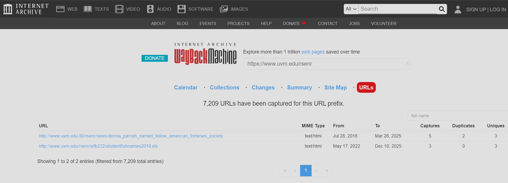

# Intel101 Lab

# Context

Lab link: [https://cyberdefenders.org/blueteam-ctf-challenges/intel101/](https://cyberdefenders.org/blueteam-ctf-challenges/intel101/)

Suggested tools: Google Lens, [archive.org](http://archive.org/), Whois, Wayback Machine

Tactics: Reconnaissance

# Scenario

This exercise focuses on Open-Source Intelligence (OSINT) as a method for mining and analyzing publicly available data. It aims to enhance skills in producing valuable insights when investigating external threats in the role of a security blue team analyst. Through practical application, participants will learn to effectively gather and interpret information to improve overall security measures.

# Questions

Q1- Who is the Registrar for `jameskainth.com`?

Answer: NameCheap

Reason: A `whois` lookup on `jameskainth.com` identified `NameCheap, Inc.` (IANA ID `1068`) as the sponsoring registrar, confirmed by the `Registrar:` and `Registrar WHOIS Server: whois.namecheap.com` fields in the record.

```python
$ whois jameskainth.com | grep -i registrar
   Registrar WHOIS Server: whois.namecheap.com
   Registrar URL: http://www.namecheap.com
   Registrar: NameCheap, Inc.
   Registrar IANA ID: 1068
   Registrar Abuse Contact Email: abuse@namecheap.com
   Registrar Abuse Contact Phone: +1.6613102107
registrar's sponsorship of the domain name registration in the registry is
registrar.  Users may consult the sponsoring registrar's Whois database to
view the registrar's reported date of expiration for this registration.
Registrars.
Registrar WHOIS Server: whois.namecheap.com
Registrar URL: http://www.namecheap.com
Registrar Registration Expiration Date: 2027-01-07T21:35:46.00Z
Registrar: NAMECHEAP INC
Registrar IANA ID: 1068
Registrar Abuse Contact Email: abuse@namecheap.com
Registrar Abuse Contact Phone: +1.9854014545
```

Q2- What is the Zoom meeting id of the British Prime Ministers Cabinet Meeting?

Answer: 539544323

Reason: OSINT review of public reporting on the UK Cabinet's video conferencing use during COVID-19 identified the Zoom meeting ID `539544323` for a British Prime Minister's Cabinet meeting, as documented in Graham Cluley's article covering the incident where the meeting ID was inadvertently exposed in a publicly posted photo.

```bash
Source: https://grahamcluley.com/uk-cabinet-zoom-meeting/
Context: "The UK Cabinet is meeting on Zoom… here’s the meeting ID"
```

Q3- In 2019 UVM's Ichthyology Class Had to Name their fish for class. Can you find out what the most recently assigned fish name was?

Answer: Saccopharyngiformes

Reason: Using the Wayback Machine's CDX listing for `www.uvm.edu/rsenr`, an archived copy of `studentfishnames2019.xls` was located and retrieved, listing the class roster of student-assigned fish taxonomic order names for UVM's 2019 Ichthyology course; the last entry in the roster, assigned to student `Wilkins, Dylan D.`, was `Saccopharyngiformes`, as shown in the `xls2csv` dump of the recovered spreadsheet.

```bash
$ xls2csv studentfishnames2019.xls
[...]
"Shapiro, Lily K."," Atheriniformes",,,,,
"Shore, Teighan J."," Beloniformes",,,,,
"Sloan, Oliver S."," Pleuronectiformes",,,,,
"Weller, Noah E."," Salmoniformes",,,,,
"Wilkins, Dylan D."," Saccopharyngiformes",,,,,
[...]
```



Q4- Can you identify the state from which this picture was taken? See the attached photo.

Answer: Virginia

Reason: A Google Lens reverse image search on the photograph matched the pterodactyl statue perched atop a tree stump, alongside the sculpted rock formations, to `Dinosaur Land`, a roadside attraction located in `White Post, Virginia`, identifying `Virginia` as the state where the photo was taken.

```bash
# Using Google Lens
The image shows a statue of a Pterodactyl perched on a tree stump, which appears to be located at Dinosaur Land in White Post, Virginia.
```

# Artifacts

| Category | Type | Value |
| --- | --- | --- |
| Domain Recon | Domain | `jameskainth.com` |
|  | Registrar | `NameCheap, Inc.` (IANA ID `1068`) |
| Exposed Meeting | Platform | `Zoom` |
|  | Meeting ID | `539544323` |
|  | Context | UK Cabinet meeting, ID exposed via publicly posted photo |
| Archived Record | Source | `Wayback Machine` |
|  | Archived URL | `http://www.uvm.edu/rsenr/wfb232/studentfishnames2019.xls` |
|  | Recovered Value | `Saccopharyngiformes` (last-assigned fish name, student `Wilkins, Dylan D.`) |
| Geolocation | Method | Google Lens reverse image search |
|  | Subject | Pterodactyl statue on tree stump |
|  | Identified Location | Dinosaur Land, White Post, Virginia |

# Lab Insights

- **Public records outlive their original purpose.** WHOIS data, archived class rosters, and old spreadsheets are never really deleted from the internet's memory — the Wayback Machine turned a routine university webpage into a fully recoverable dataset years after the live version presumably changed or vanished, showing that "gone from the site" and "gone from OSINT reach" are not the same thing.
- **Human error, not technical compromise, creates the loudest leaks.** The Zoom meeting ID exposure came from a photo someone chose to publish, not a breach or misconfiguration in Zoom itself. The most damaging OSINT finds are often self-inflicted by the target rather than extracted through any clever technique.
- **Visual data is queryable data.** A single photo with no GPS metadata still yielded a precise physical location once run through reverse image search, because visually distinctive landmarks (a specific statue, a specific building) function as unique fingerprints just as much as a hash or a domain name does.
- **OSINT chains multiple weak signals into one strong conclusion.** No single artifact here (a registrar name, a meeting ID, a spreadsheet cell, a photo) was sensitive in isolation, but each demonstrates how low-effort public lookups compound into meaningful intelligence about an organization or individual's footprint.