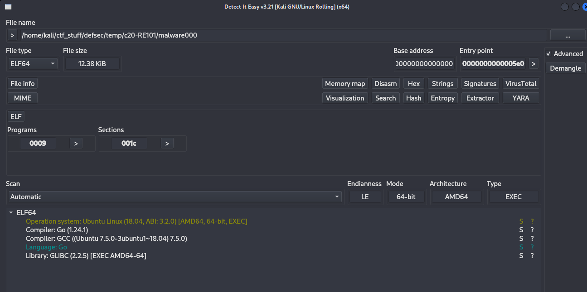

# RE101 Lab

# Context

Lab link: [https://cyberdefenders.org/blueteam-ctf-challenges/re101/](https://cyberdefenders.org/blueteam-ctf-challenges/re101/)

Suggested tools: IDA, Ghidra, Cutter, HxD, `zipdetails`

Tactics: Execution, Stealth

# Scenario

RE101 challenge is a binary analysis exercise - a task security blue team analysts do to understand how a specific malware works and extract possible intel.

# Questions

Q1- File: `MALWARE000` - I've used this new encryption I heard about online for my warez; I bet you can't extract the flag!

Answer: `0ops_i_used_1337_b64_encryption`

Reason: The `malware000` binary embeds its flag as a Base64-encoded ASCII string rather than any genuine encryption scheme, a common CTF/RE-lab misdirection where a challenge author frames trivial encoding as "encryption." Running `strings malware000` to extract printable character sequences from the binary, filtering for lines containing an `=` (a strong indicator of Base64 padding), and decoding the last matching candidate with `base64 -d` reveals the plaintext flag `0ops_i_used_1337_b64_encryption`, wrapped in a `flag<...>` marker consistent with this lab's flag format.

```bash
$ strings malware000 | grep "=" | tail -n 1 | base64 -d
flag<0ops_i_used_1337_b64_encryption>
```



Q2- File: Just some JS - Check out what I can do!

Answer: `what_a_cheeky_language!1!`

Reason: The `just_some_js` file is written entirely in JSF*ck, an esoteric JavaScript encoding that expresses arbitrary code using only the six characters `[`, `]`, `(`, `)`, `!`, and `+` by exploiting JavaScript's type coercion rules (e.g. `!+[]` evaluates to `true`, `[]+[]` evaluates to an empty string), which is the "cheeky" property the challenge author references since the code is unreadable to a human but perfectly valid to the JS engine. Executing the file directly with `node just_some_js` lets the interpreter evaluate the self-decoding logic and print the flag `what_a_cheeky_language!1!`.

```bash
$ node just_some_js     
flag<what_a_cheeky_language!1!>
```

Q3- File: This is not JS - I'm tired of JavaScript. Luckily, I found the grand-daddy of that lame last language!

Answer: `Now_THIS_is_programming`

Reason: The `this_is_not_js` file contains source code written in BF (an esoteric minimalist language commonly abbreviated this way), positioned by the challenge as the "grand-daddy" of JSF*ck since JSF*ck itself is a tribute/homage to BF's philosophy of extreme character-set minimalism. Interpreting the file with a BF interpreter (`beef`) executes the program's instruction sequence against its memory tape and prints the flag `Now_THIS_is_programming`.

```bash
$ cat this_is_not_js
++++++++++[>+>+++>+++++++>++++++++++<<<<-]>>>>++.++++++.-----------.++++++.<----------.++++++++++++++++++.>++++++++.++++++++.<+++++++++++++++++.-----------.------------.+.++++++++++.++++++++++++.++++++++++.>----.<----------.>---.++.---.<++++++++.>+++.<------.>-----..----.+++++.<++++++.<++++++++++++++++++++++++++++++++.
                                                                                                                                            
$ beef this_is_not_js
flag<Now_THIS_is_programming>
```

Q4- File: Unzip Me - I zipped flag.txt and encrypted it with the password "password", but I think the header got messed up... You can have the flag if you fix the file.

Answer: `R3ad_th3_spec`

Reason: The `file.zip_broken` local file header contained a corrupted Filename Length field: `zipdetails --scan` identified a `FATAL` truncation error at offset `0x1E`, tracing back to the Filename Length field at offset `0x1A` holding the value `5858` (22616 bytes) instead of the correct length for the 8-character filename `flag.txt`, causing every zip reader to expect far more header data than the file actually contained. Patching offset `26` (`0x1A`) with the corrected little-endian value `0800` (8) using `dd conv=notrunc` repaired the local file header, after which `file` and `unzip -l` both parsed the archive correctly and `unzip file.zip` (using the stated password `password`) extracted `flag.txt`, revealing the flag `R3ad_th3_spec`.

```bash
$ perl ./zipdetails/bin/zipdetails --scan file.zip_broken

0000 LOCAL HEADER #1       04034B50 (67324752)
0004 Extract Zip Spec      0A (10) '1.0'
0005 Extract OS            00 (0) 'MS-DOS'
0006 General Purpose Flag  0009 (9)
     [Bit  0]              1 'Encryption'
     [Bit  3]              1 'Streamed'
0008 Compression Method    0000 (0) 'Stored'
000A Modification Time     508EAB5A (1351527258) 'Tue Apr 14 17:26:52 2020'
000E CRC                   95672256 (2506564182)
0012 Compressed Size       00000020 (32)
0016 Uncompressed Size     00000014 (20)
001A Filename Length       5858 (22616)
001C Extra Length          001C (28)
#
# FATAL: Offset 0x1E: Unexpected zip file truncation while reading 'Filename' field in 'Local File Header'
#        Expected 0x5858 (22616) bytes, but only 0xB9 (185) available .

$ file file.zip_broken 
file.zip_broken: Zip archive data, made by v3.0 UNIX, extract using at least v1.0, last modified Apr 14 2020 21:26:52, uncompressed size 20, method=store
                                                                                                                                            
$ xxd file.zip_broken | head      
00000000: 504b 0304 0a00 0900 0000 5aab 8e50 5622  PK........Z..PV
00000010: 6795 2000 0000 1400 0000 5858 1c00 666c  g. .......XX..fl

$ cp file.zip_broken file.zip
                                                                                                                                            
$ printf '\x08\x00' | dd of=file.zip bs=1 seek=26 conv=notrunc status=none
                                                                                                                                            
$ xxd file.zip | head -2
00000000: 504b 0304 0a00 0900 0000 5aab 8e50 5622  PK........Z..PV
00000010: 6795 2000 0000 1400 0000 0800 1c00 666c  g. ...........fl
                                                                                                                                            
$ file file.zip       
file.zip: Zip archive data, at least v1.0 to extract, compression method=store
                                                                                                                                            
$ unzip -l file.zip
Archive:  file.zip
  Length      Date    Time    Name
---------  ---------- -----   ----
       20  2020-04-14 21:26   flag.txt
---------                     -------
       20                     1 file
                                                                                                                                            
$ unzip file.zip                       
Archive:  file.zip
[file.zip] flag.txt password: 
 extracting: flag.txt                
                                                                                                                                            
$ cat flag.txt               
flag<R3ad_th3_spec>

# More info on the zip spec
```Here's the canonical Local File Header layout per APPNOTE.TXT, built as a clean example for an 8-byte filename flag.txt, stored (uncompressed), no encryption:

Offset  Bytes            Field                        Meaning
0000    50 4B 03 04      Local File Header signature   'PK\x03\x04' — magic number identifying this record type
0004    14 00            Version needed to extract     20 (2.0) — minimum zip spec version a reader must support
0006    00 00            General purpose bit flag      0 — no encryption, no streaming/data-descriptor bit set
0008    00 00            Compression method             0 = Stored (no compression)
000A    00 00            Last mod file time            DOS time format (hour/min/sec packed into 16 bits)
000C    21 51            Last mod file date            DOS date format (year/month/day packed into 16 bits)
000E    12 34 56 78      CRC-32                         checksum of the uncompressed file data
0012    14 00 00 00      Compressed size                20 (0x14) bytes
0016    14 00 00 00      Uncompressed size               20 (0x14) bytes — matches since Stored = no compression
001A    08 00            Filename length                8 — exact byte length of the filename string that follows
001C    00 00            Extra field length             0 — no extra field data present
001E    66 6C 61 67      Filename (ASCII)               "flag" ...
        2E 74 78 74                                     "...txt" (8 bytes total = "flag.txt")
0026    <data...>        File data                       the actual 20 bytes of compressed/stored file content

The two fields that mattered in file.zip_broken's corruption were Filename Length at offset 0x1A and its downstream consequence — a reader has no way to know where the filename string ends (and the actual file data begins) except by trusting that 2-byte length field, which is exactly why setting it to a garbage value like 0x5858 broke every parser's ability to find the rest of the archive.
```
```

Q5- File: `MALWARE101` - Apparently, my encryption isn't so secure. I've got a new way of hiding my flags!

Answer: `sTaCk_strings_LMAO`

Reason: The `malware101` binary constructs its flag as a stack string, writing individual ASCII bytes one at a time into stack-local buffer slots (`local_1a0` through `local_1bc`) via a sequence of `MOV byte ptr [RBP+offset], imm8` instructions inside `main`, rather than storing the flag as a contiguous readable string in `.rodata`. This technique defeats static string extraction (`strings malware101` returns nothing for the flag), since the plaintext only assembles in memory at runtime as each byte-write instruction executes; a decoy `printf("Nothing to see here....\n")` call immediately precedes the stack-string construction, reinforcing the misdirection that `main` does nothing meaningful. Manually reading the disassembly and reordering each `local_N, 0xYY` pair by descending stack offset (`local_1bc` → `local_1a0`, consistent with the buffer's downward-growing layout) reconstructs the flag `sTaCk_strings_LMAO`.

```nasm
# Ghidra disassembly view

# Entry
# __libc_start_main’s first argument is main. That is the next function that actually runs the code.
void processEntry entry(undefined8 param_1,undefined8 param_2)

{
  undefined1 auStack_8 [8];
  
  __libc_start_main(main,param_2,&stack0x00000008,FUN_004005c0,stub_02,param_1,auStack_8);
  do {
                    /* WARNING: Do nothing block with infinite loop */
  } while( true );
}

# Pathway: entry → __libc_start_main(main, …) → main @ 004004d0
# Sort by the local_N number.
# Larger N first (local_1b8 → local_1a0). That is increasing memory address of a downward-growing stack, which is string order.
# The hex after the comma is the character. Instruction address on the left does not matter.
                             **************************************************************
                             *                          FUNCTION                          *
                             **************************************************************
                               undefined main()
             undefined         <UNASSIGNED>   <RETURN>
             undefined4        Stack[-0xc]:4  local_c                                 XREF[1]:     004004e5(W)  
             undefined1        Stack[-0x1a0   local_1a0                               XREF[1]:     0040051d(W)  
             undefined1        Stack[-0x1a1   local_1a1                               XREF[1]:     00400516(W)  
             undefined1        Stack[-0x1a2   local_1a2                               XREF[1]:     0040057f(W)  
             undefined1        Stack[-0x1a3   local_1a3                               XREF[1]:     00400578(W)  
             undefined1        Stack[-0x1a4   local_1a4                               XREF[1]:     00400594(W)  
             undefined1        Stack[-0x1a5   local_1a5                               XREF[1]:     0040056a(W)  
             undefined1        Stack[-0x1a6   local_1a6                               XREF[1]:     00400547(W)  
             undefined1        Stack[-0x1a7   local_1a7                               XREF[1]:     0040052b(W)  
             undefined1        Stack[-0x1a8   local_1a8                               XREF[1]:     004004ec(W)  
             undefined1        Stack[-0x1a9   local_1a9                               XREF[1]:     00400508(W)  
             undefined1        Stack[-0x1aa   local_1aa                               XREF[1]:     00400501(W)  
             undefined1        Stack[-0x1ab   local_1ab                               XREF[1]:     004004fa(W)  
             undefined1        Stack[-0x1ac   local_1ac                               XREF[1]:     00400563(W)  
             undefined1        Stack[-0x1ad   local_1ad                               XREF[1]:     0040055c(W)  
             undefined1        Stack[-0x1ae   local_1ae                               XREF[1]:     00400540(W)  
             undefined1        Stack[-0x1af   local_1af                               XREF[1]:     00400524(W)  
             undefined1        Stack[-0x1b0   local_1b0                               XREF[1]:     00400571(W)  
             undefined1        Stack[-0x1b1   local_1b1                               XREF[1]:     004004f3(W)  
             undefined1        Stack[-0x1b2   local_1b2                               XREF[1]:     00400539(W)  
             undefined1        Stack[-0x1b3   local_1b3                               XREF[1]:     0040050f(W)  
             undefined1        Stack[-0x1b4   local_1b4                               XREF[1]:     0040058d(W)  
             undefined1        Stack[-0x1b5   local_1b5                               XREF[1]:     00400586(W)  
             undefined1        Stack[-0x1b6   local_1b6                               XREF[1]:     00400532(W)  
             undefined1        Stack[-0x1b7   local_1b7                               XREF[1]:     0040054e(W)  
             undefined1        Stack[-0x1b8   local_1b8                               XREF[1]:     00400555(W)  
             undefined4        Stack[-0x1bc   local_1bc                               XREF[1]:     004005a4(W)  
                             main                                            XREF[3]:     entry:004003fd(*), 00400684, 
                                                                                          00400728(*)  
        004004d0 55              PUSH       RBP
        004004d1 48 89 e5        MOV        RBP,RSP
        004004d4 48 81 ec        SUB        RSP,0x1c0
                 c0 01 00 00
        004004db 48 bf 44        MOV        RDI,s_Nothing_to_see_here...._00400644           = "Nothing to see here....\n"
                 06 40 00 
                 00 00 00 00
        004004e5 c7 45 fc        MOV        dword ptr [RBP + local_c],0x0
                 00 00 00 00
        004004ec c6 85 60        MOV        byte ptr [RBP + local_1a8],0x67 'g'
                 fe ff ff 67
        004004f3 c6 85 57        MOV        byte ptr [RBP + local_1b1],0x61 'a'
                 fe ff ff 61
        004004fa c6 85 5d        MOV        byte ptr [RBP + local_1ab],0x72 'r'
                 fe ff ff 72
        00400501 c6 85 5e        MOV        byte ptr [RBP + local_1aa],0x69 'i'
                 fe ff ff 69
        00400508 c6 85 5f        MOV        byte ptr [RBP + local_1a9],0x6e 'n'
                 fe ff ff 6e
        0040050f c6 85 55        MOV        byte ptr [RBP + local_1b3],0x73 's'
                 fe ff ff 73
        00400516 c6 85 67        MOV        byte ptr [RBP + local_1a1],0x3e '>'
                 fe ff ff 3e
        0040051d c6 85 68        MOV        byte ptr [RBP + local_1a0],0x0 'end'
                 fe ff ff 00
        00400524 c6 85 59        MOV        byte ptr [RBP + local_1af],0x6b 'k'
                 fe ff ff 6b
        0040052b c6 85 61        MOV        byte ptr [RBP + local_1a7],0x73 's'
                 fe ff ff 73
        00400532 c6 85 52        MOV        byte ptr [RBP + local_1b6],0x61 'a'
                 fe ff ff 61
        00400539 c6 85 56        MOV        byte ptr [RBP + local_1b2],0x54 'T'
                 fe ff ff 54
        00400540 c6 85 5a        MOV        byte ptr [RBP + local_1ae],0x5f '_'
                 fe ff ff 5f
        00400547 c6 85 62        MOV        byte ptr [RBP + local_1a6],0x5f '_'
                 fe ff ff 5f
        0040054e c6 85 51        MOV        byte ptr [RBP + local_1b7],0x6c 'l'
                 fe ff ff 6c
        00400555 c6 85 50        MOV        byte ptr [RBP + local_1b8],0x66 'f' <--
                 fe ff ff 66
        0040055c c6 85 5b        MOV        byte ptr [RBP + local_1ad],0x73 's'
                 fe ff ff 73
        00400563 c6 85 5c        MOV        byte ptr [RBP + local_1ac],0x74 't'
                 fe ff ff 74
        0040056a c6 85 63        MOV        byte ptr [RBP + local_1a5],0x4c 'L'
                 fe ff ff 4c
        00400571 c6 85 58        MOV        byte ptr [RBP + local_1b0],0x43 'c'
                 fe ff ff 43
        00400578 c6 85 65        MOV        byte ptr [RBP + local_1a3],0x41 'A'
                 fe ff ff 41
        0040057f c6 85 66        MOV        byte ptr [RBP + local_1a2],0x4f 'O'
                 fe ff ff 4f
        00400586 c6 85 53        MOV        byte ptr [RBP + local_1b5],0x67 'g'
                 fe ff ff 67
        0040058d c6 85 54        MOV        byte ptr [RBP + local_1b4],0x3c '<'
                 fe ff ff 3c
        00400594 c6 85 64        MOV        byte ptr [RBP + local_1a4],0x4d 'M'
                 fe ff ff 4d
[...]
```

## Stack Strings

Stack strings are a string-obfuscation technique where a program builds a plaintext string entirely at runtime, one or more bytes at a time, via a sequence of immediate-value writes into stack-local memory — instead of storing the string as a contiguous blob in `.rodata`. Because the string never exists as readable bytes anywhere in the static binary image, tools that scan file contents (`strings`, most YARA rules) find nothing. The plaintext only comes into existence in memory once the instruction sequence actually executes, which means recovering it statically requires reconstructing that sequence by hand or via emulation rather than just reading the file. It's a cheap technique — no encryption, no packing — but effective against the very first triage step almost every analyst and automated sandbox runs.

**Example — `malware101`:** `strings malware101` returns nothing for the flag, and `main` opens with a decoy `printf("Nothing to see here....\n")` that reinforces the impression the function does nothing meaningful. Disassembly tells a different story: 28 individual `MOV byte ptr [RBP+local_N], imm8` instructions, each writing one ASCII character into a stack buffer spanning `local_1bc` (start) down to `local_1a0` (end). Ghidra's variable pane lists these XREFs out of execution order, so the flag never appears contiguous anywhere in the listing. Sorting the writes by descending `local_N` — matching the buffer's downward-growing layout — reconstructs the plaintext in correct order: `sTaCk_strings_LMAO`.

**Key Pivot/Insight:** The flag isn't encoded or hidden — it's simply never assembled as a unit anywhere except in live memory, mid-execution. Manual disassembly reordering works for a small, fixed byte count like this; real malware more often builds strings via an XOR/decode loop rather than bare immediates, which is where emulation-based tooling (`flare-floss`, built on `vivisect`) earns its keep instead of hand-sorting offsets.

**Root Cause:** No cryptographic obfuscation at all — just structural placement of plaintext bytes across scattered stack slots, paired with a decoy print to misdirect a human skimming the function.

**Lessons for Future Engagements:** Static string triage alone produces false negatives. Pair `strings`/YARA sweeps with an emulation-based stack-string detector, and treat a suspiciously "empty" or decoy-output function as a cue to check the disassembly directly.

**Example code**

Compiled, that becomes a handful of `mov byte ptr [rbp-N], imm8` in **source order**, not index order. In memory the buffer is still `"flag"`. Ghidra will name the slots something like local_8 … local_4. Sort by those names / offsets, not by the instruction list, and you get `f l a g \0`. That is all a stack string is: a local `char[]` filled one byte at a time so strings on the binary does not see `flag`.

```c
#include <stdio.h>

int main(void) {
    char s[5];

    s[0] = 'f';
    s[3] = 'g';
    s[1] = 'l';
    s[4] = 0;
    s[2] = 'a';

    printf("Nothing to see here....\n");
    return 0;
}
```

Q6- File: `MALWARE201` - Ugh... I guess I'll just roll my own encryption. I'm not too good at math, but it looks good to me!

Answer: `malwar3-3ncryp710n-15-Sh17`

Reason: Here's the analysis organized as a clean step-by-step walkthrough:

1. Locate the entry point — `main()` in `malware201` calls `FUN_00400620` (renamed `encrypt`) on a hardcoded self-test string, `"my message"`.
2. Identify the embedded flag data — A separate 32-byte ciphertext blob is statically stored at `&DAT_0040082b` and printed via a helper (renamed `hex_printer`) that formats each byte as `\xNN`.
3. Reverse the encryption routine — Decompiling `encrypt()` in Ghidra reveals the per-byte transform:
    
    ```
    ciphertext[i] = (plaintext[i] << 1 | 1) XOR ((i mod 255) | 0xa0)
    ```
    
4. Simplify the key stream — Since `0xa0`'s low 5 bits are zero, `(i mod 255) | 0xa0` reduces to `0xa0 + i` for any `i < 32` — an incrementing key sequence `0xa0`–`0xbf`.
5. Derive the inverse operation — Because XOR is self-inverse, and `<<1 | 1` is bijective on 7-bit ASCII (it forces every output byte odd, so a logical right shift by 1 recovers the original with no ambiguity):
    
    ```
    plaintext[i] = (ciphertext[i] XOR ((i mod 255) | 0xa0)) >> 1
    ```
    
6. Validate the formula — Manually apply the derived inverse to the binary's own `"my message"` self-test output and confirm it matches byte-for-byte.
7. Apply the recipe to the flag blob — In CyberChef, chain:
    - `From Hex`
    - `XOR` against the incrementing key sequence `0xa0`–`0xbf`
    - `Bit Shift Right` (logical, by 1)
8. Result — The 32-byte flag ciphertext decodes to:
    
    ```
    flag<malwar3-3ncryp710n-15-Sh17>
    ```
    


```c
// encrypt() decompiled (Ghidra)
// Per-byte transform: left-shift the input, force LSB to 1, then XOR with (i % 0xff) | 0xa0. The 128-bit Ghidra math is just a zero-extended i % 255.

void * encrypt(long param_1,size_t param_2)
{
  undefined1 auVar1 [16];
  void *pvVar2;
  undefined8 local_28;

  pvVar2 = calloc(param_2,1);
  for (local_28 = 0; local_28 < param_2; local_28 = local_28 + 1) {
    auVar1._8_8_ = 0;
    auVar1._0_8_ = local_28;
    *(byte *)((long)pvVar2 + local_28) =
         (*(char *)(param_1 + local_28) << 1 | 1U) ^ (SUB161(auVar1 % ZEXT816(0xff),0) | 0xa0);
  }
  return pvVar2;
}

// Rename variables
void *encrypt(const unsigned char *plaintext, size_t len)
{
    unsigned char *ciphertext;
    size_t i;

    ciphertext = calloc(len, 1);                 // output buffer, same length, zeroed
    for (i = 0; i < len; i++) {
        unsigned char shifted = (plaintext[i] << 1) | 1;          // drop MSB, force LSB=1
        unsigned char key     = (unsigned char)(i % 0xff) | 0xa0; // (i % 255) | 0xa0
        ciphertext[i] = shifted ^ key;
    }
    return ciphertext;
}
```

# Artifacts

| Category | Type | Value |
| --- | --- | --- |
| Sample | File | `malware000` (ELF64, unstripped) |
|  | File | `malware101` (ELF64, stripped) |
|  | File | `malware201` (ELF64, stripped) |
|  | File | `file.zip_broken` (corrupted PKWARE zip) |
|  | File | `just_some_js` (JSF*ck-encoded JS) |
|  | File | `this_is_not_js` (BF-encoded source) |
| Encoding | Method (Q1) | Base64, extracted via `strings | grep "="` |
|  | Method (Q2) | JSF*ck (6-character JS type-coercion encoding) |
|  | Method (Q3) | BF (8-command esoteric language) |
| Zip Structure | Corrupted field | Filename Length @ offset `0x1A` = `5858` (should be `0008`) |
|  | Fix applied | `dd conv=notrunc` patch of offset `26` to `0800` |
|  | Password | `password` |
| Anti-Analysis | Technique (malware101) | Decoy `main()` printing `"Nothing to see here....\n"` |
|  | Technique (malware101) | Stack string construction (flag built byte-by-byte via `MOV byte ptr` into stack locals) |
|  | Tool limitation | `flare-floss` does not support ELF stackstring detection (PE-only) |
| Custom Encryption | Function (malware201) | `encrypt()` @ `FUN_00400620` |
|  | Algorithm | `c[i] = ((p[i]<<1)|1) XOR ((i mod 255)|0xa0)` |
|  | Key sequence | `a0a1a2a3a4a5a6a7a8a9aaabacadaeafb0b1b2b3b4b5b6b7b8b9babbbcbdbebf` |
|  | Decrypt recipe | CyberChef: From Hex -> XOR -> Bit Shift Right (1, logical) |
| Flags | Q1 | `flag<0ops_i_used_1337_b64_encryption>` |
|  | Q2 | `flag<what_a_cheeky_language!1!>` |
|  | Q3 | `flag<Now_THIS_is_programming>` |
|  | Q4 | `flag<R3ad_th3_spec>` |
|  | Q5 | `flag<sTaCk_strings_LMAO>` |
|  | Q6 | `flag<malwar3-3ncryp710n-15-Sh17>` |

# Lab Insights

- **Trusting the first visible function is a trap.** Both `malware101`'s decoy `main()` (a taunting `printf` and nothing else) and the recurring pattern of glibc boilerplate stubs (`__libc_csu_init`/`__libc_csu_fini`) masquerading as unnamed `FUN_` entries show that surface-level behavior at the entry point tells you almost nothing. The only reliable anchor was tracing the actual argument passed to `__libc_start_main`, confirming which function the runtime truly treats as `main`, rather than assuming the first thing a disassembler lands on is the whole story.
- **"Static analysis" is a spectrum, not one technique.** Base64 (Q1), stack strings (Q5), and interpreted esoteric-language source (Q2, Q3) each defeated naive byte-pattern tools like `strings` in a different way, yet all were fully solvable without executing anything malicious, once the analysis moved to the right layer — decoding, manual instruction-level semantics reading, or simply invoking the correct interpreter. Automated tooling (`flare-floss`) also proved format-limited (PE-only), reinforcing that no single tool covers every obfuscation technique across platforms.
- **Homebrew crypto tends to break on a hidden assumption, not brute force.** `malware201`'s cipher looked opaque as raw bytes, but its `(p<<1)|1` step was only bijective because the author implicitly assumed 7-bit ASCII input — an unstated domain restriction that made the whole scheme perfectly invertible once identified, illustrating that weak custom cryptography usually fails on a design oversight rather than requiring computational brute force to defeat.
- **Corrupted structured formats are still spec-defined documents.** The broken zip header was solved entirely by treating `zipdetails`' fatal error as a precise pointer into the APPNOTE.TXT field layout, then patching a single 2-byte field once its correct value was derivable from the filename's actual length. This is a transferable habit for any binary format investigation: a parser error is a description of exactly which field violates the spec, not a reason to reach for a black-box repair tool.