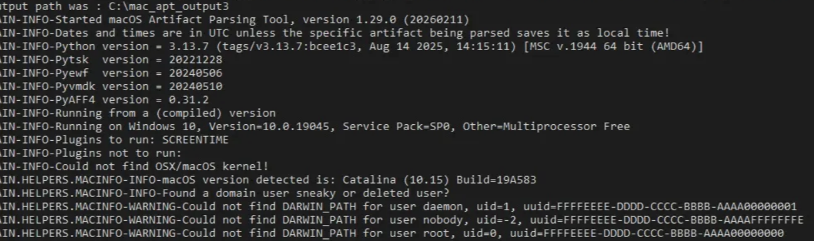

# Spotlight Lab

# Context

Lab link: [https://cyberdefenders.org/blueteam-ctf-challenges/spotlight/](https://cyberdefenders.org/blueteam-ctf-challenges/spotlight/)

Suggested tools: Autopsy, `mac_apt`, SQLite, `steghide`

Tactics: Stealth, Credential Access, Discovery, Collection

# Scenario

Spotlight is a MAC OS image forensics challenge where you can evaluate your DFIR skills against an OS you usually encounter in today's case investigations as a security blue team member.

# Questions

Q1- What version of macOS is running on this image?

Answer: `10.15`

Reason: The disk image `FruitBook.ad1` hosts a macOS `10.15` (Catalina) system volume, build `19A583`, confirmed via `SystemVersion.plist` at `/System/Library/CoreServices/` on the mounted APFS volume `macOS Catalina [volume_4]`.

```bash
# After mounting the .ad1 image using a tool such as 4n6mount

$ cat "macOS Catalina [volume_4]/root/System/Library/CoreServices/SystemVersion.plist"
<?xml version="1.0" encoding="UTF-8"?>
<!DOCTYPE plist PUBLIC "-//Apple//DTD PLIST 1.0//EN" "http://www.apple.com/DTDs/PropertyList-1.0.dtd">
<plist version="1.0">
<dict>
        <key>ProductBuildVersion</key>
        <string>19A583</string>
        <key>ProductCopyright</key>
        <string>1983-2019 Apple Inc.</string>
        <key>ProductName</key>
        <string>Mac OS X</string>
        <key>ProductUserVisibleVersion</key>
        <string>10.15</string>
        <key>ProductVersion</key>
        <string>10.15</string>
        <key>iOSSupportVersion</key>
        <string>13.0</string>
</dict>
</plist>
```

Q2- What "competitive advantage" did Hansel lie about in the file `AnotherExample.jpg`? (two words)

Answer: flip phone

Reason: Hansel falsely claimed the upcoming phone would feature `"flip phone"` technology as a competitive advantage, per a note recovered at `/Users/Shared/secret` on the mounted volume, alongside a decoy image set (`AnotherExample.jpg`, `Example.jpg`, `GoodExample.jpg`) and its `AnotherExample.jpg.FileSlack` sibling in the same `/Users/Shared` directory.

```bash
$ ls ./macOS\ Catalina\ -\ Data\ \[volume_0\]/root/Users/Shared
 adi   AnotherExample.jpg   AnotherExample.jpg.FileSlack   Example.jpg   GoodExample.jpg  'SC Info'   secret
                                                                                                                                                 
$ cat ./macOS\ Catalina\ -\ Data\ \[volume_0\]/root/Users/Shared/secret
!Our newest phone will have helicopter blades and six cameras and <"flip phone"> technology!
```

Q3- How many bookmarks are registered in Safari?

Answer: 13

Reason: Safari on the user `hansel.apricot`'s profile registers 13 bookmarks, determined by parsing `Bookmarks.plist` at `/Users/hansel.apricot/Library/Safari/` and counting entries typed `WebBookmarkTypeLeaf`.

```bash
$ python3 -c "
import plistlib, pprint
with open('./macOS Catalina - Data [volume_0]/root/Users/hansel.apricot/Library/Safari/Bookmarks.plist','rb') as f:
    pprint.pp(plistlib.load(f))
" | grep -i WebBookmarkTypeLeaf | wc -l
13
```

Q4- What's the content of the note titled `Passwords`?

Answer: `Passwords`

Reason: The note titled `Passwords` (Z_PK `7`, ZIDENTIFIER `6585435D-75E7-4777-8E99-AE5341D3C72C`) contains only the string `Passwords` itself, recovered by extracting the `gzip`-compressed protobuf blob from `ZICNOTEDATA.ZDATA` (114 bytes) and decompressing it.

```bash
$ sqlite3 "./macOS Catalina - Data [volume_0]/root/Users/hansel.apricot/Library/Group Containers/group.com.apple.notes/NoteStore.sqlite" "SELECT Z_PK, ZTITLE1, ZIDENTIFIER FROM ZICCLOUDSYNCINGOBJECT WHERE ZTITLE1='Passwords';"
╭──────┬───────────┬──────────────────────────────────────╮
│ Z_PK │  ZTITLE1  │             ZIDENTIFIER              │
╞══════╪═══════════╪══════════════════════════════════════╡
│    7 │ Passwords │ 6585435D-75E7-4777-8E99-AE5341D3C72C │
╰──────┴───────────┴──────────────────────────────────────╯
                                                                                                                                                 
$ sqlite3 "./macOS Catalina - Data [volume_0]/root/Users/hansel.apricot/Library/Group Containers/group.com.apple.notes/NoteStore.sqlite" "SELECT writefile('/tmp/note7.bin', ZDATA) FROM ZICNOTEDATA WHERE ZNOTE=7;"
╭──────────────────────╮
│ writefile('/tmp/n... │
╞══════════════════════╡
│                  114 │
╰──────────────────────╯
                                                                                                                                                 
$ zcat /tmp/note7.bin | strings -n 3
Passwords
```

Q5- Provide the MAC address of the ethernet adapter for this machine.

Answer: `00:0c:29:c4:65:77`

Reason: The Ethernet adapter's MAC address is `00:0c:29:c4:65:77`, registered to interface `en0` as shown in cached `netstat -i` output logged in `/private/var/log/daily.out`. The `00:0c:29` OUI prefix identifies it as a VMware virtual NIC, consistent with this image originating from a VM.

```bash
$ grep -B2 -A2 "00:0c:29:c4:65:77" "macOS Catalina - Data [volume_0]/root/private/var/log/daily.out"
gif0* 1280  <Link#2>                             0     0        0     0     0
stf0* 1280  <Link#3>                             0     0        0     0     0
en0   1500  <Link#4>    00:0c:29:c4:65:77   372733     0    73025     0     0
en0   1500  fe80::8c8:8 fe80:4::8c8:87c2:   372733     -    73025     -     -
en0   1500  184.171.151/2 stu-181-151-171   372733     -    73025     -     -
--
gif0* 1280  <Link#2>                             0     0        0     0     0
stf0* 1280  <Link#3>                             0     0        0     0     0
en0   1500  <Link#4>    00:0c:29:c4:65:77      790     0      694     0     0
en0   1500  fe80::1cba: fe80:4::1cba:cac8      790     -      694     -     -
en0   1500  184.171.151/2 stu-181-151-171      790     -      694     -     -
```

Q6- Name the data URL of the quarantined item.

Answer: `hxxps://futureboy.us/stegano/encode.pl`

Reason: The quarantined item's data URL is `hxxps://futureboy[.]us/stegano/encode.pl`, recovered from the `LSQuarantineEvent` table of `com.apple.LaunchServices.QuarantineEventsV2` under user `sneaky`'s profile, pointing to an online steganography encoding tool consistent with the lab's steganography theme.

```bash
$ sqlite3 "macOS Catalina - Data [volume_0]/root/Users/sneaky/Library/Preferences/com.apple.LaunchServices.QuarantineEventsV2" "SELECT LSQuarantineDataURLString FROM LSQuarantineEvent;"
╭────────────────────────────────────────╮
│          LSQuarantineDataU...          │
╞════════════════════════════════════════╡
│ https://futureboy.us/stegano/encode.pl │
╰────────────────────────────────────────╯
```

Q7- What app did the user `sneaky` try to install via a `.dmg` file? (one word)

Answer: `silenteye`

Reason: User `sneaky` attempted to install `SilentEye`, a steganography tool, via the disk image `silenteye-0.4.1b-snowleopard.dmg` found discarded in `~/.Trash/`.

```bash
$ find "macOS Catalina - Data [volume_0]/root/Users/sneaky" -iname "*.dmg"
macOS Catalina - Data [volume_0]/root/Users/sneaky/.Trash/silenteye-0.4.1b-snowleopard.dmg
```

Q8- What was the file `Examplesteg.jpg` renamed to?

Answer: `GoodExample.jpg`

Reason: The file `Examplesteg.jpg`, downloaded to `Users/sneaky/Downloads/`, was renamed to `GoodExample.jpg`, as shown by the adjacent `FSEvents` transaction entries for the same directory recovered from `.fseventsd`.

```bash
$ for f in "macOS Catalina - Data [volume_0]/root/.fseventsd/"*; do zcat "$f" 2>/dev/null; done | strings -a | grep -i -B2 -A2 "examplesteg"
Users/sneaky/Downloads/.DS_Store
Users/sneaky/Downloads/Example.jpg
Users/sneaky/Downloads/Examplesteg.jpg
Users/sneaky/Downloads/Examplesteg.jpg.download
Users/sneaky/Downloads/Examplesteg.jpg.download/Examplesteg.jpg
Users/sneaky/Downloads/Examplesteg.jpg.download/Info.plist
Users/sneaky/Downloads/GoodExample.jpg
Users/sneaky/Library/Application Scripts/com.apple.Preview
```

Q9- How much time was spent on `mail.zoho.com` on `4/20/2020`?

Answer: 20:58

Reason: On `4/20/2020`, `274` seconds (`00:04:34`) plus `984` seconds (`00:16:24`) of active `mail.zoho.com` usage were logged across two separate hourly usage blocks (`2020-04-20 01:00:00` and `2020-04-20 03:00:00`), for a total of 20 minutes 58 seconds, recovered from the `ScreenTime` backing store `RMAdminStore-Local.sqlite` (`ZUSAGETIMEDITEM` joined to `ZUSAGECATEGORY`/`ZUSAGEBLOCK` for the date).

```bash
$ sqlite3 /tmp/RMAdminStore-Local.sqlite "SELECT ZUSAGETIMEDITEM.Z_PK, ZUSAGETIMEDITEM.ZDOMAIN, ZUSAGETIMEDITEM.ZTOTALTIMEINSECONDS, datetime(ZUSAGEBLOCK.ZSTARTDATE+978307200,'unixepoch') FROM ZUSAGETIMEDITEM JOIN ZUSAGECATEGORY ON ZUSAGETIMEDITEM.ZCATEGORY=ZUSAGECATEGORY.Z_PK JOIN ZUSAGEBLOCK ON ZUSAGECATEGORY.ZBLOCK=ZUSAGEBLOCK.Z_PK WHERE ZUSAGETIMEDITEM.ZDOMAIN LIKE '%zoho%';"
╭──────┬───────────────────┬─────────────────────┬──────────────────────╮
│ Z_PK │      ZDOMAIN      │ ZTOTALTIMEINSECONDS │ datetime(ZUSAGEBL... │
╞══════╪═══════════════════╪═════════════════════╪══════════════════════╡
│   15 │ mail.zoho.com     │                  67 │ 2020-04-12 17:00:00  │
│   20 │ zoho.com          │                  12 │ 2020-04-12 17:00:00  │
│   23 │ accounts.zoho.com │                  24 │ 2020-04-12 17:00:00  │
│   34 │ mail.zoho.com     │                  31 │ 2020-04-12 18:00:00  │
│   58 │ mail.zoho.com     │                 274 │ 2020-04-20 01:00:00  │
│   72 │ mail.zoho.com     │                 984 │ 2020-04-20 03:00:00  │
╰──────┴───────────────────┴─────────────────────┴──────────────────────╯
```



Q10- What's `hansel.apricot`'s password hint? (two words)

Answer: `Family Opinion`

Reason: The user `hansel.apricot`'s password hint is `Family Opinion`, recovered from the `hint` key in the local account plist `hansel.apricot.plist` under `/private/var/db/dslocal/nodes/Default/users/`.

```bash
$ python3 -c "import plistlib,pprint; pprint.pp(plistlib.load(open('macOS Catalina - Data [volume_0]/root/private/var/db/dslocal/nodes/Default/users/hansel.apricot.plist','rb')))" | grep -i hint
 'hint': ['Family Opinion'],
 '_writers_hint': ['hansel.apricot'],
```

Q11- The main file that stores Hansel's iMessages had a few permissions changes. How many times did the permissions change?

Answer: 7

Reason: The main file storing Hansel's iMessages, `chat.db` at `/Users/hansel.apricot/Library/Messages/chat.db`, underwent 7 permission-change events, identified by filtering the `FsEvents` table (parsed via mac_apt's FSEVENTS plugin from `.fseventsd`) for that `filepath` where `EventFlags = 'PermissionChange'`.

```bash
$ sqlite3 /tmp/mac_apt_out/mac_apt02.db "SELECT COUNT(*) FROM FsEvents WHERE Filepath LIKE '%hansel.apricot/Library/Messages/chat.db' AND EventFlags='PermissionChange';"
╭──────────╮
│ COUNT(*) │
╞══════════╡
│        7 │
╰──────────╯
```

Q12- What's the UID of the user who is responsible for connecting mobile devices?

Answer: `213`

Reason: The system service account responsible for connecting mobile devices is `_usbmuxd`, holding UID `213`, recovered from `_usbmuxd.plist` under `/private/var/db/dslocal/nodes/Default/users/`.

```bash
$ python3 -c "import plistlib,pprint; pprint.pp(plistlib.load(open('/mnt/tmp_mount/ro/root/FruitBook.E01:Partition 2 [102071MB]:[APFS Container] (5_5) [APFS]/macOS Catalina - Data [volume_0]/root/private/var/db/dslocal/nodes/Default/users/_usbmuxd.plist','rb')))" | grep -i uid
 'uid': ['213'],
 'generateduid': ['FFFFEEEE-DDDD-CCCC-BBBB-AAAA000000D5'],
```

Q13- Find the flag in the `GoodExample.jpg` image. It's hidden with better tools.

Answer: `helicopter`

Reason: The steghide-embedded flag in `GoodExample.jpg` is `helicopter`, extracted with an empty passphrase using `stegseek`, revealing a hidden marketing note referencing helicopter blades.

```bash
$ stegseek "/mnt/tmp_mount/ro/root/FruitBook.E01:Partition 2 [102071MB]:[APFS Container] (5_5) [APFS]/macOS Catalina - Data [volume_0]/root/Users/Shared/GoodExample.jpg" -xf /tmp/goodexample_out.txt
StegSeek 0.6 - https://github.com/RickdeJager/StegSeek

[i] Found passphrase: ""
[i] Original filename: "steganopayload27635.txt".
[i] Extracting to "/tmp/goodexample_out.txt".
                                                                                                                                                      
$ cat /tmp/goodexample_out.txt 
Our latest phone will have flag<helicopter> blades and 6 cameras on it. No
other phone has those features!  
```

Q14- What was exactly typed in the Spotlight search bar on `4/20/2020 02:09:48`?

Answer: `term`

Reason: At `2020-04-20 02:09:48 UTC`, the user typed `term` into the Spotlight search bar, which resolved to and launched `Terminal.app` (`/System/Applications/Utilities/Terminal.app`), per the `LAST_USED` timestamp recorded in `com.apple.spotlight.Shortcuts` under `~/Library/Application Support/com.apple.spotlight/` for user `sneaky`.

```bash
$ cat "/mnt/tmp_mount/ro/root/FruitBook.E01:Partition 2 [102071MB]:[APFS Container] (5_5) [APFS]/macOS Catalina - Data [volume_0]/root/Users/sneaky/Library/Application Support/com.apple.spotlight/com.apple.spotlight.Shortcuts"
<?xml version="1.0" encoding="UTF-8"?>
<!DOCTYPE plist PUBLIC "-//Apple//DTD PLIST 1.0//EN" "http://www.apple.com/DTDs/PropertyList-1.0.dtd">
<plist version="1.0">
<dict>
        <key>silent</key>
        <dict>
                <key>DISPLAY_NAME</key>
                <string>silenteye-0.4.1b-snowleopard_installer</string>
                <key>LAST_USED</key>
                <date>2020-04-20T02:44:27Z</date>
                <key>URL</key>
                <string>/Applications/silenteye-0.4.1b-snowleopard_installer.app</string>
        </dict>
        <key>term</key>
        <dict>
                <key>DISPLAY_NAME</key>
                <string>Terminal</string>
                <key>LAST_USED</key>
                <date>2020-04-20T02:09:48Z</date>
                <key>URL</key>
                <string>/System/Applications/Utilities/Terminal.app</string>
        </dict>
</dict>
</plist>
```

Q15- What is `hansel.apricot`'s Open Directory user UUID?

Answer: `5BB00259-4F58-4FDE-BC67-C2659BA0A5A4`

Reason: The Open Directory user UUID for `hansel.apricot` is `5BB00259-4F58-4FDE-BC67-C2659BA0A5A4`, recovered from the `generateduid` key in `hansel.apricot.plist` under `/private/var/db/dslocal/nodes/Default/users/`.

```bash
$ python3 -c "import plistlib,pprint; pprint.pp(plistlib.load(open('/mnt/tmp_mount/ro/root/FruitBook.E01:Partition 2 [102071MB]:[APFS Container] (5_5) [APFS]/macOS Catalina - Data [volume_0]/root/private/var/db/dslocal/nodes/Default/users/hansel.apricot.plist','rb')))" | grep -i generateduid
 'generateduid': ['5BB00259-4F58-4FDE-BC67-C2659BA0A5A4'],
```

# Artifacts

| Category | Type | Value |
| --- | --- | --- |
| System | OS Version | macOS `10.15` (Catalina), build `19A583` |
|  | Ethernet MAC | `00:0c:29:c4:65:77` (`en0`, VMware OUI) |
| Users | Suspect account | `hansel.apricot` |
|  | Secondary account | `sneaky` |
|  | hansel.apricot password hint | `Family Opinion` |
|  | hansel.apricot Open Directory UUID | `5BB00259-4F58-4FDE-BC67-C2659BA0A5A4` |
|  | Mobile-device connection service UID | `213` (`_usbmuxd`) |
| Steganography | Encoder site (quarantined) | `hxxps://futureboy[.]us/stegano/encode.pl` |
|  | Tool downloaded | `SilentEye` (`silenteye-0.4.1b-snowleopard.dmg`, found in Trash) |
|  | Decoy/cover file | `AnotherExample.jpg` (fabricated via `cat Example.jpg secret`) |
|  | Renamed steg file | `Examplesteg.jpg` → `GoodExample.jpg` |
|  | Embedded flag | `helicopter` (extracted via `stegseek`, blank passphrase) |
| Communication | iMessage store | `/Users/hansel.apricot/Library/Messages/chat.db` (`7` permission-change events) |
|  | Notes app entry | Note titled `Passwords`, content = `Passwords` |
| Browser/Web | Safari bookmarks | `13` registered |
|  | Zoho Mail usage | `mail.zoho.com`, `00:20:58` total on `2020-04-20` |
| Discovery | Spotlight search | `term` typed at `2020-04-20 02:09:48 UTC` → launched `Terminal.app` |

# Lab Insights

- **Deleted artifacts don't erase intent — they relocate it.** The `Examplesteg.jpg` → `GoodExample.jpg` rename, the `SilentEye` installer sitting in `.Trash`, and the discarded original filename in FSEvents all show that macOS keeps a durable record of file lifecycle events independent of what the user thinks they've cleaned up. FSEvents in particular proved to be the most consistently reliable artifact across this lab — it survived a file being renamed, downloaded, and referenced nowhere else in a readable form.
- **"Time spent" and "what was typed" live in surprisingly specific, siloed databases.** ScreenTime duration (`RMAdminStore-Local.sqlite`) and Spotlight query history (`com.apple.spotlight.Shortcuts`) aren't in any single unified log — each UX feature Apple ships tends to get its own bespoke SQLite/plist store with its own schema quirks (WAL-only data, category/block join chains). Knowing *which* app feature generates *which* backing store was the actual bottleneck in this lab, not the querying itself.
- **Weak steganography defeats itself.** The flag was recoverable with `stegseek` in seconds because the passphrase was left blank — a reminder that steghide's security model is entirely dependent on passphrase strength that the tool never enforces. The lab's contrast between `steghide extract` (failed, assumed a passphrase was needed) and `stegseek` (auto-cracked instantly) is a clean illustration of why brute-force-first tooling should be the default triage step, not a last resort.
- **Tooling friction is itself a forensic skill.** Getting `mac_apt` running required diagnosing a C standard mismatch in a 2010s-era C codebase, an ABI conflict with a system library, and Catalina's split System/Data volume architecture defeating naive mounted-image detection. None of that was scenario-specific — it's the standing cost of running community forensic tooling against a rolling-release Linux distro, and worth documenting once so it doesn't have to be re-solved per lab.