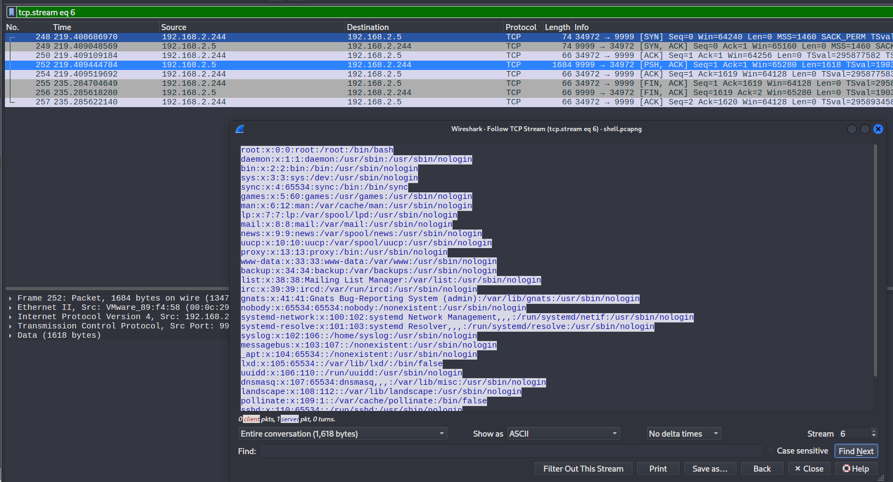

# WireDive Lab

# Table of Contents
- [Context](#context)
- [Scenario](#scenario)
- [DHCP](#dhcp)
- [DNS](#dns)
- [SMB](#smb)
- [Shell](#shell)
- [Network](#network)
- [HTTPS](#https)
- [Artifacts](#artifacts)
- [Lab Insights](#lab-insights)

# Context

Lab link: [https://cyberdefenders.org/blueteam-ctf-challenges/wiredive/](https://cyberdefenders.org/blueteam-ctf-challenges/wiredive/)

Suggested tools: Brim, Wireshark

Tactics: Initial Access, Execution, Persistence, Lateral Movement, Collection, Command and Control, Exfiltration

# Scenario

WireDive is a combo traffic analysis exercise that contains various traces to help you understand how different protocols look on the wire where you can evaluate your DFIR skills against an artifact you usually encounter in today's case investigations as a security blue team member.

**Challenge Files**

- `dhcp.pcapng`
- `dns.pcapng`
- `https.pcapng`
- `network.pcapng`
- `secret_sauce.txt`
- `shell.pcapng`
- `smb.pcapng`

# DHCP

Q1- What IP address is requested by the client?

Answer: `192.168.2.244`

Reason: The DHCP client requested the address `192.168.2.244`, confirmed by the DHCP Request broadcast at `2020-04-16 14:59:59` (frame 189, Transaction ID `0x2a7d544b`) which was immediately answered by the DHCP server `192.168.2.1` with a DHCP ACK at `2020-04-16 14:59:59` (frame 190, same Transaction ID) granting that address to the client.

```bash
$ tshark -r dhcp.pcapng -t ad dhcp                       
  176 2020-04-16 14:59:19.071855574 192.168.2.244 → 192.168.2.1  DHCP 342 DHCP Release  - Transaction ID 0x9f8fa557
  186 2020-04-16 14:59:58.974308232      0.0.0.0 → 255.255.255.255 DHCP 342 DHCP Discover - Transaction ID 0x2a7d544b
  188 2020-04-16 14:59:59.996422601  192.168.2.1 → 192.168.2.244 DHCP 342 DHCP Offer    - Transaction ID 0x2a7d544b
  189 2020-04-16 14:59:59.996948490      0.0.0.0 → 255.255.255.255 DHCP 342 DHCP Request  - Transaction ID 0x2a7d544b
  190 2020-04-16 14:59:59.998168565  192.168.2.1 → 192.168.2.244 DHCP 342 DHCP ACK      - Transaction ID 0x2a7d544b
```

Q2- What is the transaction ID for the DHCP release?

Answer: `0x9f8fa557`

Reason: The client `192.168.2.244` released its DHCP lease back to server `192.168.2.1` at `2020-04-16 14:59:19` (frame 176), sending a DHCP Release with Transaction ID `0x9f8fa557`. A DHCP transaction ID (`xid`) is a random 4-byte value the client generates to tag one DHCP message exchange, letting client and server match requests to responses when multiple DHCP conversations happen close together. This value is distinct from the subsequent Discover/Offer/Request/ACK exchange (Transaction ID `0x2a7d544b`) that reacquired the address roughly 40 seconds later.

```bash
$ tshark -r dhcp.pcapng -t ad dhcp                       
  176 2020-04-16 14:59:19.071855574 192.168.2.244 → 192.168.2.1  DHCP 342 DHCP Release  - Transaction ID 0x9f8fa557
  186 2020-04-16 14:59:58.974308232      0.0.0.0 → 255.255.255.255 DHCP 342 DHCP Discover - Transaction ID 0x2a7d544b
  188 2020-04-16 14:59:59.996422601  192.168.2.1 → 192.168.2.244 DHCP 342 DHCP Offer    - Transaction ID 0x2a7d544b
  189 2020-04-16 14:59:59.996948490      0.0.0.0 → 255.255.255.255 DHCP 342 DHCP Request  - Transaction ID 0x2a7d544b
  190 2020-04-16 14:59:59.998168565  192.168.2.1 → 192.168.2.244 DHCP 342 DHCP ACK      - Transaction ID 0x2a7d544b
```

Q3- What is the MAC address of the client?

Answer: `00:0c:29:82:f5:94`

Reason: The DHCP client's MAC address is `00:0c:29:82:f5:94`, confirmed by the server `192.168.2.1` addressing its DHCP Offer at `2020-04-16 18:59:59 UTC` and DHCP ACK at `2020-04-16 18:59:59 UTC` (both captured as `-0400` local, converted to UTC) to that Ethernet destination address.

```bash
$ tshark -r dhcp.pcapng -t ad -T fields -Y dhcp -e frame.time -e eth.dst -e ip.src | grep "192.168.2.1" 
2020-04-16T14:59:59.996422601-0400      00:0c:29:82:f5:94       192.168.2.1
2020-04-16T14:59:59.998168565-0400      00:0c:29:82:f5:94       192.168.2.1
```

# DNS

Q4- What is the response for the lookup for `flag.fruitinc.xyz`?

Answer: `ACOOLDNSFLAG`

Reason: The DNS TXT record lookup for `flag.fruitinc.xyz` resolved to the value `ACOOLDNSFLAG`, returned by the authoritative server `192.168.2.5` in its standard query response at `2020-04-16 18:08:48 UTC` (Transaction ID `0x41ff`, converted from `-0400` local capture time) to the querying client `192.168.2.2`.

```bash
$ tshark -r dns.pcapng -t ad -Y "dns.qry.name == "flag.fruitinc.xyz""
   23 2020-04-16 14:08:48.983566674  192.168.2.2 → 192.168.2.5  DNS 77 Standard query 0x41ff TXT flag.fruitinc.xyz
   24 2020-04-16 14:08:48.983959891  192.168.2.5 → 192.168.2.2  DNS 135 Standard query response 0x41ff TXT flag.fruitinc.xyz TXT NS ns.fruitinc.xyz A 192.168.2.5
                                                                                                                                                 
$ tshark -r dns.pcapng -V | grep -i "flag.fruitinc.xyz" -A 15 | grep -i "txt:"
            TXT: ACOOLDNSFLAG
```

Q5- Which root server responds to the `google.com` query? Hostname.

Answer: `e.root-servers.net`

Reason: The root server that responded to the `google.com` query is `e.root-servers.net`, identified by its source IP `192.203.230.10` in the response captured at `2020-04-16 18:08:20 UTC` (frame 4), which delegated authority for the `.com` zone to the `gtld-servers.net` nameservers. The IP was confirmed to that hostname via a reverse DNS (PTR) lookup rather than from glue records within the capture itself, since the priming response in frame 2 carried no address data.

```bash
$ tshark -r dns.pcapng -Y "dns.qry.name == "google.com" && dns.flags.response == 1" -T fields -e frame.number -e ip.src -e dns.a
4       192.203.230.10  192.41.162.30,192.33.14.30,192.26.92.30,192.31.80.30,192.12.94.30,192.35.51.30,192.42.93.30,192.5.6.30,192.54.112.30,192.43.172.30,192.48.79.30,192.52.178.30,192.55.83.30
6       192.5.6.30      216.239.34.10,216.239.32.10,216.239.36.10,216.239.38.10
8       216.239.34.10   172.217.10.46
                                                                                                                                                 
$ dig -x 192.203.230.10 +short                                                                                                  
e.root-servers.net.
```

# SMB

Q6- What is the path of the file that is opened?

Answer: `HelloWorld\TradeSecrets.txt`

Reason: The SMB2 file opened over the share is `HelloWorld\TradeSecrets.txt`, first referenced at `2020-04-16 17:35:09 UTC` (`-0400` local) and repeatedly across the session (Create/Read/Close cycle spanning roughly `17:35:09` to `17:35:18` UTC based on the full timestamp range), confirmed by filtering on the `smb2.filename` field across all matching packets.

```bash
$ tshark -r smb.pcapng -t ad -Y 'smb2.filename == "HelloWorld\\TradeSecrets.txt"' -T fields -e smb2.filename -e frame.time
HelloWorld\\TradeSecrets.txt    2020-04-16T13:35:09.967930365-0400
HelloWorld\\TradeSecrets.txt    2020-04-16T13:35:09.968074135-0400
[...]
HelloWorld\\TradeSecrets.txt    2020-04-16T13:35:14.968589029-0400
HelloWorld\\TradeSecrets.txt    2020-04-16T13:35:14.968908238-0400
```

Q7- What was the hex status code when the user `SAMBA\jtomato` logs in?

Answer: `0xc000006d`

Reason: The Session Setup attempt for user `SAMBA\jtomato` failed with NT status code `0xc000006d` (`STATUS_LOGON_FAILURE`), returned by server `192.168.2.10` to client `192.168.2.2` at `2020-04-16 17:35:07 UTC` (frame 76), indicating an authentication failure during the SMB2 session setup.

```bash
$ tshark -r smb.pcapng -Y "frame.number == 76" -V -x | grep -i "nt status"
        NT Status: STATUS_LOGON_FAILURE (0xc000006d)
        
$ tshark -r smb.pcapng -t ad -Y "frame.number == 76"
   76 2020-04-16 13:35:07.155032619 192.168.2.10 → 192.168.2.2  SMB2 143 Session Setup Response, Error: STATUS_LOGON_FAILURE
```

Q8- What is the tree that is being browsed?

Answer: `\\192.168.2.10\public`

Reason: The SMB2 tree browsed (beyond the administrative `IPC$` connection) is `\\192.168.2.10\public`, established by a Tree Connect request from client `192.168.2.2` at `2020-04-16 17:35:08 UTC` (frame 133), following an initial `IPC$` connection at `2020-04-16 17:35:08 UTC` (frame 124) used for the RPC/named-pipe negotiation preceding the actual share access.

```bash
$ tshark -r smb.pcapng -t ad -Y "smb2.cmd == 3 && smb2.flags.response == 0" -T fields -e ip.src -e frame.number -e smb2.tree -e frame.time
192.168.2.2     124     \\\\192.168.2.10\\IPC$  2020-04-16T13:35:08.500816829-0400
192.168.2.2     133     \\\\192.168.2.10\\public        2020-04-16T13:35:08.502559174-0400
```

Q9- What is the flag in the file?

Answer: `OneSuperDuperSecret`

Reason: The extracted file `HelloWorld\TradeSecrets.txt` contains the flag `OneSuperDuperSecret`, recovered by exporting the SMB object from the session (opened beginning `2020-04-16 17:35:09 UTC`, per Q6) and grepping the reconstructed file contents for the `flag<...>` marker.

```bash
# Export the only SMB object to secret.txt
$ grep -oE '.{0,0}flag.{0,25}' secret.txt
flag<OneSuperDuperSecret> - Y
```

# Shell

Q10- What port is the shell listening on?

Answer: `4444`

Reason: The shell listener is bound to port `4444` on host `192.168.2.244`, evidenced by the initial connection from `192.168.2.5:52242` to `192.168.2.244:4444` beginning at `2020-04-16 19:18:54 UTC` (frame 1), a classic default port choice consistent with common reverse-shell/Metasploit tooling.

```bash
$ tshark -r shell.pcapng -Y "tcp.port == 4444" -t ad -T fields -e frame.number -e tcp.port -e ip.src -e ip.dst -e frame.time | head
1       52242,4444      192.168.2.5     192.168.2.244   2020-04-16T15:18:54.295006493-0400
2       4444,52242      192.168.2.244   192.168.2.5     2020-04-16T15:18:54.295170238-0400
3       52242,4444      192.168.2.5     192.168.2.244   2020-04-16T15:18:54.295383683-0400
4       52242,4444      192.168.2.5     192.168.2.244   2020-04-16T15:18:54.333118900-0400
5       4444,52242      192.168.2.244   192.168.2.5     2020-04-16T15:18:54.333328133-0400
15      4444,52242      192.168.2.244   192.168.2.5     2020-04-16T15:19:17.716277230-0400
16      52242,4444      192.168.2.5     192.168.2.244   2020-04-16T15:19:17.716435262-0400
17      52242,4444      192.168.2.5     192.168.2.244   2020-04-16T15:19:17.716706642-0400
18      4444,52242      192.168.2.244   192.168.2.5     2020-04-16T15:19:17.716777262-0400
19      52242,4444      192.168.2.5     192.168.2.244   2020-04-16T15:19:17.716789721-0400
```

Q11- What is the port for the second shell?

Answer: `9999`

Reason: A second shell connection is established on port `9999`, this time with `192.168.2.244` connecting outbound to `192.168.2.5:9999` beginning at `2020-04-16 19:22:33 UTC` (frame 248) — the reverse of the first shell's direction, indicating `192.168.2.5` is now the listener for this second connection.

```bash
$ tshark -r shell.pcapng -Y "tcp.port != 4444" -t ad -T fields -e frame.number -e tcp.port -e ip.src -e ip.dst -e frame.time | tail
246     56398,80        192.168.2.244   35.222.85.5     2020-04-16T15:22:27.964372036-0400
247     80,56398        35.222.85.5     192.168.2.244   2020-04-16T15:22:28.010033324-0400
248     34972,9999      192.168.2.244   192.168.2.5     2020-04-16T15:22:33.703693463-0400
249     9999,34972      192.168.2.5     192.168.2.244   2020-04-16T15:22:33.704055062-0400
250     34972,9999      192.168.2.244   192.168.2.5     2020-04-16T15:22:33.704115677-0400
252     9999,34972      192.168.2.5     192.168.2.244   2020-04-16T15:22:33.704451277-0400
254     34972,9999      192.168.2.244   192.168.2.5     2020-04-16T15:22:33.704526185-0400
255     34972,9999      192.168.2.244   192.168.2.5     2020-04-16T15:22:49.579711142-0400
256     9999,34972      192.168.2.5     192.168.2.244   2020-04-16T15:22:49.580624773-0400
257     34972,9999      192.168.2.244   192.168.2.5     2020-04-16T15:22:49.580628633-0400
```

Q12- What version of netcat is installed?

Answer: `1.10-41.1`

Reason: The netcat package installed is version `1.10-41.1`, evidenced by an HTTP GET request from `192.168.2.5` to the Ubuntu archive mirror `91.189.91.38` at `2020-04-16 19:19:35 UTC` (frame 105) for `/ubuntu/pool/universe/n/netcat/netcat_1.10-41.1_all.deb`.

```bash
$ tshark -r shell.pcapng -Y "frame.number == 105" -V -x | grep netcat
    GET /ubuntu/pool/universe/n/netcat/netcat_1.10-41.1_all.deb HTTP/1.1\r\n
        Request URI: /ubuntu/pool/universe/n/netcat/netcat_1.10-41.1_all.deb
    [Full request URI: http://us.archive.ubuntu.com/ubuntu/pool/universe/n/netcat/netcat_1.10-41.1_all.deb]
0060  74 63 61 74 2f 6e 65 74 63 61 74 5f 31 2e 31 30   tcat/netcat_1.10

$ tshark -r shell.pcapng -Y "frame.number == 105" -t ad              
  105 2020-04-16 15:19:35.716056347  192.168.2.5 → 91.189.91.38 HTTP 209 GET /ubuntu/pool/universe/n/netcat/netcat_1.10-41.1_all.deb HTTP/1.1 
```

Q13- What file is added to the second shell?

Answer: `/etc/passwd`

Reason: The file transferred over the second shell (port 9999, TCP stream 6) is `/etc/passwd`, sent from `192.168.2.5` to `192.168.2.244` at `2020-04-16 19:22:33 UTC` (frame 252), evidenced by the reconstructed TCP stream content showing full passwd-format entries (`root:x:0:0:root:/root:/bin/bash`, etc.) delivered as the payload of that PSH/ACK packet.



Q14- What password is used to elevate the shell?

Answer: `*umR@Q%4V&RC`

Reason: The shell was elevated using the password `*umR@Q%4V&RC`, piped directly into `sudo -S apt update` by user `jtomato` at `2020-04-16 19:19:17 UTC` (frame 15), visible in plaintext within the reconstructed TCP stream 0 payload since this shell session carries no transport encryption.

```bash
# Stream 0 head
jtomato@ns01:~$ 
echo "*umR@Q%4V&RC" | sudo -S apt update

15	2020-04-16 19:19:17.716277230Z	192.168.2.244	192.168.2.5	TCP	107	4444 → 52242 [PSH, ACK] Seq=1 Ack=17 Win=65152 Len=41 TSval=295681594 TSecr=1903071520
```

Q15- What is the codename of the target system's OS version?

Answer: `bionic`

Reason: The target system's OS codename is `bionic` (Ubuntu 18.04 LTS), evidenced by an apt package retrieval line referencing the `bionic/universe` repository component at `2020-04-16 19:19:35 UTC` (frame 110), captured in the follow-stream output for TCP stream 0.

```bash
$ tshark -r shell.pcapng -q -z follow,tcp,ascii,0 | grep -i get    
Need to get 3,436 B of archives.
Get:1 http://us.archive.ubuntu.com/ubuntu bionic/universe amd64 netcat all 1.10-41.1 [3,436 B]

$ tshark -r shell.pcapng -Y "frame.number == 110" -t ad   
  110 2020-04-16 15:19:35.731339855  192.168.2.5 → 192.168.2.244 TCP 327 52242 → 4444 [PSH, ACK] Seq=970 Ack=91 Win=64256 Len=261 TSval=1903112916 TSecr=295699563
```

Q16- How many users are on the target system?

Answer: 31

Reason: The target system has `31` user accounts, counted by tallying the lines in the reconstructed `/etc/passwd` content (TCP stream 6, retrieved at `2020-04-16 19:22:33 UTC` per frame 252 from Q13) that contain the `x` password-placeholder field characteristic of each passwd entry.

```bash
$ tshark -r shell.pcapng -q -z follow,tcp,ascii,6 | grep x | wc -l
31
```

# Network

Q17- What is the IPv6 NTP server IP?

Answer: `2003:51:6012:110::dcf7:123`

Reason: The IPv6 NTP server queried is `2003:51:6012:110::dcf7:123`, which responded to a client request from `2003:51:6012:121::10` at `2017-03-03 15:01:57 UTC` (frame 2918/2919), the only NTP Version 4 (IPv6) exchange among an otherwise IPv4/NTPv3 set of time-sync servers in this capture.

```bash
$ tshark -r network.pcapng -t ad ntp
  157 2017-03-03 14:57:24.700378 192.168.121.40 → 212.224.120.164 NTP 94 NTP Version 3, client
  158 2017-03-03 14:57:24.702385 212.224.120.164 → 192.168.121.40 NTP 94 NTP Version 3, server
  187 2017-03-03 14:57:26.696935 192.168.121.40 → 78.46.107.140 NTP 94 NTP Version 3, client
  188 2017-03-03 14:57:26.703936 78.46.107.140 → 192.168.121.40 NTP 94 NTP Version 3, server
  459 2017-03-03 14:57:47.702200 192.168.121.40 → 148.251.154.36 NTP 94 NTP Version 3, client
  460 2017-03-03 14:57:47.708955 148.251.154.36 → 192.168.121.40 NTP 94 NTP Version 3, server
 2918 2017-03-03 15:01:57.261458 2003:51:6012:121::10 → 2003:51:6012:110::dcf7:123 NTP 114 NTP Version 4, client
 2919 2017-03-03 15:01:57.262960 2003:51:6012:110::dcf7:123 → 2003:51:6012:121::10 NTP 114 NTP Version 4, server
 3891 2017-03-03 15:02:45.706238 192.168.121.40 → 212.227.54.68 NTP 94 NTP Version 3, client
 3893 2017-03-03 15:02:45.711985 212.227.54.68 → 192.168.121.40 NTP 94 NTP Version 3, server
```

Q18- What is the first IP address that is requested by the DHCP client?

Answer: `192.168.20.11`

Reason: The first IP address requested by the DHCP client is `192.168.20.11`, sent in a DHCP Request broadcast at `2017-03-03 14:59:12 UTC` (frame 1254, Transaction ID `0x5f511e61`), identified via DHCP Option 50 (Requested IP Address).

```bash
$ tshark -r network.pcapng -t ad dhcp | grep -i request                       
 1254 2017-03-03 14:59:12.666896      0.0.0.0 → 255.255.255.255 DHCP 346 DHCP Request  - Transaction ID 0x5f511e61
 1258 2017-03-03 14:59:12.715650      0.0.0.0 → 255.255.255.255 DHCP 346 DHCP Request  - Transaction ID 0x96a1041e

$ tshark -r network.pcapng -Y "frame.number == 1254" -V -x | grep -i requested
    Option: (50) Requested IP Address (192.168.20.11)
        Requested IP Address: 192.168.20.11
                                                                                                                                         
$ tshark -r network.pcapng -Y "frame.number == 1254"                          
 1254 121.772905      0.0.0.0 → 255.255.255.255 DHCP 346 DHCP Request  - Transaction ID 0x5f511e61                                                                                                                                         
```

Q19- What is the first authoritative name server returned for the domain that is being queried?

Answer: `ns1.hans.hosteurope.de`

Reason: The first authoritative name server returned in the response for `blog.webernetz.net` is `ns1.hans.hosteurope.de`, delivered by `192.168.120.22` to `192.168.121.2` at `2017-03-03 14:57:31 UTC` (frame 243, Transaction ID `0xb4ca`), alongside the secondary `ns2.hans.hosteurope.de` and the resolved `A` record `5.35.226.136`.

```bash
$ tshark -r network.pcapng -t ad dns | grep -i response | head -n 1
  243 2017-03-03 14:57:31.944513 192.168.120.22 → 192.168.121.2 DNS 152 Standard query response 0xb4ca A blog.webernetz.net A 5.35.226.136 NS ns2.hans.hosteurope.de NS ns1.hans.hosteurope.de
```

Q20- What is the number of the first VLAN to have a topology change occur?

Answer: `20`

Reason: The first VLAN to experience a Spanning Tree topology change is VLAN `20`, evidenced by an RST BPDU with the Topology Change (TC) flag set, sent by `Cisco_a1:5a:9a` over Per-VLAN Spanning Tree (PVST+) at `2017-03-03 14:57:15 UTC` (frame 42), carrying an Originating VLAN (PVID) value of `20`.

```bash
$ tshark -r network.pcapng -t ad -Y "stp.flags.tc == 1" | head -n 1
   42 2017-03-03 14:57:15.656972 Cisco_a1:5a:9a → PVST+        STP 68 RST. TC + Root = 24576/20/00:21:1b:ae:31:80  Cost = 4  Port = 0x8042
   
$ tshark -r network.pcapng -t ad -Y "frame.number == 42" -V -x | grep -i originating
    Originating VLAN (PVID): 20
        Type: Originating VLAN (0x0000)
        Originating VLAN: 20
```

Q21- What is the port for CDP for `CCNP-LAB-S2`?

Answer: `GigabitEthernet0/2`

Reason: The CDP-advertised port for device `CCNP-LAB-S2.webernetz.net` is `GigabitEthernet0/2`, announced by `Cisco_a1:5a:9a` in a Cisco Discovery Protocol frame at `2017-03-03 14:57:21 UTC` (frame `133`).

```bash
$ tshark -r network.pcapng -t ad cdp | grep "CCNP-LAB-S2" | head -n 1
  133 2017-03-03 14:57:21.982961 Cisco_a1:5a:9a → CDP/VTP/DTP/PAgP/UDLD CDP 498 Device ID: CCNP-LAB-S2.webernetz.net  Port ID: GigabitEthernet0/2 
```

Q22- What is the MAC address for the root bridge for VLAN 60?

Answer: `00:21:1b:ae:31:80`

Reason: The root bridge MAC address for VLAN `60` is `00:21:1b:ae:31:80`, consistently reported across PVST+ BPDUs for that VLAN starting at `2017-03-03 19:57:12 UTC` (first observed instance), confirmed via the `stp.root.hw` field filtered by `stp.pvst.origvlan == 60`.

```bash
$ tshark -r network.pcapng -t ad -Y "stp.pvst.origvlan == 60" -T fields -e frame.time -e stp.root.hw | head
2017-03-03T14:57:12.851540000-0500      00:21:1b:ae:31:80
2017-03-03T14:57:14.869600000-0500      00:21:1b:ae:31:80
[SNIP]
```

Q23- What is the IOS version running on CCNP-LAB-S2?

Answer: `12.1(22)EA14`

Reason: The device `CCNP-LAB-S2.webernetz.net` is running Cisco IOS version `12.1(22)EA14` on a `C2950` platform (image `C2950-I6K2L2Q4-M`), identified from the CDP `Software Version` field advertised by that device.

```bash
$ tshark -r network.pcapng -Y 'cdp.deviceid contains "CCNP-LAB-S2"' -T fields -e cdp.deviceid -e cdp.software_version | head -n 1
CCNP-LAB-S2.webernetz.net       Cisco Internetwork Operating System Software ,IOS (tm) C2950 Software (C2950-I6K2L2Q4-M), Version 12.1(22)EA14, RELEASE SOFTWARE (fc1),Technical Support: http://www.cisco.com/techsupport,Copyright (c) 1986-2010 by cisco Systems, Inc.,Compiled Tue 26-Oct-10 10:35 by nburra
```

Q24- What is the virtual IP address used for HSRP group 121?

Answer: `192.168.121.1`

Reason: The virtual IP address for HSRP group `121` is `192.168.121.1`, confirmed across all matching HSRP/HSRPv2 advertisements filtered by `hsrp.group == 121 or hsrp2.group == 121`.

```bash
$ tshark -r network.pcapng -Y "hsrp.group == 121 or hsrp2.group == 121" -T fields -e hsrp.virt_ip -e hsrp2.virt_ip | uniq
        192.168.121.1
```

Q25- How many router solicitations were sent?

Answer: 3

Reason: Three Router Solicitation (ICMPv6 type 133) messages were sent by `fe80::221:70ff:fee9:bb47` to the all-routers multicast address `ff02::2`, the first occurring at `2017-03-03 14:59:05 UTC` (frame 1187), followed by two more at `14:59:09` and `14:59:13` UTC — a client repeating its solicitation while awaiting a Router Advertisement.

```bash
$ tshark -r network.pcapng -t ad -Y "icmpv6.type == 133"
 1187 2017-03-03 14:59:05.886844 fe80::221:70ff:fee9:bb47 → ff02::2      ICMPv6 66 Router Solicitation
 1220 2017-03-03 14:59:09.675055 fe80::221:70ff:fee9:bb47 → ff02::2      ICMPv6 66 Router Solicitation
 1267 2017-03-03 14:59:13.672799 fe80::221:70ff:fee9:bb47 → ff02::2      ICMPv6 66 Router Solicitation
```

Q26- What is the management address of `CCNP-LAB-S2`?

Answer: `192.168.121.20`

Reason: The management address of `CCNP-LAB-S2.webernetz.net` is `192.168.121.20`, extracted from the CDP Management Addresses TLV (Type `0x0016`) via the `cdp.nrgyz.ip_address` field, consistently reported across all matching CDP advertisements from that device.

```bash
$ tshark -r network.pcapng -Y 'cdp.deviceid contains "CCNP-LAB-S2"' -T fields -e cdp.deviceid -e cdp.nrgyz.ip_address | uniq
CCNP-LAB-S2.webernetz.net       192.168.121.20,192.168.121.20
```

Q27- What is the interface being reported on in the first SNMP query?

Answer: `Fa0/1`

Reason: The interface reported on in the first SNMP query is `Fa0/1`, returned by `2003:51:6012:121::2` in response to a get-request from `2003:51:6012:120::13` at `2017-03-03 15:00:21 UTC` (frame 1912), where OID `1.3.6.1.2.1.31.1.1.1.1.2` (ifName) resolved to the value `"Fa0/1"`.

```bash
$ tshark -r network.pcapng -t ad snmp | head -n 2                          
 1911 2017-03-03 15:00:21.774628 2003:51:6012:120::13 → 2003:51:6012:121::2 SNMP 177 get-request 1.3.6.1.2.1.31.1.1.1.1.2 1.3.6.1.2.1.31.1.1.1.6.2 1.3.6.1.2.1.31.1.1.1.1.2 1.3.6.1.2.1.31.1.1.1.10.2
 1912 2017-03-03 15:00:21.777628 2003:51:6012:121::2 → 2003:51:6012:120::13 SNMP 198 get-response 1.3.6.1.2.1.31.1.1.1.1.2 1.3.6.1.2.1.31.1.1.1.6.2 1.3.6.1.2.1.31.1.1.1.1.2 1.3.6.1.2.1.31.1.1.1.10.2
 
$ tshark -r network.pcapng -Y "frame.number == 1912" -V -x | grep bindings -A 5
            variable-bindings: 4 items
                1.3.6.1.2.1.31.1.1.1.1.2: "Fa0/1"
                    Object Name: 1.3.6.1.2.1.31.1.1.1.1.2 (iso.3.6.1.2.1.31.1.1.1.1.2)
                    Value (OctetString): "Fa0/1"
                1.3.6.1.2.1.31.1.1.1.6.2: 3674543850
                    Object Name: 1.3.6.1.2.1.31.1.1.1.6.2 (iso.3.6.1.2.1.31.1.1.1.6.2)
```

Q28- When was the NVRAM config last updated?

Answer: `2017-03-03 21:02`

Reason: The device's NVRAM configuration was last updated at `21:02:36 UTC` on `Fri Mar 3 2017` by user `weberjoh`, embedded as plaintext within a UDP payload (likely a TFTP config backup transfer) from `192.168.121.2` to `192.168.110.10` at `2017-03-03 20:02:38 UTC` (frame 3770), where the config banner text itself carries the update timestamp.

```bash
$ tshark -r network.pcapng -t ad -Y 'frame contains "NVRAM config last updated"'
 3770 2017-03-03 15:02:38.771405 192.168.121.2 → 192.168.110.10 UDP 562 54445 → 1556 Len=516

$ tshark -r network.pcapng -V -x | grep -i nvram -C 5
0070  62 79 20 77 65 62 65 72 6a 6f 68 0a 21 20 4e 56   by weberjoh.! NV
0080  52 41 4d 20 63 6f 6e 66 69 67 20 6c 61 73 74 20   RAM config last 
0090  75 70 64 61 74 65 64 20 61 74 20 32 31 3a 30 32   updated at 21:02
00a0  3a 33 36 20 55 54 43 20 46 72 69 20 4d 61 72 20   :36 UTC Fri Mar 
00b0  33 20 32 30 31 37 20 62 79 20 77 65 62 65 72 6a   3 2017 by weberj
00c0  6f 68 0a 21 20 4e 56 52 41 4d 20 63 6f 6e 66 69   oh.! NVRAM confi
00d0  67 20 6c 61 73 74 20 75 70 64 61 74 65 64 20 61   g last updated a
00e0  74 20 32 31 3a 30 32 3a 33 36 20 55 54 43 20 46   t 21:02:36 UTC F
00f0  72 69 20 4d 61 72 20 33 20 32 30 31 37 20 62 79   ri Mar 3 2017 by
```

Q29- What is the IPv6 of the RADIUS server?

Answer: `2001:DB8::1812`

Reason: The RADIUS server's IPv6 address is `2001:DB8::1812`, configured as server `blubb` (auth-port `1812`, acct-port `1813`) within the reassembled TFTP-transferred running-config found in TCP/UDP stream 54, extracted via `follow,udp,ascii` — the "radius" traffic here was config-file text, not live RADIUS protocol packets on the wire.

```bash
$ tshark -r network.pcapng -q -z follow,udp,ascii,54 | grep -i radius -A 1
aaa group server radius foobar
 server name blubb
--
aaa authentication login default group radius local-case
aaa authentication login johndoe group foobar local-case none
--
radius server blubb
 address ipv6 2001:DB8::1812 auth-port 1812 acct-port 1813
```

# HTTPS

Q30- What has been added to web interaction with `web01.fruitinc.xyz`?

Answer: `y2*Lg4cHe@Ps`

Reason: A custom `flag` HTTP response header containing the value `y2*Lg4cHe@Ps` has been added to the web interaction with `web01.fruitinc.xyz`, observed in the server's `HTTP/1.1 200 OK` response at `2020-04-17 18:32:24 UTC` (frame 678, decrypted TLS stream 19) alongside the standard `Apache/2.4.6 (CentOS) OpenSSL/1.0.2k-fips` headers. This traffic was only readable after loading the NSS key log file `secret_sauce.txt` into Wireshark's TLS preferences (Pre-Master-Secret log filename) to decrypt the TLS 1.2 session between `192.168.2.244` and `192.168.2.20`.


Q31- What is the name of the photo that is viewed in Slack?

Answer: `get_a_new_phone_today__720.jpg`

Reason: The photo viewed via Slack's CDN is `get_a_new_phone_today__720.jpg`, requested by `192.168.2.244` from `files.slack.com` (`13.225.221.18`) at `2020-04-17 18:33:56 UTC` (frame 6642), retrieved from the path `/files-tmb/TTL7QHDUJ-F011PDVK8TD-115062e5c0/get_a_new_phone_today__720.jpg` within the decrypted TLS session.


Q32- What is the username and password to login to `192.168.2.1`?

Answer: `admin`:`Ac5R4D9iyqD5bSh`

Reason: The login credentials submitted to `192.168.2.1` (host `fw01.fruitinc.xyz`) are username `admin` and password `Ac5R4D9iyqD5bSh`, extracted from an HTTP/2 `x-www-form-urlencoded` login form POST sent by `192.168.2.244` at `2020-04-17 18:32:52 UTC` (frame 937), decrypted from the TLS 1.2 session (stream 25).


Q33- What is the `certStatus` for the certificate with a serial number of `07752cebe5222fcf5c7d2038984c5198`?

Answer: `good`

Reason: The OCSP `certStatus` for the certificate with serial number `07752cebe5222fcf5c7d2038984c5198` is `good` (0), returned by the OCSP responder `72.21.91.29` to client `192.168.2.244` at `2020-04-17 18:32:13 UTC` (frame 160), confirming the certificate had not been revoked at the time of the TLS handshake.

```bash
$ tshark -r https.pcapng -t ad -Y "ocsp.serialNumber == 07:75:2c:eb:e5:22:2f:cf:5c:7d:20:38:98:4c:51:98"
  153 2020-04-17 14:32:13.762808982 192.168.2.244 → 72.21.91.29  OCSP 437 Request
  154 2020-04-17 14:32:13.762952318 192.168.2.244 → 72.21.91.29  OCSP 437 Request
  157 2020-04-17 14:32:13.764266305 192.168.2.244 → 72.21.91.29  OCSP 437 Request
  160 2020-04-17 14:32:13.776112432  72.21.91.29 → 192.168.2.244 OCSP 865 Response
  162 2020-04-17 14:32:13.776115835  72.21.91.29 → 192.168.2.244 OCSP 864 Response
  165 2020-04-17 14:32:13.777072819  72.21.91.29 → 192.168.2.244 OCSP 864 Response
                                                                                                                    
$ tshark -r https.pcapng -Y "frame.number == 160" -V -x | grep -i certStatus                            
                        certStatus: good (0)
```

Q34- What is the email of someone who needs to change their password?

Answer: `Jim.Tomato@fruitinc.xyz`

Reason: The email address associated with the account requiring a password change is `Jim.Tomato@fruitinc.xyz`, submitted in a Slack sign-in POST request to `fruitincworkspace.slack.com` (`13.225.221.110`) at `2020-04-17 18:33:51 UTC` (frame 4758), captured within the decrypted HTTP/2 form data (`tcp.stream 39`, HTTP2 stream 21) as `email=Jim.Tomato%40fruitinc.xyz`.


Q35- A service is assigned to an interface. What is the interface, and what is the service?

Answer: LAN:NTP

Reason: The service assigned to an interface is NTP (Network Time Protocol) bound to the `LAN` interface, evidenced by a pfSense "NTP Server Configuration" admin page (`services_ntpd.php`) retrieved over HTTP/2 from `192.168.2.1` at `2020-04-17 18:33:06 UTC` (frame 1078), whose HTML form shows `<option value="lan">LAN</option>` selected within the interface picker for the NTP service.


# Artifacts

| Category | Type | Value |
| --- | --- | --- |
| DHCP | Client requested IP | `192.168.2.244` |
|  | Release Transaction ID | `0x9f8fa557` |
|  | Client MAC | `00:0c:29:82:f5:94` |
|  | Second-capture first requested IP | `192.168.20.11` |
| DNS | TXT-queried domain | `flag[.]fruitinc[.]xyz` |
|  | TXT record value | `ACOOLDNSFLAG` |
|  | Root server IP | `192.203.230.10` |
|  | Root server hostname | `e.root-servers.net` |
|  | First authoritative NS | `ns1.hans.hosteurope.de` |
| SMB | Opened file path | `HelloWorld\TradeSecrets.txt` |
|  | Failed logon user | `SAMBA\jtomato` |
|  | Failed logon status | `0xc000006d` (`STATUS_LOGON_FAILURE`) |
|  | Auth mechanism | NTLM (NTLMSSP Negotiate/Auth) |
|  | Tree connected | `\\192.168.2.10\public` |
|  | Recovered flag | `OneSuperDuperSecret` |
| Shell | First shell port | `4444` |
|  | Second shell port | `9999` |
|  | Netcat package version | `netcat_1.10-41.1` |
|  | File exfiltrated on 2nd shell | `/etc/passwd` |
|  | Sudo elevation password | `*umR@Q%4V&RC` |
|  | OS codename | `bionic` (Ubuntu 18.04 LTS) |
|  | User account count | `31` |
| Network/Switching | STP first topology-change VLAN | `20` |
|  | STP root bridge (VLAN 60) | `00:21:1b:ae:31:80` |
|  | CDP port (`CCNP-LAB-S2`) | `GigabitEthernet0/2` |
|  | IOS version (`CCNP-LAB-S2`) | `12.1(22)EA14` |
|  | Management address (`CCNP-LAB-S2`) | `192.168.121.20` |
|  | HSRP group 121 virtual IP | `192.168.121.1` |
|  | IPv6 NTP server | `2003:51:6012:110::dcf7:123` |
|  | Router Solicitations sent | `3` |
|  | SNMP interface reported | `Fa0/1` |
|  | NVRAM config last updated | `21:02:36 UTC Fri Mar 3 2017` by `weberjoh` |
|  | RADIUS server (config-embedded, IPv6) | `2001:DB8::1812` |
| HTTPS/TLS | TLS key log file | `secret_sauce.txt` (NSS `CLIENT_RANDOM` format) |
|  | Custom HTTP response header | `flag: y2*Lg4cHe@Ps` (from `web01[.]fruitinc[.]xyz`) |
|  | Slack file viewed | `get_a_new_phone_today__720.jpg` |
|  | Firewall (`fw01[.]fruitinc[.]xyz` / `192.168.2.1`) login | `admin` : `Ac5R4D9iyqD5bSh` |
|  | OCSP-checked cert serial | `07752cebe5222fcf5c7d2038984c5198` → `good` |
|  | Slack account requiring password change | `Jim.Tomato@fruitinc[.]xyz` |
|  | pfSense service/interface binding | NTP service on `LAN` interface |

# Lab Insights

- **Cleartext protocols still leak everything, even in 2020.** DHCP broadcasts an MAC/requested-IP pair to the whole segment, SMB NTLM handshakes expose usernames on failed logons, and — most strikingly — the shell.pcapng reverse shell over ports 4444/9999 carried a sudo password (`*umR@Q%4V&RC`) in fully readable plaintext. None of these protocols were misconfigured; they're simply not designed with confidentiality in mind, which is exactly why an attacker who gets on-path doesn't need to break crypto at all when so much of the stack still talks in the clear.
- **A single TLS key log file collapses the hardest part of the investigation.** Everything in `https.pcapng` — the injected `flag` header, the Slack file transfer, the pfSense admin login, the OCSP check, the password-reset email — was invisible until `secret_sauce.txt` was loaded as the Pre-Master-Secret log. This is the single highest-leverage artifact in the whole lab: without it, six-plus questions worth of HTTPS traffic are simply opaque ciphertext, no matter how good the filter syntax is.
- **Discovery and management protocols are a topology map handed to anyone listening.** CDP alone gave device IDs, IOS versions, native VLANs, and management IP addresses for switches never directly touched — no exploitation required, just passive capture. Combined with SNMP (interface names/counters) and DHCP (client MAC/IP pairs), a purely passive listener on this network could reconstruct most of its physical and logical topology without sending a single crafted packet.
- **Field typing determines filter syntax, and guessing wrong wastes real time.** The `dns.a == <ip>` self-referencing comparison, the CDP `cdp.address` bytes-vs-typed-IP confusion, and the OCSP serial number needing colon-delimited byte format instead of a quoted string all trace back to the same root cause: Wireshark/tshark fields carry a declared type (`FT_BYTES`, `FT_IPv4`, `FT_STRING`), and the filter operator that works depends entirely on that type, not on how the value visually looks in the GUI tree.
- **Every log source has its own "instance lifetime" identifier, and finding it is the fastest path to an answer.** DHCP's Transaction ID, TCP's `tcp.stream` index, and TLS's stream index all serve the same purpose as ProcessGuid/RunspaceId in endpoint forensics — a single value that ties every related packet in one logical transaction together, letting you filter out the noise of everything else in a large multi-protocol capture instantly.
- **Shell quoting bugs are a recurring, avoidable time sink.** Nearly every stuck query in this lab traced back to nested double-quotes closing the outer filter early in the shell, not a wrong Wireshark filter concept. The fix (outer single quotes, inner double quotes for string literals) is mechanical and should be applied by default to any `-Y` filter containing a quoted value, rather than rediscovered each time a query silently returns nothing.
- **Passive protocol metadata often answers questions a full packet capture "shouldn't" be able to.** The RAserver's IPv6 address wasn't found in RADItting in plaintext inside aTFTP-transferred running-config, because a device backup happened to be captured. This is a reminder that investigations, the artifact that answers the one the question's name suggests youshould be filtering for.
- **External reference data is sometimes unavoidable, and that's not a forensic gap.** Identifying `192.203.as` [e.root-servers.net](http://e.root-servers.net/)`required consultinr list (or a reverse DNS lookup) ratherthan anything inside the pcap itself, since the priming response in this capture carried no glue records. Recognizing when a capture genuinely lacksn — versus assuming the answer must bederivable purely from what's on the wire — is itself a useful investigative skill, and reaching for`dig -x` as an external corroboration source is faster therivation.